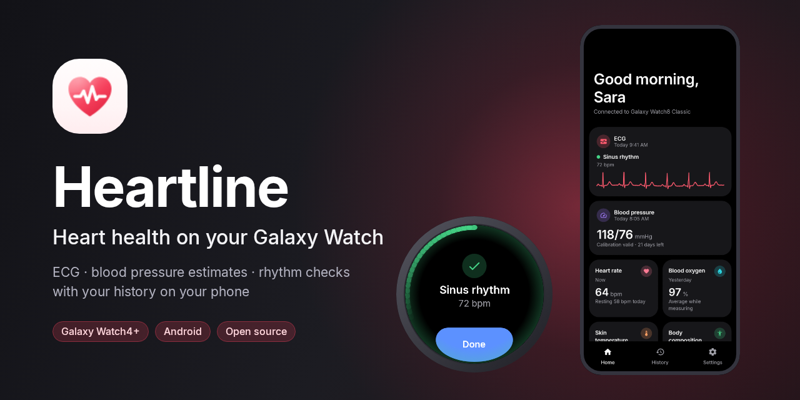
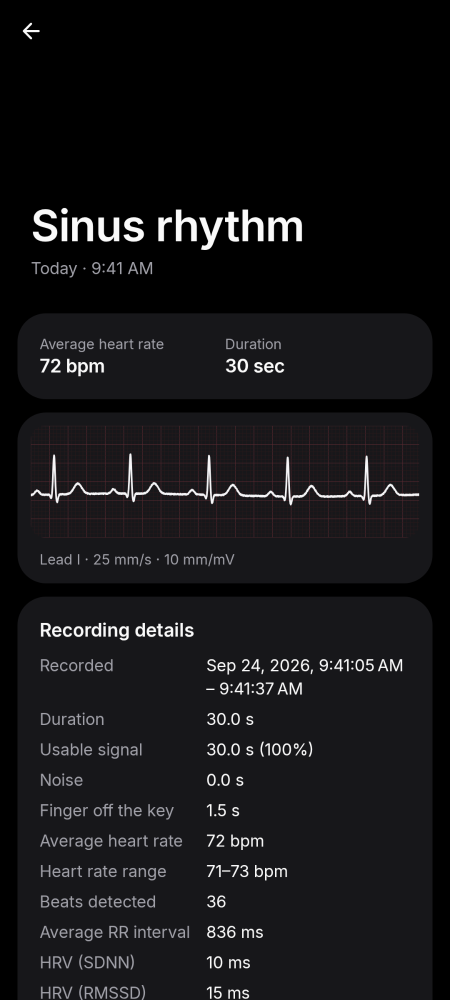
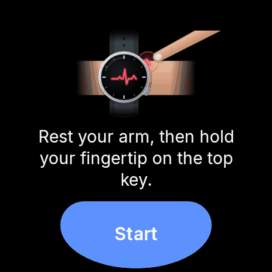

<div align="center">



# Heartline

**Heart health on your Galaxy Watch: ECG, blood pressure estimates and rhythm checks, with your history on your phone.**

[](https://github.com/selin2005/heartline/releases/latest)
[](https://github.com/selin2005/heartline/releases)
[](LICENSE)
[](#requirements)
[](https://t.me/HeartlineCommunity)






</div>

> [!IMPORTANT]
> **Heartline is not a medical device.** It is a general wellness app. It does not diagnose, treat
> or prevent any condition, and it cannot detect a heart attack, stroke or other emergency.
> Blood pressure values are estimates. If you think you are having a medical emergency, call your
> local emergency number. See the [medical disclaimer](legal/MEDICAL_DISCLAIMER.md).

Heartline is an independent open-source project, **not affiliated with, endorsed by or sponsored by
Samsung**. Samsung, Galaxy, Galaxy Watch, Samsung Health and Samsung Health Monitor are trademarks
of Samsung Electronics Co., Ltd.; Wear OS is a trademark of Google LLC.

## Features

| | On the watch | On the phone |
|---|---|---|
| **ECG** | 30-second single-lead recording, live waveform, rhythm label (sinus rhythm, signs of AFib, high / low heart rate, inconclusive, poor recording) | History, waveform on ECG paper, symptoms, PDF report, second opinion model |
| **Blood pressure** | PPG-based estimate after calibration with your own cuff | Calibration wizard, trends, averages, accuracy against your cuff |
| **Heart rate & rhythm** | Live heart rate, background irregular rhythm and high / low heart rate alerts | Day and week charts, resting rate, HRV, alert history |
| **More** | SpO₂, skin temperature, stress, body composition | Details, ranges and trends |
| **Everywhere** | Tiles, cards and complications | Home screen widgets, Quick Settings tiles |
| **Your data** | Stays on the watch until it reaches the phone | Stays on the phone. Export as PDF, image or CSV, or share with an AI app, only when you choose |

Browse every screen, sorted by section: **[Screenshots](docs/screenshots/README.md)**.

## Install

### Requirements
- A **Galaxy Watch4 or newer** (Wear OS Powered by Samsung / One UI Watch)
- An **Android phone** (Android 8.0 or newer) paired with the watch
- Heartline on **both** devices

Watches and phones Heartline has been tested on: [Tested devices](docs/TESTED_DEVICES.md).

### From GitHub Releases
1. Download `Heartline-phone-<version>.apk` and `Heartline-watch-<version>.apk` from the
   [latest release](https://github.com/selin2005/heartline/releases/latest).
2. Install the phone app on the phone and the watch app on the watch with `adb`.
   Step by step: [Installing on a device](docs/DEVICE_TESTING.md).
3. Until Heartline is approved as a Samsung Health partner, turn on **developer mode** in the
   watch's **Health Platform** app (called Health Sensor Service on older watches). The phone app
   shows how.

A **Google Play** release is being prepared (see [docs/PLAY_STORE.md](docs/PLAY_STORE.md)).

### Updates and beta versions
The phone app checks for new releases once a day and installs them after checking their
SHA-256 checksum: **Settings → Updates**.
- Which versions you're offered depends on your **update channel**, which starts at the kind of
  build you installed:

  | Channel | You get |
  |---|---|
  | **Stable** | main releases |
  | **Beta** | betas and the main releases after them |
  | **Development** | every new build: development builds, betas and main releases |

  Updating from a development build to a beta or main release keeps you on the development
  channel (and from a beta to a main release on the beta channel). Beta and development builds
  can change it in **Settings → Updates → Update channel**. To join the beta from a main release,
  install a beta from [Releases](https://github.com/selin2005/heartline/releases) over it.
- After each update, **What's new** shows the release notes.
- When the watch app is behind, the phone tells you and links to the watch APK.

All changes are listed in the [changelog](CHANGELOG.md).

## Privacy
There is no account, no server, no analytics and no ads. Health data never leaves your devices
unless you export or share it. The only network request the app makes is the update check to
GitHub. Read the [Privacy Policy](legal/PRIVACY_POLICY.md) and the [Terms of Use](legal/TERMS_OF_USE.md).
The app asks you to accept both on first launch.

## Build from source

```bash
./gradlew :phone:assembleDebug :wear:assembleDebug   # debug APKs
./gradlew test verifyPaparazziDebug                  # JVM, Robolectric and screenshot tests
./gradlew ktlintCheck                                 # lint
./gradlew -Pheartline.fakeSensors=true :wear:assembleDebug   # watch app with simulated sensors
```

Requirements: JDK 21 and the Android SDK (compile SDK 37).

| Module | Contents |
|---|---|
| `shared/` | Kotlin/JVM: models, sync protocol, and the ECG, HRV, rhythm, blood pressure and stress algorithms, with JVM tests |
| `datalayer/` | Android library: the sync transport over the Wearable Data Layer |
| `phone/` | Phone app (Jetpack Compose, Material 3, Room, Koin, Glance widgets) |
| `wear/` | Watch app (Wear Compose, Samsung Health Sensor SDK, tiles and complications) |
| `tools/` | Model training and evaluation, screenshot and release scripts |

Documentation: [docs/](docs/README.md). This covers the [ECG](docs/algorithms/ECG_ALGORITHM.md)
and [blood pressure](docs/algorithms/BP_ALGORITHM.md) algorithms, the
[sync protocol](docs/architecture/PROTOCOL.md), the [design system](docs/DESIGN.md) and
[releasing](docs/RELEASING.md).

## Community
Questions, tips, test builds and news: join the **[Heartline community on Telegram](https://t.me/HeartlineCommunity)**.
Bugs and device reports go to [GitHub Issues](https://github.com/selin2005/heartline/issues/new/choose),
so they can be tracked. Heartline doesn't give medical advice there either: for health questions,
talk to a doctor.

## Contributing
Contributions are welcome! Please send improvements as **pull requests to this repository**, so
everyone using Heartline gets them. Read [CONTRIBUTING.md](CONTRIBUTING.md) first. Contributors
sign the [CLA](CLA.md) once, through a bot on the first pull request. Report security problems
privately as described in [SECURITY.md](SECURITY.md). Everyone taking part follows the
[Code of Conduct](CODE_OF_CONDUCT.md).

## License
Heartline is free software: you can redistribute it and/or modify it under the terms of the
**[GNU Affero General Public License v3.0 or later](LICENSE)**, with the linking permission in
[LICENSE-EXCEPTION.md](LICENSE-EXCEPTION.md). Any modified version you distribute must be released
under the same license, with its complete source code.

The **Heartline name and icon are not covered by the license.** Forks must use their own name,
icon and application ID. See the [trademark policy](TRADEMARK.md). Third-party components keep
their own licenses: [THIRD_PARTY_NOTICES.md](THIRD_PARTY_NOTICES.md).

Copyright © 2026 Selin and Heartline contributors.
