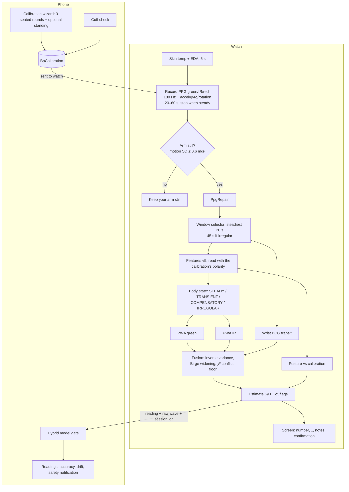

# Blood pressure on the watch: technical specification (algorithm 6.5)

This is the complete specification of how Heartline estimates blood pressure (BP) today. It
contains every step, formula, threshold and constant, so the algorithm can be checked, reproduced
or re-implemented from this document alone. Every value here was read from the code; each
section names the file and function it comes from (paths below `shared/src/main/kotlin/com/heartline/shared/`
unless stated otherwise).

What changed between versions, why, and the real-data tables behind each decision are kept in
[BP_HISTORY.md](BP_HISTORY.md). If this document and the code ever disagree, the code is right and
this document has a bug.

> Heartline is a wellness app. A BP estimate never diagnoses or rules out hypertension or
> hypotension. All user-facing text stays at that level.

## Contents

0. [Scope, notation and versions](#0-scope-notation-and-versions)
1. [System overview](#1-system-overview)
2. [Data acquisition and repair](#2-data-acquisition-and-repair)
3. [Pulse detection and features (PpgFeatures v5)](#3-pulse-detection-and-features-ppgfeatures-v5)
4. [Body state (HemodynamicStateClassifier)](#4-body-state-hemodynamicstateclassifier)
5. [Calibration](#5-calibration)
6. [Pulse-wave estimator (BpEstimator)](#6-pulse-wave-estimator-bpestimator)
7. [Transit-time channels](#7-transit-time-channels)
8. [Precise mode and the arm-raise maneuver](#8-precise-mode-and-the-arm-raise-maneuver)
9. [Fusion (BpFusion)](#9-fusion-bpfusion)
10. [Posture (algorithm 6.4)](#10-posture-algorithm-64)
11. [Output, categories, safety and confirmation](#11-output-categories-safety-and-confirmation)
12. [Phone side](#12-phone-side)
13. [Worked example on a real reading](#13-worked-example-on-a-real-reading)
14. [Data, logging and evaluation](#14-data-logging-and-evaluation)
15. [Validation status and limits](#15-validation-status-and-limits)
16. [Parameter reference](#16-parameter-reference)
17. [References](#17-references)

---

## 0. Scope, notation and versions

**What it is.** Calibrated, cuffless BP estimation, the same family of method as Samsung Health
Monitor. A cuff reading taken together with a watch recording gives a reference point. Later
readings estimate the change in BP from the change in the pulse wave (pulse-wave analysis, PWA)
and, where available, from transit times. The estimate is always relative to the user's own cuff
readings; there is no absolute, population-only model.

**Versions.**

| Item | Value | Where |
|---|---|---|
| Algorithm (stored with each reading) | 6 (6.5 behaviour) | `wear/.../bp/BpMeasureViewModel.kt` → `ALGORITHM` |
| Phone-refined reading | 4 (hybrid model applied) | `phone/.../data/BpData.kt` → `ALGORITHM_HYBRID` |
| Feature extractor | `PpgFeatureVector.VERSION = 5` | `bp/PpgFeatures.kt` |
| Oldest features the estimator accepts | `MIN_MODEL_VERSION = 2` | `bp/PpgFeatures.kt` |
| Tunable choices | `BpTuning.DEFAULT` (6.4 tuning, unchanged in 6.5); `BpTuning.ALGORITHM_6_3` for comparison | `bp/BpTuning.kt` |
| Session log format | `BpSessionLog.FORMAT = 1`, magic `HLBP` | `bp/BpSessionLog.kt` |

**Notation.**

| Symbol | Meaning | Unit |
|---|---|---|
| $f_s$ | sample rate of the PPG being analysed (100 quick, 500 precise) | Hz |
| $L$ | median beat length (foot to next foot) | samples at $f_s$ |
| $\mathbf{x}$ | corrected feature vector (7 entries, §6.1) | mixed |
| $\bar{\mathbf{x}}$ | reference features of the calibration (weighted mean) | mixed |
| $\boldsymbol\delta = \mathbf{x}-\bar{\mathbf{x}}$ | feature change from the calibration | mixed |
| $\mathbf{w}^{(0)}$ | population prior sensitivities | mmHg per feature unit |
| $\mathbf{w}$ | this user's posterior sensitivities | mmHg per feature unit |
| $S, D$ | systolic, diastolic | mmHg |
| $\sigma_c = 4$ | cuff reading noise (`CUFF_SD`) | mmHg |
| $\tau_i$ | time weight of calibration point $i$ | – |
| $a_i$ | age of point $i$ at the time of the reading | days |
| $\rho$ | this user's diastolic change per systolic change | – |
| $\sigma$ | a ± (one standard deviation) | mmHg |

"±" in the app is about one standard deviation, rounded to whole mmHg.

---

## 1. System overview



Precise mode (finger on the key, experimental) replaces the PPG recording with ECG and its
500 Hz PPG for 34 s and adds the PAT, ECG-PTT and HYDRO_MAP channels (§8).

**Channels** (`bp/Fusion.kt` → `BpChannel`):

| Channel | Source | Mode |
|---|---|---|
| `PWA_GREEN` | green PPG shape (§6) | quick, precise |
| `PWA_IR` | infrared PPG shape (§6), same window | quick (when the watch gives IR) |
| `BCG_PTT` | accelerometer I-wave → PPG foot (§7.1) | quick, precise |
| `PAT` | ECG R peak → PPG foot (§7.3) | precise |
| `ECG_PTT` | PAT − pre-ejection period (§7.2) | precise |
| `HYDRO_MAP` | amplitude peak during the arm-raise maneuver (§8.2) | precise, rarely |

---

## 2. Data acquisition and repair

### 2.1 Sensors (watch)

| Stream | Rate | Notes | Source |
|---|---|---|---|
| PPG green, IR, red (`PPG_ON_DEMAND`) | 100 Hz | every SDK point logged with its timestamp and status; IR used when ≥ 90 % of samples are finite | `wear/.../sensor/sdk/SdkPpgSource.kt`, `BpMeasureViewModel.recordQuick` |
| Accelerometer, gyroscope, rotation vector | `SENSOR_DELAY_FASTEST` | stops itself after `ImuRecorder.MAX_SAMPLES = 40 000` samples | `wear/.../sensor/ImuRecorder.kt` |
| Skin temperature | once, before recording | object and ambient °C | `BpAuxSensors.skinTemp` |
| Skin conductance (EDA, Watch8+) | `EDA_SECONDS = 5` s before recording | µS | `BpAuxSensors.skinConductance` |
| ECG + its green PPG (`ECG_ON_DEMAND`) | 500 Hz | precise mode only | `recordPrecise` |

Sample times are wall-clock nanoseconds. When the SDK gives per-point timestamps they are used
index by index; otherwise $t_k = t_0 + k/f_s$.

### 2.2 Recording control (quick mode)

`BpMeasureViewModel.recordQuick`, `BpWindowSelector.shouldStop`:

- Minimum `WINDOW_SECONDS = 20` s (with known AF in the profile: `BpProfile.recordingSeconds = 45` s);
  maximum `MAX_SECONDS = 60` s.
- From the minimum on, every `CHECK_EVERY_SECONDS = 2` s, the last 20 s are analysed (§2.4). The
  recording stops when that window is steady (§2.4) and its quality is ≥ `BpEstimator.MIN_QUALITY = 0.55`;
  an irregular window stops only at ≥ `IRREGULAR_SECONDS = 45` s; at 60 s it always stops.
- **Stillness.** The standard deviation of the acceleration magnitude
  $\lVert\mathbf a\rVert$ over the last 20 s of PPG time (`ImuStreams.motionSd`, population SD,
  ≥ 20 samples) must be ≤ `MotionMeter.MAX_STILL = 0.6` m/s²; otherwise the result is "Keep your arm
  still" and no number.

### 2.3 PPG repair (`dsp/PpgRepair.kt`)

Applied to every PPG before analysis (quick green and IR, precise PPG):

1. **Missing values.** The SDK's placeholder `-1`, non-finite values, and exact zeros before the
   first non-zero sample become missing.
2. If fewer than `MIN_VALID_SHARE = 0.15` of samples remain, the channel is unusable (repair returns
   null; quick mode then uses the raw array, precise mode returns "poor signal").
3. **Gaps** are linearly interpolated; the edges take the nearest value.
4. **Gain steps.** With $d_k = x_{k+1}-x_k$ and $\tilde d = \mathrm{median}\,|d_k|$, any step with
   $|d_k| > 60\,\tilde d$ (`STEP_FACTOR`) is cancelled by shifting everything after it by $-d_k$.

### 2.4 Window selection (`bp/BpPipeline.kt` → `BpWindowSelector.best`)

A 20 s window ($N_w = 20 f_s$ samples) is chosen from the recording:

1. If the recording is ≤ 20 s, the whole recording is used.
2. If the rhythm of the whole recording is irregular (§3.7), the last $\min(N, 45 f_s)$ samples are
   used and the window is marked irregular.
3. Otherwise candidate windows end at the last sample and step back by `STEP_SECONDS = 2` s. Each
   candidate's features are extracted. A window is **steady** when
   $|\text{hrSlope}| \le 0.5$ bpm/s, $|\text{amplitudeTrend}| \le 0.35$ and its rhythm is not irregular.
4. Chosen: among steady windows with quality ≥ 0.55, the one with the highest quality. If none
   qualifies, the window minimising $|\text{hrSlope}| + 2\,|\text{amplitudeTrend}|$.

All PPG features, the IR features, the BCG and the posture use this window.

---

## 3. Pulse detection and features (PpgFeatures v5)

`bp/PpgFeatures.kt`. Input: one repaired PPG window of at least 8 s.

### 3.1 Filtering

Two biquads (RBJ cookbook, Butterworth $Q = 1/\sqrt2$): high-pass 0.5 Hz then low-pass 8 Hz,
applied forward and backward (`filtFilt`, zero phase; each stage's magnitude response is squared).
A flat result (range < 1e-6) is rejected.

### 3.2 Polarity (which way up the wave is)

Raw watch PPG is light intensity, which falls when blood volume rises, so it is usually upside
down. Let $d_k$ be the sorted first differences of the filtered signal $y$ and $k = \max(1, \lfloor 0.02\,n\rfloor)$.

- $R = \operatorname{mean}$ of the $k$ largest $d$ (steepest rises), $F = -\operatorname{mean}$ of the $k$
  smallest (steepest falls).
- **Light-intensity signal:** $|\overline{\text{raw}}| > 20\,(\max y - \min y)$ (`LIGHT_DC_FACTOR`).
  Then the wave is inverted unless it is clearly upright: inverted $= \lnot(R > 2F)$.
- **Otherwise:** inverted $= F > 1.15\,R$ (`isInverted`).
- **Algorithm 6.2:** a measurement and every calibration round are read with the calibration's
  polarity (§5.3), passed in as `polarity`, and the detection above is skipped.

The upright signal is $x = \pm y$.

### 3.3 Peaks, feet, beats

1. **Local maxima:** $x_i \ge x_j$ for all $|j-i| \le 0.25 f_s$. Need ≥ 6.
2. **Threshold:** $0.35 \times$ the lower-quartile maximum height (index $\lfloor m/4\rfloor$ of the
   sorted heights); maxima below it are dropped. Low on purpose, so a weak premature beat is still
   found and can be recognised.
3. Maxima closer than $0.35 f_s$ to the previous peak replace it when higher.
4. **Foot** of each peak: the minimum of $x$ in the $0.35 f_s$ before it. Need ≥ 6 distinct feet.
5. **Beats:** consecutive feet whose distance is in $[0.33 f_s, 1.6 f_s]$ (37–182 bpm). Need ≥ 5.

`PpgFeatures.pulses` additionally gives, per beat, the steepest upstroke sample $u$ (maximum of
the central difference between foot and peak) and the **intersecting-tangent onset**

```math
t_\text{onset} = u - \frac{x_u - x_\text{foot}}{(x_{u+1}-x_{u-1})/2}, \quad \text{clamped to } [\text{foot}, u],
```

the standard transit-time marker (used by the BCG and PAT channels).

### 3.4 Ectopic beats and rhythm (`PpgFeatures.rhythm`)

With beat lengths $\ell_i$:

- **Local reference** for beat $i$: the median of $\ell_j$ for $j \in [i-2, i+3] \setminus \{i, i+1\}$
  (falls back to the median of all beats). Local, so breathing-related sinus arrhythmia is not ectopy.
- **Premature beat:** $\ell_i < 0.8\,\text{ref}$ (`ECTOPIC_SHORT`), beat $i+1$ follows directly and
  $\ell_{i+1} > 1.1\,\text{ref}$ (`ECTOPIC_LONG`). Beats $i$, $i+1$ and (if contiguous) $i+2$
  (post-extrasystolic potentiation) are excluded; the search continues at $i+2$.
- **ibiCv** of the remaining (clean) intervals: sample SD / mean (0 with fewer than 3).
- **hrSlope:** least-squares slope of the instantaneous rate $60 f_s/\ell_i$ against the beat's
  start time, bpm/s (0 with fewer than 5 clean beats).
- **RR features** (`hr/RrFeatures.kt`, Dash et al. 2009) on the clean intervals in ms, keeping
  250–2500 ms:
  - $\text{nRMSSD} = \text{RMSSD}/\text{mean}$;
  - Shannon entropy over 16 equal-width bins, normalised by $\ln 16$, on the series without its
    2 most extreme values at each end when it has more than 10;
  - turning-point ratio = turning points / $(n-2)$.

### 3.5 Ensemble beat

1. **Kept beats:** not excluded in §3.4, length within ±20 % of $L$, and in an irregular rhythm
   (§3.7) the previous beat must be contiguous and typical too (in AF the shape depends on the
   preceding interval). Need ≥ 5.
2. Each kept beat is linearly resampled to $n = 4L$ points (`UPSAMPLE = 4`, so timings are in
   2.5 ms steps at 100 Hz), the straight line from its foot to the next foot is subtracted, and it
   is divided by its maximum (foot 0, peak 1).
3. **Template** $T$: the point-wise median of the normalised beats. Rejected if $\max T < 0.5$.
4. **Quality:** with $r_i$ the Pearson correlation of beat $i$ with $T$,

```math
q = \operatorname{clamp}\big(\operatorname{median}_i r_i, 0, 1\big) \cdot \frac{\#\{i : r_i > 0.9\}}{\#\text{kept}}.
```

### 3.6 Features

$p$ = index of the template maximum; $\Delta t = 1000/(4 f_s)$ ms per template sample.

| Feature | Definition |
|---|---|
| `heartRateBpm` | $60 f_s / L$ |
| `riseFraction` | $p/n$ |
| `widthFraction` | $\#\{k: T_k \ge 0.5\}/n$ |
| `upstrokeMs` | $p\,\Delta t$ |
| `width50Ms` | $\#\{k: T_k \ge 0.5\}\,\Delta t$ (a count, not a contiguous run) |
| `width25Ms` | $\#\{k: T_k \ge 0.25\}\,\Delta t$ |
| `areaRatio` | $\sum_{k\ge p} T_k \,/\, \sum_{k \le p} T_k$ |
| `apgBa`, `apgDa` | acceleration plethysmogram ratios, below |
| `reflectionDelayMs`, `reflectionIndex` | reflected wave, below |
| `rmssdMs` | RMSSD of the kept beats' lengths (ms) |
| `skewness` | third standardised moment of the filtered upright signal |
| `shape` | $T$ sampled at 32 evenly spaced points (`SHAPE_POINTS`) |
| `ibiCv`, `ectopicCount`, `hrSlopeBpmPerS`, `rr*` | §3.4 |
| `rejectedFraction` | $1 - \#\text{kept}/\#\text{beats}$ |
| `perfusionIndex` | $100\,\text{AC}/\text{DC}$: AC = median beat amplitude (peak − foot), DC = $\lvert\overline{\text{raw}}\rvert$; 0 (unknown) if AC/DC > 0.2 (`MAX_AC_DC`, no real light offset) |
| `amplitudeTrend` | mean amplitude of the last third of kept beats / first third − 1 (0 with fewer than 6) |
| `inverted`, `version` | polarity used; 5 |

**Reflected wave.** $T$ is smoothed with a Gaussian of σ = 15 ms. Search from $p + 80$ ms to
$\min(p + 500\text{ ms}, 0.85\,n)$. The reflection point is the first local maximum of the smoothed
beat above 0.05; if there is none (merged waves, stiff arteries), the point where the downslope
flattens most (maximum of the central difference). Delay = (index − $p$) $\Delta t$; index = $T$ at it.

**Acceleration plethysmogram** (Takazawa 1998). $T$ is smoothed with σ = 10 ms; first and second
derivatives by central differences with step $h$ = 10 ms. Then
$a = \arg\max_{[0,p]} T''$ (must be > 0), $b = \arg\min_{[a,\,a+150\text{ ms}]} T''$,
$d = \arg\min_{[p+50,\,p+250\text{ ms}]} T''$, and `apgBa` $= T''_b/T''_a$, `apgDa` $= T''_d/T''_a$.

### 3.7 Irregular rhythm

`HemodynamicStateClassifier.irregular`:

- irregular if `ectopicCount` ≥ 3 (`IRREGULAR_ECTOPICS`); otherwise
- with RR features: $n \ge 8$, nRMSSD > 0.10 (0.15 when the latest ECG in the last 30 days showed
  sinus rhythm), entropy > 0.55, turning-point ratio in [0.45, 0.95];
- vectors before v5 (no entropy): ibiCv > 0.15 and RMSSD / beat length > 0.10 (0.15).

---

## 4. Body state (HemodynamicStateClassifier)

`bp/HemodynamicState.kt` → `assess`. The state never blocks a reading; it sets how far each
channel is trusted (§6.3, §9) and is logged and shown as a short note.

References from the calibration: $\text{HR}_\text{ref}$ = mean heart rate of the seated base rounds;
$\text{PI}_\text{ref}$ = median positive perfusion index of the seated base rounds; $\text{EDA}_\text{ref}$ =
median skin conductance of the seated rounds.

In order:

1. Features older than v4 → **STEADY**.
2. Irregular (§3.7) and AF not already known (profile or latest ECG) → **IRREGULAR**.
3. **COMPENSATORY** if $\text{HR} - \text{HR}_\text{ref} > 25$ bpm and either
   $\text{PI}/\text{PI}_\text{ref} < 0.6$, or the PI ratio is unknown and EDA > 2 × $\text{EDA}_\text{ref}$.
   With POTS / orthostatic intolerance in the profile: 15 bpm and 0.75.
4. **TRANSIENT** if $|\text{hrSlope}| > 0.5$ bpm/s (heart rate changing) or $|\text{amplitudeTrend}| > 0.35$
   (pulse amplitude changing).
5. Otherwise **STEADY**.

The estimator treats the rhythm as irregular (relaxed signal gate, extra ±) when the state is
IRREGULAR, the profile has AF, or the latest ECG showed AF.

---

## 5. Calibration

### 5.1 Protocol

Phone wizard (`phone/.../ui/model/BpModels.kt`) and watch (`BpMeasureViewModel.finishCalibration`):

- **3 seated rounds** (`REQUIRED_POINTS = 3`). Each round is a quick recording; the user enters the
  cuff reading taken with it. An optional **4th standing round** (`STANDING_ROUND = 4`), watch arm
  across the chest at heart level.
- A round needs quality ≥ 0.55 and ≥ 10 beats (else "poor signal"), and must be
  **calibration-grade**: quality ≥ 0.7, ≥ 15 beats, $|\text{hrSlope}| \le 0.5$, $|\text{amplitudeTrend}| \le 0.35$;
  otherwise the watch asks to take the round again.
- Each round is captured on every channel (`BpPipeline.capture`): green and IR features and raw
  window, BCG transit, PAT/PEP/PTT in precise mode, mean gravity vector, skin temperature, EDA,
  the PPG rate and the round's session id. The phone pairs it with the cuff reading
  (`CalibrationPoint.of`).
- The phone stores the calibration (`BpCalibration`: id, creation time, points, profile, `armSign`)
  after aligning its polarity (§5.3) and sends it to the watch.

### 5.2 Validity (`BpCalibration.isValid`)

The phone's status and the watch's check use the same function:

- at least 3 **base** points that are seated, from the 100 Hz PPG (`featureFs = 100`), and either
  read with the calibration's polarity or carrying their raw wave (so they can be read again);
- now < creation + 28 days (`VALIDITY_MS`), or 14 days (`SHORT_VALIDITY_MS`) when the profile
  has diabetes or kidney disease, or age ≥ 65;
- every base point's features at least v2.

When invalid the result is "needs calibration", and the session log gives the reason round by
round (`BpPipeline.needsCalibrationReason`).

### 5.3 Polarity and alignment (algorithm 6.2)

`BpCalibration.polarity(channel, fs)`: majority vote of the `inverted` flag over all seated points
(base and extra) of that PPG rate; a tie counts as inverted. `aligned()` re-extracts the features
of every point read the other way up from its stored raw wave with the majority polarity (green
and IR separately). Measurements are then read with the same polarity (§3.2).

### 5.4 Cuff checks as extra points (algorithm 3)

A cuff reading entered within 30 min of a watch reading (`VALIDATION_WINDOW_MS`) is stored as a
validation and added to the calibration as an **extra point** (`withExtraPoint`, at most
`MAX_EXTRA_POINTS = 12`, the latest kept), with the reading's time. With the reading's raw session on the
phone, every channel is recaptured from it (`BpSessionReplay` + `BpPipeline.capture`) using the
calibration's polarity; otherwise only the green features from the stored wave. Extra points
widen the pressure range the fit sees and move the baseline (§6.2).

### 5.5 Profile (`BpProfile`)

| Field | Effect |
|---|---|
| beta blocker, pacemaker, POTS/orthostatic intolerance | `heartRateWeight = 0`: the heart-rate feature is left out of the fit and the HR term is 0 |
| atrial fibrillation | rhythm treated as irregular; 45 s minimum recording |
| POTS/orthostatic intolerance | compensatory thresholds 15 bpm / 0.75 |
| diabetes or kidney disease, or age ≥ 65 | `shortValidity`: 14-day validity, prior width 3.5 instead of 2.5 |
| pregnancy | reading marked "not validated" |

---

## 6. Pulse-wave estimator (BpEstimator)

`bp/BloodPressure.kt` → `BpEstimator.estimate`, `fit`, `posterior`. Run once per PWA channel
(`PWA_GREEN` with the green window features, `PWA_IR` with the IR features of the same window).

### 6.1 Feature vector and heart-rate correction

The model uses 7 features (`PpgFeatureVector.modelArray`):

| $j$ | Feature | Prior $w^{(0)}_{S,j}$ | Prior $w^{(0)}_{D,j}$ | Scale $s_j$ | HR slope $k_j$ (ms/bpm) | Class |
|---|---|---|---|---|---|---|
| 0 | heart rate (bpm) | 0.45 | 0.30 | 15 | 0 | core |
| 1 | upstroke (ms) | −0.12 | −0.06 | 25 | 0.5 | core |
| 2 | width50 (ms) | −0.06 | −0.03 | 60 | 1.2 | core |
| 3 | area ratio | 6.0 | 3.0 | 0.8 | 0 | noisy |
| 4 | APG b/a | 15.0 | 8.0 | 0.5 | 0 | noisy |
| 5 | APG d/a | −5.0 | −3.0 | 1.0 | 0 | noisy |
| 6 | reflection delay (ms) | −0.04 | −0.025 | 60 | 0.9 | core |

The priors are population sensitivities informed by the literature (`priorSys`, `priorDia`); the
scales are typical within-person day-to-day spreads (`featureScale`). Timing features lengthen as
the pulse slows (LVET ≈ 413 − 1.7 HR ms, Weissler 1968), so each is moved to
$\text{HR}_0 = 70$ bpm (`corrected`):

```math
x_j = \text{raw}_j + k_j\,(\text{HR} - 70) \qquad (\text{only when } k_j \ne 0 \text{ and raw}_j \ne 0).
```

**Active features.** A feature is used only when every calibration point and the current reading
have it (all 7 since v3), and the heart rate only when `heartRateWeight > 0` (§5.5). Inactive
entries are 0 throughout.

### 6.2 Fit on the calibration points (`fit`)

**Points.** All timed points (base points at the calibration time, extra points at their own
time) whose features the channel can use (`shapeSelector`): same PPG rate as the measurement,
not standing, a feature vector for the channel, and the majority polarity. At least 3 are needed,
otherwise "needs calibration".

**Time weights.** With $a_i$ the point's age in days at the time of the reading:

```math
\tau_i = \max\!\big(0.25,\; 2^{-a_i/14}\big).
```

**Reference.** Weighted means: $\bar{\mathbf x} = \sum \tau_i \mathbf x_i / \sum\tau_i$, and the same
for the cuff values $\bar S$, $\bar D$. Centred rows $X_i = \mathbf x_i - \bar{\mathbf x}$ (active
entries only); targets $y_i = S_i - \bar S$ (and $D_i - \bar D$).

**Slope weights.** The baseline drifts like a random walk (variance $q = 4$ mmHg²/day,
`DRIFT_VAR_PER_DAY`), so a point taken $g_i$ days from the calibration teaches the slopes less:

```math
\omega_i = \tau_i\,\frac{\sigma_c^2}{\sigma_c^2 + q\,g_i}, \qquad g_i = |t_i - t_\text{calibration}| \text{ in days}.
```

**Bayesian ridge-to-prior posterior** (`posterior`). Prior $w_j \sim \mathcal N\big(w^{(0)}_j, (r\,|w^{(0)}_j|)^2\big)$ with
$r = 2.5$ (`PRIOR_REL`; 3.5 with `shortValidity`). With $P = \operatorname{diag}\big(1/(r\,w^{(0)}_j)^2\big)$:

```math
\mathbf w = \mathbf w^{(0)} + \Big(\tfrac{1}{\sigma_c^2}\textstyle\sum_i \omega_i X_i X_i^\top + P\Big)^{-1}
\tfrac{1}{\sigma_c^2}\textstyle\sum_i \omega_i X_i\,\big(y_i - X_i^\top \mathbf w^{(0)}\big).
```

The system is solved by Gauss–Jordan elimination with partial pivoting; if it is singular
(pivot < 1e-12) the prior is used. The diastolic weights $\mathbf w_D$ are fitted the same way with
`BpTuning.diaPriorRel = 2.5` (at least 3.5 with `shortValidity`); they are used only by the 6.3
`SHAPE` diastolic, kept for comparison.

**Systolic misfit:**

```math
r_S = \sqrt{\textstyle\sum_i \tau_i\,(y_i - \mathbf w_S^\top X_i)^2 \,/\, \sum_i \tau_i}.
```

**Diastolic coupling (6.4, `Diastolic.COUPLED`).** With $\Delta S_i = S_i - \bar S$ and
$\Delta D_i = D_i - \bar D$, prior $\rho \sim \mathcal N(0.5, 0.3^2)$ (`DIA_RATIO_PRIOR`, `DIA_RATIO_SD`):

```math
\rho = \frac{0.5/0.3^2 + \sum_i \omega_i\,\Delta S_i\,\Delta D_i/\sigma_c^2}{1/0.3^2 + \sum_i \omega_i\,\Delta S_i^2/\sigma_c^2},
\qquad
r_D = \sqrt{\textstyle\sum_i \tau_i\,(\Delta D_i - \rho\,\Delta S_i)^2 \,/\, \sum_i\tau_i}.
```

With only 3 base points in a narrow range, $\rho$ stays near 0.5; it moves to the user's own ratio
as cuff checks span a range.

**Anchored baseline.** The slopes use every point, but the baseline follows recent cuff readings,
each moved to the reference features along the slopes its change uses. Anchor weights
$\alpha_i = \max(0.05, 2^{-a_i/5})$ (half-life 5 days):

```math
S_\text{ref} = \frac{\sum_i \alpha_i\,(S_i - \mathbf w_S^\top X_i)}{\sum_i\alpha_i}, \qquad
D_\text{ref} = \frac{\sum_i \alpha_i\,(D_i - \rho\,\mathbf w_S^\top X_i)}{\sum_i\alpha_i}
```

(with the 6.3 `SHAPE` diastolic, $\mathbf w_D^\top X_i$ instead of $\rho\,\mathbf w_S^\top X_i$; until 6.5 the
coupled model also used $\mathbf w_D$ here).

Without extra points this equals the weighted means $\bar S$, $\bar D$.

The model also keeps the latest point time and the lowest and highest cuff systolic of its points
($S_\min$, $S_\max$).

### 6.3 Estimate (`estimate`)

**Signal gate.** Quality ≥ 0.55 and ≥ 10 beats (`MIN_QUALITY`, `MIN_BEATS`); with an irregular
rhythm ≥ 0.35 and ≥ 8. Otherwise "poor signal".

**Plausibility** (`isPlausible`), otherwise "unsteady signal, try again" (`OutOfRange`):
$30 \le \text{HR} \le 200$; $30 \le \text{upstroke} \le 0.6\,\text{beat}$; $0 < \text{width50} < \text{beat}$.

**Change from the calibration.**

```math
\delta_j = x_j - \bar x_j, \qquad z_j = |\delta_j| / s_j .
```

$s_j$ is the population scale, widened to this user's own robust spread
$1.4826\,\mathrm{MAD}$ once the watch has `MIN_HISTORY = 5` earlier readings that were steady and
within the calibration (green channel only; at most 30 kept), never narrower than the population value.

- **Noisy features** ($j \in \{3,4,5\}$) with $z_j > 3$ (`NOISY_FEATURE_Z`) are set to "unchanged"
  ($\delta_j = 0$) for this reading.
- **Movement guard.** If any core feature ($j \in \{0,1,2,6\}$) has $z_j > 3$, quality < 0.7
  (`MARGINAL_QUALITY`) and the rhythm is regular → `OutOfRange`.

**Heart-rate term** (bounded: within a person the rate is a weak, state-dependent signal):

```math
h_S = 6\,\tanh\!\Big(\frac{w_{S,0}\,\delta_0\,\kappa}{6}\Big), \qquad
\kappa = \begin{cases} 0 & \text{COMPENSATORY} \\ \text{heartRateWeight} & \text{otherwise}\end{cases}
```

(`HR_CAP_SYS = 6`; the diastolic cap `HR_CAP_DIA = 4` is used only by the 6.3 `SHAPE` model.)

**Shape term and change.**

```math
\Sigma = \sum_{j \ne 0} w_{S,j}\,\delta_j, \qquad
t = \begin{cases} 0.3 & \text{COMPENSATORY} \\ 1 & \text{otherwise}\end{cases}, \qquad
\Delta S = t\,\Sigma + h_S, \qquad \Delta D = \rho\,\Delta S .
```

In a compensating state the narrowing wave is vasoconstriction, not pressure, so only 30 %
(`COMPENSATORY_SHAPE`) of the shape change is used; the rest goes into the ±.

**Heart-rate dominated:** $|h_S| \ge 4$ and $|h_S| > |t\,\Sigma|$.

**Value of the channel.**

```math
\hat S = S_\text{ref} + \Delta S - H, \qquad \hat D = D_\text{ref} + \Delta D - H,
```

with $H$ = hydrostatic offset × `BpTuning.hydrostaticFactor` = **0** since 6.4 (§10).

### 6.4 Uncertainty of a PWA channel

**Extrapolation** (scale uncertainty: grows with the size of the change; uses the prior weights so
it doesn't shrink with an overconfident fit):

```math
E = 0.5\,\sqrt{\textstyle\sum_{j\in\{1,2,6\}} \big(w^{(0)}_{S,j}\,\delta_j\big)^2 + h_S^2}.
```

**Doubts** (each added in quadrature):

| Doubt | Size (mmHg) | Condition |
|---|---|---|
| heart-rate dominated | 4 | §6.3 |
| vasomotor | 4 | both PI > 0 and $\text{PI}/\text{PI}_\text{ref} \notin [0.6, 1.7]$ |
| cold skin | 4 | skin temperature more than 2 °C below the calibration's mean |
| ectopic beats | $1.5 \times \min(\text{ectopicCount}, 2)$ | |
| irregular rhythm | 4 | §4 |
| distrusted shape | $(1-t)\,\Sigma$ | COMPENSATORY |

With $d$ = days since the latest calibration point:

```math
\sigma_S^2 = 5^2 + r_S^2 + (0.15\,d)^2 + E^2 + \sum \text{doubt}^2,
```

```math
\sigma_D^2 = 4^2 + r_D^2 + (0.15\,d)^2 + (0.7E)^2 + \sum (0.7\,\text{doubt})^2 .
```

5 and 4 are cuff repeatability plus model error (`BASE_SD`, `BASE_SD_DIA`), 0.15 mmHg/day the
drift (`DRIFT_SD_PER_DAY`). For the fusion the channel reports scale parts $E$ (systolic) and
$0.7E$ (diastolic) (§9).

### 6.5 Beyond the calibration

The reading is **shown** with its ± and flagged `beyondCalibration` when any of:

- a core feature has $z_j > 2.5$ (`BEYOND_FEATURE_Z`);
- $|\Delta S| > 20$ or $|\Delta D| > 14$ mmHg (`BEYOND_DELTA_SYS`, `BEYOND_DELTA_DIA`);
- the rounded systolic was clamped to the limits;
- $\hat S < S_\min - 20$ or $\hat S > S_\max + 20$;
- heart-rate dominated.

A real change of pressure is never refused. Only a recording that is not a trustworthy pulse wave
is (§6.3).

---

## 7. Transit-time channels

### 7.1 Wrist ballistocardiogram (`bp/WristBcg.kt`)

The body recoils slightly with each ejection, and the watch's accelerometer feels it (Yousefian &
Mukkamala 2019; SeismoWatch 2017). Single beats are buried in noise, so the accelerometer is
averaged over many beats aligned on a known marker.

**In quick mode** the triggers are the PPG tangent onsets of the chosen window (§3.3) in
wall-clock time (fractional sample positions interpolated between sample times).

1. Need ≥ 50 accelerometer samples, a true rate ≥ 80 Hz (`MIN_RATE_HZ`), ≥ 12 triggers
   (`MIN_BEATS`), and ≥ 5 s of data.
2. Each axis is linearly resampled to 250 Hz (`FS`) and band-passed 1–20 Hz (zero phase).
3. Around each trigger: 450 ms before to 100 ms after; each segment's mean is removed. Template =
   mean of the segments.
4. **J wave:** the largest $|\text{template}|$ in $[-400, -40]$ ms; its sign sets the polarity.
   **I wave:** the minimum of sign × template in the 120 ms (`MAX_IJ_MS`) before J.
5. **Quality:** correlation of the mean of odd beats with the mean of even beats, clamped to
   [0, 1] (split-half reliability). Amplitude $= |T_J - T_I|$.
6. The axis with the largest quality × amplitude wins.

```math
\text{PTT}_\text{BCG} = -\,t_I \quad\text{accepted when quality} \ge 0.5 \text{ and } 80 \le \text{PTT} \le 300\text{ ms}.
```

Aligned on ECG R peaks instead (`afterRPeaks`: 100 ms before, 450 ms after, J searched 30–250 ms),
the I wave gives the pre-ejection period (§7.2).

### 7.2 PAT, PEP, PTT (precise mode, `bp/TransitTimes.kt`)

- **PAT** = median per-beat arrival time (§7.3).
- **HR** from the median R–R interval.
- **PEP** = R → BCG I wave when its quality is ≥ 0.5 and $40 \le \text{PEP} \le \text{PAT} - 40$ ms
  (measured); otherwise Weissler's relation $\text{PEP} = \operatorname{clamp}(131 - 0.4\,\text{HR}, 50, 140)$ ms,
  × 0.75 (`STRESS_PEP`) in a compensating state (flagged estimated).
- **ECG-PTT** = PAT − PEP: the arterial transit only, without the stress-dependent PEP.

### 7.3 Pulse arrival time (`bp/PulseArrival.kt`)

On the 500 Hz ECG and its repaired PPG (same clock, ≥ 8 s):

1. R peaks (`ecg/RPeakDetector`); need ≥ 8 (`MIN_BEATS`).
2. PPG band-passed 0.5–8 Hz, flipped upright by `isInverted` (§3.2).
3. For each R peak $r$: the steepest slope in $[r + 120\text{ ms},\ \min(r + 450\text{ ms}, r_\text{next} + 120\text{ ms})]$;
   rejected at a window edge or with a non-positive slope.
4. Foot = minimum of $x$ in $[\max(r + 60\text{ ms}, u - 250\text{ ms}),\ u]$; arrival = tangent onset (§3.3) − $r$.
5. PAT = median; spread = interquartile range.

### 7.4 Transit estimator (`bp/Fusion.kt` → `TransitEstimator`)

Pressure changes linearly with the transit time around the calibration (shorter transit, higher
pressure). Priors (mmHg per ms) and base noise:

| Channel | $b^{(0)}_S$ | $b^{(0)}_D$ | base σ (mmHg) |
|---|---|---|---|
| `BCG_PTT` | −0.8 | −0.5 | 6 |
| `PAT` | −0.5 | −0.3 | 7 |
| `ECG_PTT` | −0.8 | −0.5 | 5 |

1. **Points:** seated calibration points (base and extra) with this transit. Standing rounds are
   left out (the hanging hand changes the transit, not the cuff pressure). With $m$ the median
   transit, points with $|x_i - m| > 60$ ms (`MAX_ROUND_SPREAD_MS`) are left out as
   mis-detections. Need ≥ 2.
2. Time weights $\tau_i$ as in §6.2 (half-life 14 days, floor 0.25). Weighted means $x_0$, $S_0$, $D_0$.
3. **Slope posterior** with prior sd $\tau_p = 0.5\,|b^{(0)}|$ (`PRIOR_REL`) and, in precise mode
   with the maneuver, an in-session slope observation $(m_\text{obs}, \sigma_\text{obs})$ (§8.2;
   for the diastolic scaled by $b^{(0)}_D/b^{(0)}_S$):

```math
b = \frac{b^{(0)}/\tau_p^2 + \sum_i \tau_i\,\Delta x_i\,\Delta y_i/\sigma_c^2 \;[+\, m_\text{obs}/\sigma_\text{obs}^2]}
{1/\tau_p^2 + \sum_i \tau_i\,\Delta x_i^2/\sigma_c^2 \;[+\, 1/\sigma_\text{obs}^2]}, \qquad
\sigma_b = \Big(1/\tau_p^2 + \textstyle\sum_i \tau_i \Delta x_i^2/\sigma_c^2 \,[+\,1/\sigma_\text{obs}^2]\Big)^{-1/2}.
```

4. **Noise.** Round spread in ms $\text{sp} = \max\!\big(5, \sqrt{\sum \tau_i (\Delta x_i - \Delta S_i/b_S)^2/\sum\tau_i}\big)$
   (`MIN_TRANSIT_NOISE_MS = 5`); $d$ = days since the latest point:

```math
n_S^2 = \sigma_\text{base}^2 + (b_S\,\text{sp})^2 + (0.15\,d)^2, \qquad
n_D^2 = (0.7\,\sigma_\text{base})^2 + (b_D\,\text{sp})^2 + (0.15\,d)^2 .
```

   Above the 5 ms floor $|b_S|\,\text{sp}$ equals the rounds' misfit
   $r = \sqrt{\sum\tau_i(S_i - S_0 - b_S\Delta x_i)^2/\sum\tau_i}$, since
   $b_S(\Delta x_i - \Delta S_i/b_S) = -(\Delta S_i - b_S\Delta x_i)$; $r$ is logged but not added again
   (until 6.5 it was, so the misfit counted twice).

5. **Scale** (how sure the slope is): $c_S = |\sigma_{b,S}\,\Delta x|$, $c_D = |\sigma_{b,D}\,\Delta x|$ with $\Delta x = x - x_0$.
6. **Value:** $\hat S = S_0 + b_S\,\Delta x - \ell$, $\hat D = D_0 + b_D\,\Delta x - \ell$, where
   $\ell$ = hydrostatic offset × `transitHydrostaticFactor` × 0.5 (`ARM_FRACTION`) = **0** since 6.4.
   $\sigma_S = \sqrt{n_S^2 + c_S^2}$, $\sigma_D = \sqrt{n_D^2 + c_D^2}$.

---

## 8. Precise mode and the arm-raise maneuver

Experimental, offered only when the calibration has at least 2 points with PAT from the 500 Hz
ECG PPG (`preciseAvailable`). Calibration rounds themselves are always quick mode.

### 8.1 Recording

34 s (`BpPhase.TOTAL_SECONDS`) of ECG with its PPG (500 Hz) and the motion sensors, finger on the
key. Phases by elapsed seconds: rest until 12, raise until 18, hold up until 20, lower until 26,
rest until 34. The raised window comes from the arm's actual angle (`raisedWindow`:
|pitch| > 45°, ≥ 20 samples), or from the schedule (15–20 s) if the motion sensor didn't see it.
Fewer than 10 s of samples or a missing PPG → "poor signal".

**Level segment** (`levelSegment`): the PPG estimates (PWA, PAT, PTT) use only the heart-level
part: everything outside the raised window ± 3 s; the longer remaining stretch.

### 8.2 Hydrostatic analysis (`bp/HydrostaticCalibration.kt`)

Raising the wrist by $h$ lowers the pressure there by $\rho g h = 0.78$ mmHg/cm (`MMHG_PER_CM`), a
change known without a cuff. Per PPG beat: forearm pitch (§10.1) from the mean gravity over the
beat, arm length $\ell_\text{arm} = 0.33 \times \text{height}$ (170 cm when unknown), local offset
$o = 0.78\,\ell_\text{arm}\sin(\text{pitch})$. The sign that makes the raised phase positive is
measured (`armSign`). Needs ≥ 12 beats.

- **In-session slope** (McCombie 2007). Each PAT beat takes the offset of the PPG beat nearest in
  time (≤ 1 s). With ≥ 12 pairs and a local-pressure range ≥ 20 mmHg (`MIN_RANGE_MMHG`), PAT is
  regressed on the local pressure $-o$: slope $\beta$ (ms/mmHg, must be < −0.001) with standard
  error $\text{se}$. Then
  $m_\text{obs} = 0.5/\beta$ mmHg/ms (the arm is half the path, `ARM_FRACTION`) and
  $\sigma_\text{obs} = |m_\text{obs}|\sqrt{(\text{se}/|\beta|)^2 + 0.3^2}$ (30 % for the arm assumptions).
  It enters the PAT and ECG-PTT slope posteriors (§7.4).
- **Mean pressure from the amplitude peak** (Shaltis & Asada 2008). Beat amplitude $A$ is
  largest where the transmural pressure is near zero. Grid search of
  $A = c + A_0\exp\!\big(-(o - m)^2/(2w^2)\big)$ over $m$ from min to max offset in 1 mmHg steps and
  $w \in \{8, 10, \dots, 40\}$, with $c, A_0$ by least squares ($A_0 > 0$). Accepted only if the
  fitted curve at both ends of the range is ≤ 0.9 of the peak (`EDGE_RATIO`), $R^2 \ge 0.5$ and
  $A_0 \ge 0.15\,(c + A_0)$. Then
  $\text{MAP} = m + 5$ (`TISSUE_MMHG`), $\sigma_\text{MAP} = 4 + 0.2\,w + 10\,(1 - R^2)$.
  Without an accepted peak and with a range ≥ 20 mmHg only a lower bound is logged:
  $\text{MAP} \ge o_\max + 5$. A raised arm reaches about 45 mmHg, so a peak is seen only when the
  mean pressure is very low.
- **HYDRO_MAP channel:** with $\overline{PP}$ the mean cuff pulse pressure of the calibration points,
  $\hat S = \text{MAP} + \tfrac23 \overline{PP}$, $\hat D = \text{MAP} - \tfrac13\overline{PP}$,
  $\sigma_S = \sqrt{\sigma_\text{MAP}^2 + 16}$, $\sigma_D = \sigma_\text{MAP}$ (8 when unknown).

Precise mode uses the PAT and ECG_PTT channels from `TransitEstimator` with the in-session slope
when there is one.

---

## 9. Fusion (BpFusion)

`bp/Fusion.kt` → `BpFusion.fuse`. Every channel $c$ gives $(\hat S_c, \hat D_c, \sigma_{S,c}, \sigma_{D,c})$
and its scale parts $(c_{S,c}, c_{D,c})$.

1. **State factor.** Each channel's σ and scale parts are multiplied by $\phi(\text{state}, c)$:

   | State | PWA green | PWA IR | BCG PTT | PAT | ECG PTT | HYDRO MAP |
   |---|---|---|---|---|---|---|
   | STEADY | 1.0 | 1.0 | 1.0 | 1.0 | 1.0 | 1.0 |
   | TRANSIENT | 1.5 | 1.5 | 1.3 | 2.0 | 1.3 | 1.3 |
   | COMPENSATORY | 2.5 | 1.8 | 1.2 | 3.0 | 1.2 | 1.0 |
   | IRREGULAR | 1.8 | 1.8 | 1.6 | 1.5 | 1.4 | 1.5 |

   In a compensating state PAT is trusted least (PEP shortens under stress) and the hydrostatic
   and pure-transit channels most.

2. **Noise vs scale (6.3).** Only a channel's measurement noise decides its weight; the scale part
   (uncertainty about how big a change is) would otherwise make a channel that sees a change
   always lose to one that sees none:

```math
\nu_c = \sqrt{\max\!\big(1,\ \sigma_c^2 - c_c^2\big)}, \qquad
\pi_c = 1/\max(1, \nu_c)^2, \qquad \beta_c = \pi_c/\textstyle\sum\pi .
```

3. **Mean:** $\hat S = \sum_c \beta_c \hat S_c$ (the same for $\hat D$ with its own $\nu$).

4. **Birge widening.** $\nu = (\sum\pi_c)^{-1/2}$. With $K \ge 2$ channels,

```math
\chi^2 = \frac{\sum_c \pi_c (\hat S_c - \hat S)^2}{K - 1},
```

   and $\nu \leftarrow \nu\sqrt{\chi^2}$ when $\chi^2 > 1$.

5. **Fused ±:**

```math
\sigma_S = \max\!\Big(\sqrt{\nu^2 + \big(\textstyle\sum_c \beta_c c_{S,c}\big)^2},\ 5\Big), \qquad
\sigma_D = \max\!\Big(\sqrt{\nu_D^2 + \big(\textstyle\sum_c \beta_{D,c} c_{D,c}\big)^2},\ 3.5\Big).
```

   The floor (`COMMON_SD = 5`, diastolic 0.7 × 5) is there because every channel is anchored to the
   same cuff calibration: the reference's error and the beat-to-beat variation are shared, so
   combining channels cannot remove them.

6. **Conflict:** the systolic $\chi^2$ (computed from the noise parts) > 4 (`CONFLICT_CHI2`) → the
   reading is shown with the wider ± and flagged for a cuff check, never averaged into a confident
   number. The weights logged and shown are the systolic $\beta_c$.

---

## 10. Posture (algorithm 6.4)

`bp/BpPipeline.kt` → `run`, `bp/ImuStreams.kt`.

### 10.1 Forearm angle

Gravity $\mathbf g$ = mean accelerometer vector over the time span of the chosen window (≥ 20
samples; whole recording when the PPG has no times). The straps sit at 12 and 6 o'clock, so the
forearm runs along the watch's $x$ axis:

```math
\text{pitch} = \text{armSign}\cdot\arcsin\!\big(g_x/\lVert\mathbf g\rVert\big) \quad (\lVert\mathbf g\rVert \ge 5\text{ m/s}^2),
```

$\text{pitch}_\text{ref}$ = mean pitch of the seated base rounds; arm angle = the smallest angle
between $\mathbf g$ and any calibration point's gravity vector.

### 10.2 Rule

**Posture differs** when $|\text{pitch} - \text{pitch}_\text{ref}| > 30°$ (`POSTURE_PITCH_DEG`) or the
arm angle > 45° (`POSTURE_ANGLE_DEG`). Then:

- the output ± grows: $\sigma_S \leftarrow \sqrt{\sigma_S^2 + 8^2}$, $\sigma_D \leftarrow \sqrt{\sigma_D^2 + 5.6^2}$
  (`POSTURE_SD = 8`, diastolic 0.7 × 8);
- the reading is marked beyond the calibration;
- the watch shows "sit with your forearm resting at heart level" (`postureDiffers`).

The number itself is **not** moved by the angle.

### 10.3 Why the hand's height is not subtracted

The hand's height relative to calibration, $h = \ell_\text{arm}(\sin\text{pitch} - \sin\text{pitch}_\text{ref})$,
and its $\rho g h = -0.78\,h$ mmHg are still computed and logged (`arm.handHeightCm`,
`arm.appliedMmHg`), but multiplied by `hydrostaticFactor = 0` and `transitHydrostaticFactor = 0`:

- The model is calibrated against a cuff on the upper arm at heart level, which the hand's height
  doesn't change. The pulse shape at the wrist does not follow the wrist's local pressure the way
  the subtraction assumed.
- The geometry from the forearm angle assumes sitting; lying in bed (forearm −58°) it put the wrist
  47 cm below the heart and took 37 mmHg off (shown 111/39).
- On 9 real cuff checks, taking it off the pulse-wave channels made the systolic error SD
  8.7 mmHg against 4.0 without, and taking it off the transit channel 4.4 against 4.0 (table in
  §15.1; the 6.4 entry of BP_HISTORY.md).

---

## 11. Output, categories, safety and confirmation

### 11.1 Final numbers (`BpPipeline.run`)

```math
S = \operatorname{clamp}\big(\operatorname{round}(\hat S), 60, 250\big), \qquad
D = \min\!\big(\operatorname{clamp}(\operatorname{round}(\hat D), 35, 150),\ S - 15\big),
```

± = the fused σ (with posture, §10.2), rounded. Pulse = the green features' heart rate (precise:
the ECG's). Flags:

| Flag | Meaning |
|---|---|
| `beyondCalibration` | green channel beyond (§6.5) or missing, or fusion conflict (§9), or posture differs |
| `postureDiffers` | §10.2 |
| `heartRateDominated` | from the green channel |
| `ectopicBeats` | premature beats left out |
| `notValidated` | pregnancy in the profile |
| `state` | body state (§4) |
| `deltaSystolic` | $\hat S$ − the green model's reference $S_\text{ref} - H$ (6.5; the plain mean cuff systolic when the green channel gave no estimate) |
| `wideRange` | the rounded $\sigma_S$ > 12 mmHg (`RANGE_ONLY_SD`): shown without a category (§11.2) |

Outcomes: `Ok`, `NeedsCalibration`, `PoorSignal`, `OutOfRange` (not a trustworthy wave), plus the
watch-only "moving" (§2.2). If the green channel fails but other channels give values, the fused
number is still shown, marked beyond calibration.

### 11.2 Category (`BpCategory`, AHA, wellness labels)

A reading whose ± is above 12 mmHg (`wideRange`) is still shown with its number and ±, but without
a category: an interval that wide spans several of them. The watch and phone then say to measure
again sitting still with the forearm at heart level, or to compare with a cuff, and the phone's
personal model leaves the reading as it is (`RecordSummary.BloodPressure.rangeOnly`).

| Category | Rule (first that matches) |
|---|---|
| CRISIS | $S > 180$ or $D > 120$ |
| HIGH_STAGE_2 | $S \ge 140$ or $D \ge 90$ |
| HIGH_STAGE_1 | $S \ge 130$ or $D \ge 80$ |
| ELEVATED | $S \ge 120$ |
| NORMAL | otherwise |

### 11.3 Safety (`bp/BpSafety.kt`)

- **VERY_HIGH:** $S \ge 180$ or $D \ge 120$, unless the reading is heart-rate dominated.
- **LOW:** $S < 90$ or $D < 60$. A low pressure such as 90/60 is a change like any other: it is
  shown with its ± (and flagged beyond the calibration if far from it), never refused.

Both add a "check with a cuff" message (wellness wording).

### 11.4 Confirmation (`BpConfirmation`)

A reading needs confirming when it is beyond the calibration or has a safety level. A second
reading within 10 minutes (`WINDOW_MS`) that also needs confirming confirms it when it points the
same way and lands close:

- same way: same sign of `deltaSystolic`, or both $|\text{deltaSystolic}| < 3$ (`NO_DIRECTION`),
  or the same safety level;
- close: $|S_1 - S_2| \le \max(15,\ 2\max(\sigma_{S,1}, \sigma_{S,2}))$.

A confirmed safety reading raises a phone notification.

---

## 12. Phone side

### 12.1 Personal learned model (`bp/HybridBpModel.kt`, `phone/.../data/BpData.kt`)

A personal correction on top of the classical estimate, used only when it clearly beats it on
this user's own cuff checks.

- **When:** for a reading that arrives with its wave, is STEADY and not range-only, when there are
  at least `MIN_SAMPLES = 12` cuff checks (other than this reading) with their wave.
- **Targets:** $y = \text{cuff} - \text{classical}$, with the classical estimate **recomputed** by
  replaying each check's session through the current algorithm with a calibration that leaves that
  check out (6.4: the numbers shown back then may carry corrections since removed).
- **Embedding** (`MorphologyEmbedder`, 53 dimensions): the 32-point template, its slope at 16 points
  (central differences × 4), and HR/60, upstroke/100, width50/300, reflection delay/300,
  reflection index. The phone may add other embedders; the one with the lowest LOO error is used.
- **Ridge in dual form** (n ≪ d), with centred embeddings $C$, kernel $K = CC^\top$:

```math
b = \frac{\sum_i y_i}{n + \lambda}, \qquad \boldsymbol\alpha = (K + \lambda I)^{-1}(\mathbf y - b), \qquad
\mathbf w = C^\top\boldsymbol\alpha, \qquad \hat y = b + \mathbf w^\top(\mathbf e - \bar{\mathbf e}).
```

  The bias is shrunk towards 0, so a few checks can't impose a large offset.
- $\lambda \in \{0.3, 1, 3, 10, 30, 100\}$, chosen by the lowest leave-one-out (LOO) systolic MAE.
- **Gate:** used only if $\text{MAE}_\text{hybrid} \le 0.9\,\text{MAE}_\text{classical}$ (`GATE`) **and**
  $\text{MAE}_\text{hybrid} \le \text{MAE}_\text{classical} - 1.5$ (`MIN_GAIN_MMHG`), **and** the diastolic LOO
  MAE ≤ the mean $|y_D|$. $\text{MAE}_\text{classical}$ = mean $|y_S|$.
- **Correction** clamped to ±25 mmHg (`MAX_CORRECTION`), added to the classical value and rounded
  (6.5; truncated before), then the output limits and $D \le S - 15$. The reading keeps the watch's numbers (`watchSystolic/Diastolic`) and gets
  algorithm 4.

### 12.2 Accuracy, drift and personal range (`BpAccuracy`, `BpDrift`, `BpConformal`)

- **Accuracy check:** over all cuff checks, mean and SD of watch − cuff (systolic, diastolic) and the
  share within 10 mmHg on both (Bland–Altman style), shown as is.
- **Drift by readings:** the last 3 readings since the latest cuff point (`RUN`) all beyond the
  calibration with the same sign of $S - $ mean cuff systolic → "your pressure may be higher/lower,
  check with a cuff".
- **Drift by cuff checks** (two-sided CUSUM on residuals $e = $ watch − cuff systolic since the
  calibration): $U \leftarrow \max(0, U + e - 4)$, $L \leftarrow \max(0, L - e - 4)$; either above 15
  (`SLACK = 4`, `LIMIT = 15`) → "recalibrate" (and both reset).
- **Personal 80 % range** (split conformal): with $n \ge 5$ checks, the
  $\lceil (n+1)\,0.8\rceil$-th smallest $|e|$.

---

## 13. Worked example on a real reading

Session `7ef6f470` (Galaxy Watch6 Classic, treated hypertension, 1 Oct 2026). Cuff taken with it:
**137/86**. The watch showed **152/92** under algorithm 6.3. Replayed through 6.4 with the
calibration as it was before the reading (8 seated points: 3 base rounds and 5 earlier cuff checks,
cuff systolic 133–143). Numbers from the replay's own log (`BpPipeline.run` with a recorder);
`bpEval` gives the same result.

**Fit (green).** Reference features $\bar{\mathbf x}$ = (85.33 bpm, 201.43 ms, 483.11 ms, 2.929,
−0.424, −0.101, 161.94 ms); $S_\text{ref} = 138.12$, $D_\text{ref} = 77.49$; $r_S = 2.59$,
$r_D = 2.97$, $\rho = 0.422$. Posterior systolic weights:
(−0.058, −0.0005, −0.0705, −3.14, −5.53, −4.05, −0.019), against the priors
(0.45, −0.12, −0.06, 6.0, 15.0, −5.0, −0.04): this user's cuff points have turned the heart-rate,
area-ratio and b/a sensitivities around.

**Reading.** Window of 28 beats, quality 0.998, 88.2 bpm, STEADY. Raw upstroke 182.5 ms,
width50 447.5 ms, reflection delay 157.5 ms; after the heart-rate correction (+18.2 bpm × $k_j$):
191.62, 469.38, 173.91 ms.

| $j$ | $\delta_j$ | $w_{S,j}\delta_j$ |
|---|---|---|
| 0 HR | +2.90 bpm | (tanh term) $h_S = 6\tanh(-0.058 \cdot 2.90/6) = -0.17$ |
| 1 upstroke | −9.81 ms | +0.005 |
| 2 width50 | −13.73 ms | +0.97 |
| 3 area | −0.022 | +0.07 |
| 4 b/a | 0.000 | 0.00 |
| 5 d/a | +0.007 | −0.03 |
| 6 reflection | +11.98 ms | −0.23 |

$\Delta S = 0.62$, $\Delta D = \rho\,\Delta S = 0.26$, so the green channel gives
$\hat S = 138.74$, $\hat D = 77.75$.

**± of the green channel:** $E = 0.5\sqrt{(0.12\cdot9.81)^2 + (0.06\cdot13.73)^2 + (0.04\cdot11.98)^2 + 0.17^2} = 0.76$;
1.17 days since the latest point → drift 0.18; no doubts.
$\sigma_S = \sqrt{25 + 2.59^2 + 0.18^2 + 0.76^2} = 5.68$, $\sigma_D = \sqrt{16 + 2.97^2 + 0.18^2 + 0.53^2} = 5.02$.

**IR channel:** $\hat S = 138.51$, $\hat D = 77.65$, $\sigma_S = 5.72$ (E = 0.98).
**BCG:** I wave at −188 ms but split-half quality 0.42 < 0.5, so no BCG channel.

**Fusion:** noise parts 5.63 and 5.63 → weights 0.50/0.50; $\chi^2 = 0.0008$ (no widening, no
conflict); $\nu = 3.98$, scale part 0.87 → $\sqrt{3.98^2 + 0.87^2} = 4.08$, raised to the floor 5.
Diastolic: $\nu_D = 3.53$, scale 0.61 → 3.58.
$\hat S = 138.63$, $\hat D = 77.70$.

**Posture:** pitch +15.0° against −1.8° at calibration (difference 16.8° < 30°; arm angle 15.2°
< 45°): posture matches; not flagged.

**Result: 139/78 ± 5/4** (cuff 137/86: error +2/−8).

**What 6.3 did with the same data:** the hand was $57.75 \times (\sin 15.0° - \sin(-1.8°)) = 16.7$ cm
above its calibration height (height 175 cm), so it added $0.78 \times 16.7 = 13.1$ mmHg to every
channel ($138.7 + 13.1 = 151.8$), and its diastolic shape model gave 92: **152/92**, error +15/+6.

---

## 14. Data, logging and evaluation

### 14.1 Raw session logs (`bp/BpSessionLog.kt`)

Every session (measurement, calibration round, failed or cancelled ones too) is logged in full
and sent to the phone:

- **Header (JSON):** device, versions, capabilities and actual sensor rates; timed events
  (recording start/stop, window choice, errors); notes (state, reasons, calibration cuff values,
  result); every intermediate value: all features of both PPG channels (`green.*`, `ir.*`),
  polarity (`polarity.*`), arm (`arm.pitchDeg`, `arm.referencePitchDeg`, `arm.handHeightCm`,
  `arm.angleFromCalibrationDeg`, `arm.appliedMmHg`), `posture.differs`, `bcg.*`, `precise.*`,
  `hydro.*`, every channel's value and ± parts (`channel.<C>.systolic`, `.diastolic`, `.sdSys`,
  `.sd.<part>`), fusion (`fusion.weight.<C>`, `fusion.chi2`, `fusion.systolic`, …), `outcome.code`
  (0 ok, 1 needs calibration, 2 poor signal, 3 out of range), and later the cuff reading entered for it.
- **Streams:** every sensor sample exactly as received with its own timestamp (PPG with
  green/IR/red and status, accelerometer, gyroscope, rotation, ECG, skin temperature, EDA).
- **File:** gzip of `"HLBP"`, format (int), header JSON length + bytes, stream count, then per
  stream: name, column names, $n$, $n$ × int64 timestamps (ns), $n \times$ columns float32;
  big-endian. `tools/bp-ml/read_session.py` reads it.

The phone's diagnostic export also contains `bp/calibrations.json` (every calibration kept) and
`bp/cuff-checks.csv` (`atMs, readingId, sessionId, watchSystolic, watchDiastolic, cuffSystolic, cuffDiastolic`).
See [DEVICE_TESTING.md](../DEVICE_TESTING.md).

### 14.2 Replay and evaluation (`bp/BpExportEvaluation.kt`)

```
./gradlew :shared:bpEval -Pdir=<unpacked export>
```

Every cuff-checked measurement session of an export is replayed through the algorithm
(`BpSessionReplay` rebuilds the exact input) and compared with its cuff reading. The cuff reading
of the session itself is never part of its calibration (points with its session id, or within
2 min of its start, are removed).

- **ONLINE:** only cuff checks taken before the reading are in the calibration (as on the watch).
- **LEAVE_ONE_OUT:** every other cuff check is in it.
- Variants: `BpTuning.DEFAULT`, `ALGORITHM_6_3`, 6.4 with ρgh, 6.4 with the diastolic shape model,
  6.4 with the transit ρgh correction.

Metrics per variant (errors $e$ = watch − cuff): $n$, mean, sample SD, MAE, share with
$|e| \le 5, 10, 15$ mmHg (ISO 81060-2 asks mean ≤ 5 and SD ≤ 8 across many people; IEEE 1708
grades by MAE), and how many diastolic errors fall within 2σ of the shown diastolic ±.

The replay reproduces the numbers the watch logged at the time, so any change can be measured on
real recordings before it ships. Older dataset exports (`BpDataset`, `BpEvaluation`) are replayed
the same way and also report the proportional-bias slope of $e$ against the cuff value.

### 14.3 Tests

`shared/src/test/.../BpAlgorithm*Test`, `BpRealLog2Test` (this user's derived numbers: features,
forearm angle and cuff values, no raw waves and nothing identifying), `phone/.../BpLearningTest`,
`CalibrationTest`. Synthetic sessions (`SyntheticSession`, `SyntheticPpg`) test the plumbing,
polarity, fusion and posture; they cannot validate PPG physiology.

---

## 15. Validation status and limits

### 15.1 Real data so far

One user (Galaxy Watch6 Classic, treated hypertension), 9 cuff-checked readings, cuff systolic
133–146, replayed with `bpEval`:

| Mode, variant | Systolic mean / SD / MAE | Diastolic mean / SD / MAE |
|---|---|---|
| ONLINE, 6.3 | +1.8 / 9.0 / 6.9 | −4.9 / 14.3 / 9.1 |
| ONLINE, 6.4 | +1.7 / 4.0 / 3.2 | −2.9 / 7.7 / 6.0 |
| ONLINE, 6.4 but ρgh taken off the PWA channels | +1.9 / 8.7 / 6.8 | −2.9 / 11.0 / 6.9 |
| ONLINE, 6.4 but the 6.3 diastolic shape model | +1.7 / 4.0 / 3.2 | −4.9 / 10.6 / 8.0 |
| ONLINE, 6.4 but ρgh taken off the transit channel | +1.4 / 4.4 / 3.4 | −3.0 / 8.0 / 6.1 |
| LEAVE_ONE_OUT, 6.3 | +0.2 / 8.2 / 5.6 | −3.8 / 14.8 / 10.9 |
| LEAVE_ONE_OUT, 6.4 | +0.1 / 3.7 / 2.6 | −1.3 / 8.6 / 6.9 |

ONLINE builds each reading's calibration only from cuff readings taken before it (what the watch
had); LEAVE_ONE_OUT from every other one (§14.2). Under 6.4 the ONLINE systolic errors are
within 5 mmHg in 6 of 9 readings and within 10 in 9 of 9; the diastolic ± covers the error at
2σ in 8 of 9.

The reading taken lying in bed (no cuff; cuff ≈ 142/87 sitting the same afternoon) now gives
142/84 ± 11/10, flagged for posture. The diastolic remains the weaker estimate: one reading at
146/99 is still 19 mmHg low.

**This is not a validation.** Nine readings from one person in a narrow range cannot show how the
algorithm follows large changes (for example a fall to 90/60) or how it behaves on other people
and watches. Each new export with cuff checks goes through `bpEval` before a tuning changes.

### 15.2 Context from published studies

- Calibrated PWA watches mainly track the user's baseline and tend to be pulled towards the
  calibration point. Galaxy Watch Active2: proportional bias, SD 15.5 mmHg, did not meet ISO
  81060-2 (Falter et al. 2022).
- Galaxy Watch5, long-term (2026): mean differences −0.34 / +0.62 mmHg, but the error grew to about
  3.4 / 5.1 mmHg when the true BP was 10 mmHg from the calibration point.
- Heartline counters the pull towards calibration by learning the user's own sensitivities from
  cuff checks (§6.2), by separating scale from noise in the fusion (§9), and by never refusing a
  reading far from the calibration (§6.5). Whether that suffices for large changes is not yet shown
  on real data.

### 15.3 Known limits

- Population priors, scales and thresholds are literature-informed starting points, not fitted on
  a clinical dataset. With 3 base points the personal fit can only partly correct them.
- The heart-rate correction of the timing features uses population slopes.
- A reading taken in a posture unlike the calibration's is only flagged, not corrected.
- The BCG channel works only with a clear accelerometer average (often not on the Galaxy Watch6:
  rounds scatter by about 30 ms). Precise mode and HYDRO_MAP are experimental and unvalidated.
- The perfusion index needs a raw light offset; without it the compensatory check falls back to
  EDA or does not fire.
- Pregnancy is not validated; readings are marked so.

### 15.4 Open points found while writing this specification (fixed in 6.5)

Writing the first version of this document found five points where the code did not do what it
meant to. All five were fixed in algorithm 6.5 (`BpAlgorithm65Test`) and measured with `bpEval`:

1. The transit noise counted the rounds' misfit twice (§7.4).
2. In the coupled diastolic, the baseline was anchored along the shape model's diastolic slopes
   instead of $\rho\,\mathbf w_S$ (§6.2).
3. `RANGE_ONLY_SD` was defined but unused: a reading with a very wide ± was still given a category
   (§11.2).
4. `deltaSystolic` was measured from the plain mean of the cuff readings, not the model's reference
   (§11.1).
5. The phone's learned correction was truncated, not rounded (§12.1).

Two outdated comments were corrected with them (`PulseArrival` said PAT was not used yet;
`WristBcg.beforePpgFeet` named the steepest upstroke instead of the tangent onset).

On the 9 cuff-checked readings the shown numbers did not change (ONLINE and LEAVE_ONE_OUT metrics
identical to 6.4 to 0.1 mmHg). Unrounded, the fused systolic moved by at most 0.4 mmHg and the
diastolic by at most 0.16; the BCG channel's ± fell by 0.1–1.2 mmHg (its weight rose by 0.01–0.07),
and the posture-flagged reading lying in bed kept 142/84. These were corrections of
the method, not tuning; their effect grows with a clearer BCG and with cuff checks spread over days.

---

## 16. Parameter reference

Every constant the algorithm uses, from the code. Files are under `shared/.../bp/` unless stated.

### Acquisition and windows

| Constant | Value | File | Meaning |
|---|---|---|---|
| `BpCalibration.PPG_FS` | 100 Hz | BloodPressure.kt | quick-mode PPG rate |
| `CalibrationPoint.PRECISE_FS` | 500 Hz | BloodPressure.kt | ECG-tracker PPG rate |
| `BpWindowSelector.WINDOW_SECONDS` | 20 s | BpPipeline.kt | analysis window, minimum recording |
| `BpWindowSelector.IRREGULAR_SECONDS` | 45 s | BpPipeline.kt | window in an irregular rhythm |
| `BpWindowSelector.MAX_SECONDS` | 60 s | BpPipeline.kt | maximum recording |
| `BpWindowSelector.STEP_SECONDS` | 2 s | BpPipeline.kt | window step |
| `CHECK_EVERY_SECONDS` | 2 s | wear BpMeasureViewModel.kt | stop check interval |
| `EDA_SECONDS` | 5 s | wear BpMeasureViewModel.kt | EDA before recording |
| `RECENT_ECG_MS` | 30 days | wear BpMeasureViewModel.kt | latest ECG used as rhythm prior |
| `MotionMeter.MAX_STILL` | 0.6 m/s² | wear MotionMeter.kt | stillness limit |
| `ImuRecorder.MAX_SAMPLES` | 40 000 | wear ImuRecorder.kt | IMU auto-stop |
| `BpPhase` | 12/18/20/26/34 s | wear BpMeasureViewModel.kt | precise maneuver phases |
| `PpgRepair.MIN_VALID_SHARE` | 0.15 | dsp/PpgRepair.kt | minimum share of real samples |
| `PpgRepair.STEP_FACTOR` | 60 | dsp/PpgRepair.kt | gain-step threshold × median change |
| `PpgRepair.PLACEHOLDER` | −1 | dsp/PpgRepair.kt | the SDK's "no value" |

### Features and rhythm

| Constant | Value | File | Meaning |
|---|---|---|---|
| band-pass | 0.5–8 Hz, Butterworth Q, filtfilt | PpgFeatures.kt | PPG filter |
| `LIGHT_DC_FACTOR` | 20 | PpgFeatures.kt | mean level / range for raw light intensity |
| upright / inverted ratios | 2.0 / 1.15, top 2 % slopes | PpgFeatures.kt | polarity tests |
| peak window, threshold, merge | ±0.25 s, 0.35 × lower quartile, 0.35 s | PpgFeatures.kt | peak detection |
| foot look-back | 0.35 s | PpgFeatures.kt | |
| beat length | 0.33–1.6 s | PpgFeatures.kt | plausible beats |
| typical beat | ±20 % of median | PpgFeatures.kt | kept for the template |
| `UPSAMPLE` | 4 | PpgFeatures.kt | template resolution |
| quality correlation | 0.9 | PpgFeatures.kt | "matching" beat |
| reflection search | 80–500 ms, < 85 % beat, σ 15 ms, > 0.05 | PpgFeatures.kt | |
| APG | σ 10 ms, h 10 ms, b ≤ 150 ms, d 50–250 ms | PpgFeatures.kt | |
| `ECTOPIC_SHORT` / `ECTOPIC_LONG` | 0.8 / 1.1 | PpgFeatures.kt | premature beat |
| `MAX_AC_DC` | 0.2 | PpgFeatures.kt | perfusion index validity |
| `SHAPE_POINTS` | 32 | PpgFeatures.kt | stored template |
| `PpgFeatureVector.STATE_VERSION` | 4 | PpgFeatures.kt | first extractor with rhythm/state fields |
| `RrFeatures.MIN_INTERVALS` | 8 | hr/RrFeatures.kt | |
| irregular rule | nRMSSD > 0.10 (0.15 after sinus ECG), entropy > 0.55, TPR 0.45–0.95 | hr/RrFeatures.kt, HemodynamicState.kt | |

### State

| Constant | Value | Meaning |
|---|---|---|
| `IRREGULAR_CV` | 0.15 | legacy irregular rule |
| `IRREGULAR_ECTOPICS` | 3 | |
| `TRANSIENT_HR_SLOPE` | 0.5 bpm/s | |
| `TRANSIENT_AMPLITUDE` | 0.35 | |
| `COMPENSATORY_HR_RISE` / `COMPENSATORY_PI` | 25 bpm / 0.6 | |
| `ORTHOSTATIC_HR_RISE` / `ORTHOSTATIC_PI` | 15 bpm / 0.75 | with POTS |
| `EDA_SURGE` | 2.0 | |

### Calibration

| Constant | Value | Meaning |
|---|---|---|
| `REQUIRED_POINTS` | 3 | seated rounds |
| `STANDING_ROUND` | 4 | optional |
| `MAX_EXTRA_POINTS` | 12 | cuff checks kept |
| `VALIDITY_MS` / `SHORT_VALIDITY_MS` | 28 / 14 days | |
| calibration grade | q ≥ 0.7, beats ≥ 15, \|hrSlope\| ≤ 0.5, \|ampTrend\| ≤ 0.35 | wear `calibrationGrade` |
| `VALIDATION_WINDOW_MS` | 30 min | phone: cuff check after a reading |
| `WatchBpStore.CAPTURE_TTL_MS` | 15 min | wear: a calibration-round request from the phone expires |

### PWA estimator (BloodPressure.kt)

| Constant | Value | Meaning |
|---|---|---|
| `priorSys` | 0.45, −0.12, −0.06, 6.0, 15.0, −5.0, −0.04 | §6.1 |
| `priorDia` | 0.30, −0.06, −0.03, 3.0, 8.0, −3.0, −0.025 | §6.1 |
| `featureScale` | 15, 25, 60, 0.8, 0.5, 1.0, 60 | §6.1 |
| `heartRateSlopeMs` | 0, 0.5, 1.2, 0, 0, 0, 0.9 | §6.1 |
| `HR_REFERENCE` | 70 bpm | |
| `MIN_QUALITY` / `MIN_BEATS` | 0.55 / 10 | |
| `MIN_QUALITY_IRREGULAR` / `MIN_BEATS_IRREGULAR` | 0.35 / 8 | |
| `MARGINAL_QUALITY` | 0.7 | |
| `NOISY_FEATURE_Z` | 3.0 | |
| `BEYOND_FEATURE_Z` | 2.5 | |
| `BEYOND_DELTA_SYS` / `BEYOND_DELTA_DIA` | 20 / 14 mmHg | |
| `SYSTOLIC_LIMITS` / `DIASTOLIC_LIMITS` | 60–250 / 35–150 mmHg | |
| `BASE_SD` / `BASE_SD_DIA` | 5 / 4 mmHg | |
| `DRIFT_SD_PER_DAY` | 0.15 mmHg/day | |
| `DRIFT_VAR_PER_DAY` | 4 mmHg²/day | slope weights |
| `CUFF_SD` | 4 mmHg | |
| `PRIOR_REL` / `PRIOR_REL_STIFF` | 2.5 / 3.5 | |
| `HALF_LIFE_DAYS` / `MIN_POINT_WEIGHT` | 14 days / 0.25 | |
| `ANCHOR_HALF_LIFE_DAYS` / `MIN_ANCHOR_WEIGHT` | 5 days / 0.05 | |
| `DIA_RATIO_PRIOR` / `DIA_RATIO_SD` | 0.5 / 0.3 | |
| `HR_CAP_SYS` / `HR_CAP_DIA` | 6 / 4 mmHg | |
| `HR_DOMINANT_MMHG` | 4 mmHg | |
| `COMPENSATORY_SHAPE` | 0.3 | |
| `HR_DOMINATED_SD`, `PERFUSION_SD`, `AF_SD` | 4 mmHg each | doubts |
| `ECTOPIC_SD` | 1.5 mmHg per beat (max 2) | |
| `PERFUSION_RANGE` | 0.6–1.7 | |
| `COLD_SKIN_DELTA` | 2 °C | |
| `MIN_HISTORY` | 5 | personal scale |
| `RANGE_ONLY_SD` | 12 mmHg | above it, no category (§11.2) |
| `MAX_HISTORY` | 30 | wear WatchBpStore.kt |

### Transit and maneuver

| Constant | Value | File |
|---|---|---|
| `WristBcg.FS` | 250 Hz | WristBcg.kt |
| `WristBcg.MIN_RATE_HZ` / `MIN_BEATS` / `MIN_QUALITY` | 80 Hz / 12 / 0.5 | WristBcg.kt |
| BCG band-pass | 1–20 Hz | WristBcg.kt |
| BCG windows | PPG: −450…+100 ms, J in −400…−40; R: −100…+450, J in 30…250 | WristBcg.kt |
| `MAX_IJ_MS` | 120 ms | WristBcg.kt |
| `TRANSIT_RANGE_MS` | 80–300 ms | WristBcg.kt |
| `TransitTimes.STRESS_PEP` | 0.75 | TransitTimes.kt |
| Weissler PEP | 131 − 0.4 HR, 50–140 ms | TransitTimes.kt |
| PEP acceptance | 40 ms … PAT − 40 ms | TransitTimes.kt |
| `PulseArrival.MIN_MS` / `MAX_MS` / `MIN_BEATS` | 120 / 450 ms / 8 | PulseArrival.kt |
| transit priors | BCG −0.8/−0.5/6; PAT −0.5/−0.3/7; ECG PTT −0.8/−0.5/5 | Fusion.kt |
| `TransitEstimator.PRIOR_REL` | 0.5 | Fusion.kt |
| `TransitEstimator.CUFF_SD` | 4 mmHg | Fusion.kt |
| `MAX_ROUND_SPREAD_MS` | 60 ms | Fusion.kt |
| `MIN_TRANSIT_NOISE_MS` | 5 ms | Fusion.kt |
| `ARM_FRACTION` | 0.5 | Fusion.kt |
| `HydrostaticCalibration.MMHG_PER_CM` | 0.78 | HydrostaticCalibration.kt |
| `ARM_SHARE_OF_HEIGHT` | 0.33 (170 cm default height) | HydrostaticCalibration.kt |
| `MIN_RANGE_MMHG` / `EDGE_RATIO` / `TISSUE_MMHG` | 20 / 0.9 / 5 | HydrostaticCalibration.kt |
| level-segment margin | 3 s | BpPipeline.kt |
| `PP_SYS_SHARE` | 2/3 | BpPipeline.kt |

### Fusion, posture, output

| Constant | Value | File |
|---|---|---|
| `stateFactor` | table in §9 | Fusion.kt |
| `COMMON_SD` | 5 mmHg (diastolic 3.5) | Fusion.kt |
| `CONFLICT_CHI2` | 4 | Fusion.kt |
| `POSTURE_PITCH_DEG` / `POSTURE_ANGLE_DEG` | 30° / 45° | BpPipeline.kt |
| `POSTURE_SD` | 8 mmHg (diastolic 5.6) | BpPipeline.kt |
| `BpTuning.hydrostaticFactor` / `transitHydrostaticFactor` | 0 / 0 | BpTuning.kt |
| `BpTuning.diastolic` / `diaPriorRel` | COUPLED / 2.5 | BpTuning.kt |
| `BpConfirmation.WINDOW_MS` / `NO_DIRECTION` | 10 min / 3 mmHg | BpSafety.kt |
| `BpDrift.SLACK` / `LIMIT` / `RUN` | 4 / 15 mmHg / 3 | BpSafety.kt |
| `BpConformal.MIN_CHECKS` | 5 (80 % coverage) | BpSafety.kt |
| `HybridBpModel.MIN_SAMPLES` / `MIN_GAIN_MMHG` / `GATE` / `MAX_CORRECTION` | 12 / 1.5 / 0.9 / 25 | HybridBpModel.kt |
| ridge λ grid | 0.3, 1, 3, 10, 30, 100 | HybridBpModel.kt |
| `BpExportEvaluation.OWN_POINT_WINDOW_MS` | 2 min | BpExportEvaluation.kt (own cuff point left out) |
| `BpEvaluationReport.FAST_PULSE_RISE` | 15 bpm | BpEvaluation.kt (dataset report: fast-pulse MAE) |

---

## 17. References

- Takazawa K. et al. Assessment of vasoactive agents and vascular aging by the second derivative of photoplethysmogram waveform. *Hypertension* 1998.
- Millasseau S.C. et al. Determination of age-related increases in large artery stiffness by digital pulse contour analysis. *Clin Sci* 2002.
- Elgendi M. On the analysis of fingertip photoplethysmogram signals. *Curr Cardiol Rev* 2012.
- Elgendi M. Optimal signal quality index for photoplethysmogram signals. *Bioengineering* 2016.
- Awad A. et al. The relationship between the photoplethysmographic waveform and systemic vascular resistance. *J Clin Monit Comput* 2007.
- Wang L. et al. Noninvasive cardiac output estimation using a novel photoplethysmogram index. *IEEE EMBC* 2009.
- Dash S. et al. Automatic real time detection of atrial fibrillation. *Ann Biomed Eng* 2009 (nRMSSD, Shannon entropy, turning point ratio).
- Weissler A.M. et al. Systolic time intervals in heart failure in man. *Circulation* 1968 (LVET and PEP against heart rate).
- Yousefian P., Mukkamala R. et al. The potential of wearable limb ballistocardiogram in blood pressure monitoring via pulse transit time. *Sci Rep* 2019;9:10666.
- Carek A.M. et al. SeismoWatch: wearable cuffless blood pressure monitoring using pulse transit time. *IMWUT* 2017.
- Shaltis P.A., Reisner A.T., Asada H.H. Cuffless blood pressure monitoring using hydrostatic pressure changes. *IEEE TBME* 2008.
- McCombie D.B., Reisner A.T., Asada H.H. Adaptive hydrostatic blood pressure calibration. *IEEE EMBC* 2007.
- Payne R.A. et al. Pulse transit time measured from the ECG: an unreliable marker of beat-to-beat blood pressure. *J Appl Physiol* 2006.
- Pre-ejection period as a stress-dependent parameter for PWV applications. PMC9975268.
- Mukkamala R. et al. Toward ubiquitous blood pressure monitoring via pulse transit time. *IEEE TBME* 2015.
- Mukkamala R. et al. Cuffless blood pressure measurement: where do we actually stand? *Hypertension* 2022.
- Mukkamala R. et al. / AHA Scientific Statement. Cuffless devices for the measurement of blood pressure. *Hypertension* 2025. https://www.ahajournals.org/doi/10.1161/HYP.0000000000000254
- Falter M. et al. Smartwatch-based blood pressure measurement demonstrates insufficient accuracy. *Front Cardiovasc Med* 2022. https://www.frontiersin.org/journals/cardiovascular-medicine/articles/10.3389/fcvm.2022.958212/full
- Long-term accuracy and stability of blood pressure from a smartwatch (Galaxy Watch5), 2026. https://pubmed.ncbi.nlm.nih.gov/41602947/
- Analysis for calibration pre-post difference in BP estimation of Galaxy Watch. https://pubmed.ncbi.nlm.nih.gov/38083749
- Tae Y. et al. Change point-aware evaluation and re-calibration of PPG-based blood pressure estimation. arXiv:2608.18639, 2026.
- Stergiou G.S. et al. ESH recommendations for the validation of cuffless blood pressure measuring devices. *J Hypertens* 2023;41:2074.
- ISO 81060-2:2018, non-invasive sphygmomanometers — clinical investigation of intermittent automated measurement type.
- ISO 81060-3:2022, non-invasive sphygmomanometers — continuous automated measurement type.
- IEEE 1708-2014, standard for wearable cuffless blood pressure measuring devices.
- Pillai A. et al. PaPaGei: open foundation models for optical physiological signals. *ICLR* 2025.
- Moulaeifard M. et al. Generalizable deep learning for PPG-based blood pressure estimation: a benchmarking study, 2025.
- Wearable, cuffless, and portable devices for blood pressure monitoring (2015–2025): a scoping review. *Front Digit Health* 2026.
- A method for blood pressure hydrostatic pressure correction using wearable inertial sensors and deep learning. *npj Biosensing* 2025.
- Relationship between pulse transit time, PPG features, and blood pressure in atrial fibrillation. 2025 (PubMed 41337181).
