# Screenshots

Every screen of the phone and watch apps, rendered by the Paparazzi and Robolectric tests. Pick a section to see all of its screens. The phone is shown in light and dark, the watch on a small and a large round screen.

Regenerate with `./gradlew recordPaparazziDebug` and `python3 tools/screenshots/sync.py` (see [CONTRIBUTING.md](../../CONTRIBUTING.md)). Don't edit these files by hand.

## Phone

| Section | Preview | Screens |
|---|:-:|:-:|
| [**Onboarding**](phone/onboarding/README.md) | [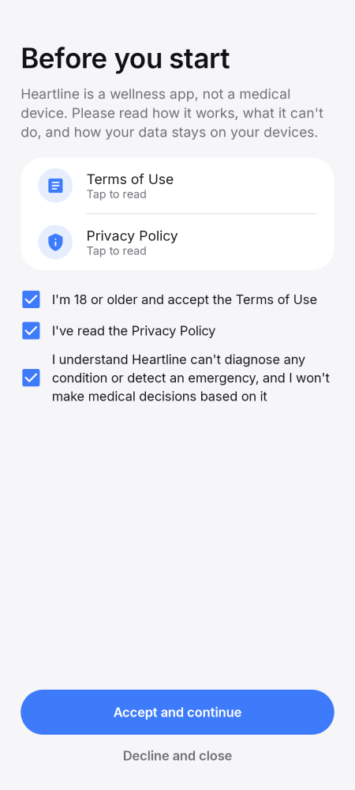](phone/onboarding/README.md) | 7 |
| [**Home**](phone/home/README.md) | [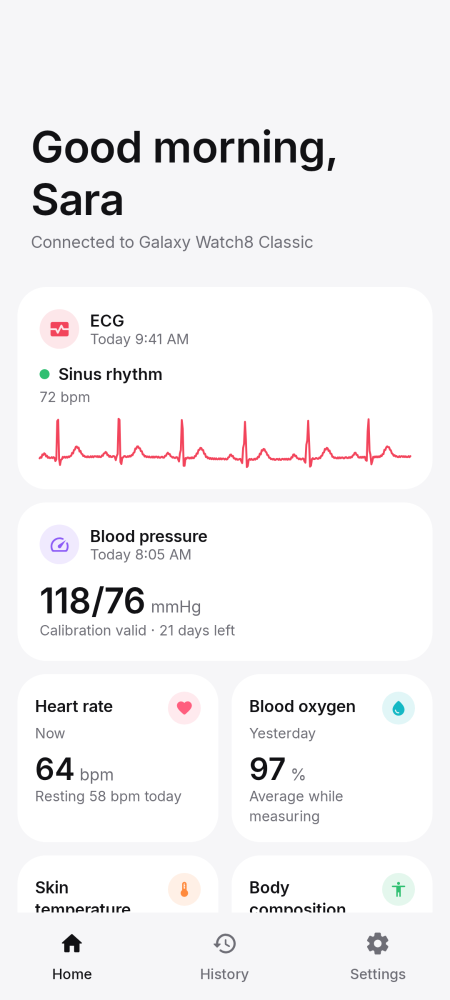](phone/home/README.md) | 6 |
| [**ECG**](phone/ecg/README.md) | [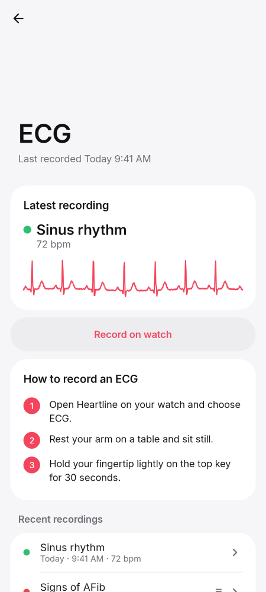](phone/ecg/README.md) | 8 |
| [**Blood pressure**](phone/blood-pressure/README.md) | [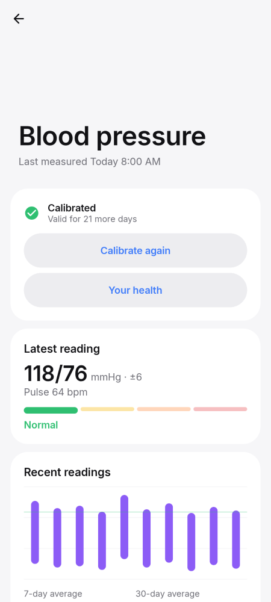](phone/blood-pressure/README.md) | 7 |
| [**Heart rate and alerts**](phone/heart-rate/README.md) | [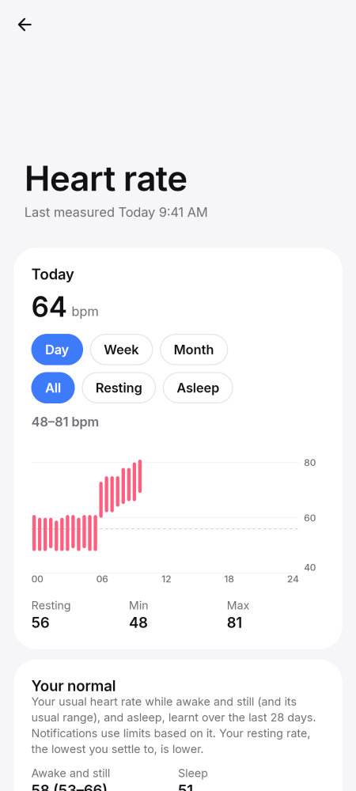](phone/heart-rate/README.md) | 5 |
| [**SpO₂, temperature and stress**](phone/more-measurements/README.md) | [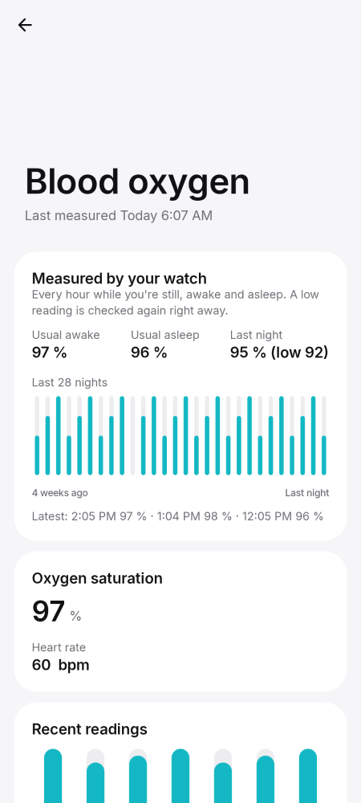](phone/more-measurements/README.md) | 3 |
| [**Body composition**](phone/body-composition/README.md) | [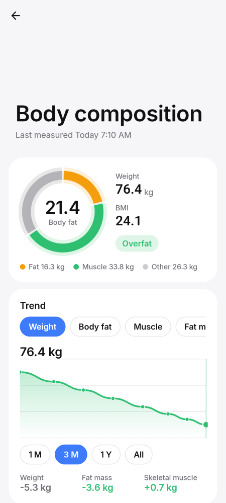](phone/body-composition/README.md) | 3 |
| [**Settings, updates and sharing**](phone/settings/README.md) | [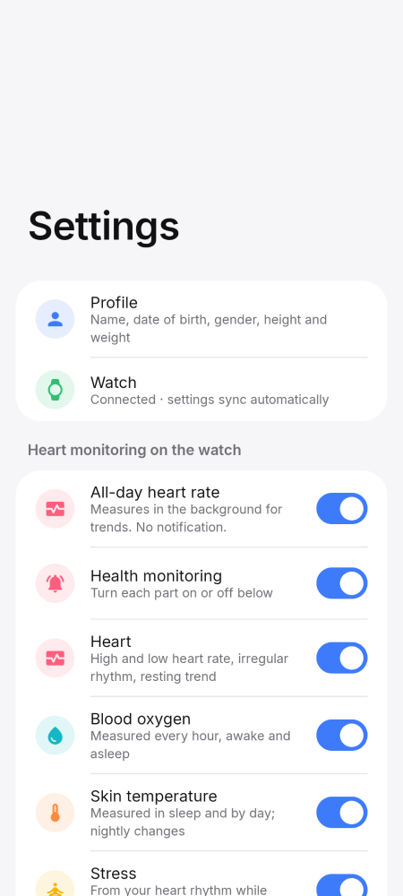](phone/settings/README.md) | 25 |
| [**Other**](phone/other/README.md) | [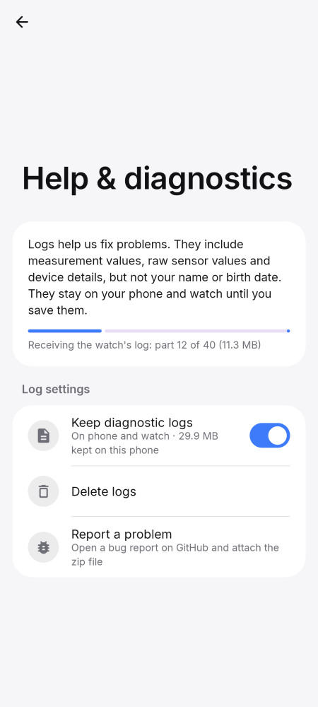](phone/other/README.md) | 6 |
| [**Widgets**](widgets/README.md) |  | 38 |

## Watch

| Section | Preview | Screens |
|---|:-:|:-:|
| [**Setup**](wear/setup/README.md) |  | 14 |
| [**Launcher and history**](wear/launcher/README.md) | [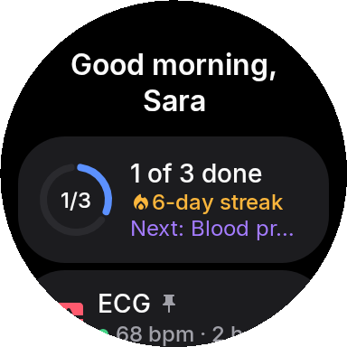](wear/launcher/README.md) | 6 |
| [**ECG**](wear/ecg/README.md) | [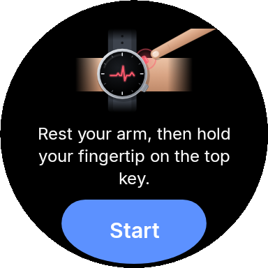](wear/ecg/README.md) | 11 |
| [**Blood pressure**](wear/blood-pressure/README.md) |  | 17 |
| [**Heart rate**](wear/heart-rate/README.md) | [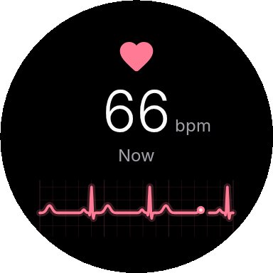](wear/heart-rate/README.md) | 2 |
| [**SpO₂, temperature and stress**](wear/more-measurements/README.md) | [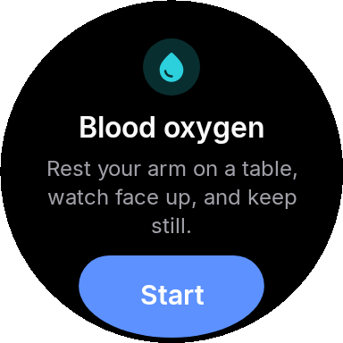](wear/more-measurements/README.md) | 8 |
| [**Body composition**](wear/body-composition/README.md) | [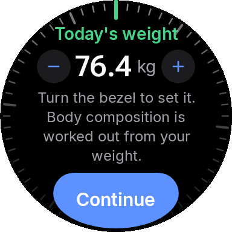](wear/body-composition/README.md) | 6 |
| [**Settings**](wear/settings/README.md) | [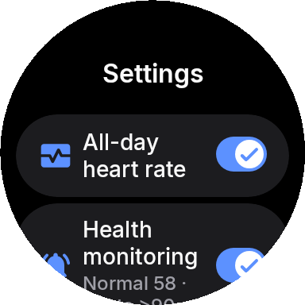](wear/settings/README.md) | 8 |
| [**Other**](wear/other/README.md) | [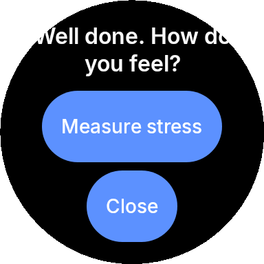](wear/other/README.md) | 2 |
| [**Tiles and cards**](wear/tiles/README.md) | [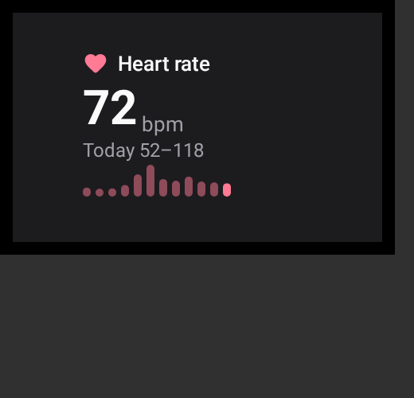](wear/tiles/README.md) | 10 |
