# Phone · Blood pressure

Cuff calibration, trends and the accuracy of the watch estimate.

[← All screenshots](../../README.md)

| | Light | Dark |
|---|:-:|:-:|
| **Blood pressure overview** |  | 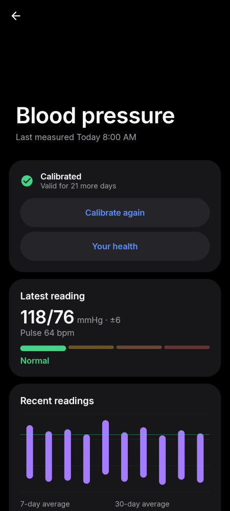 |
| **Before calibration** | 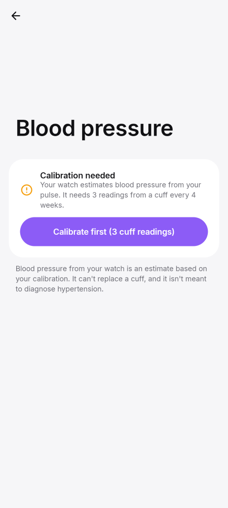 | 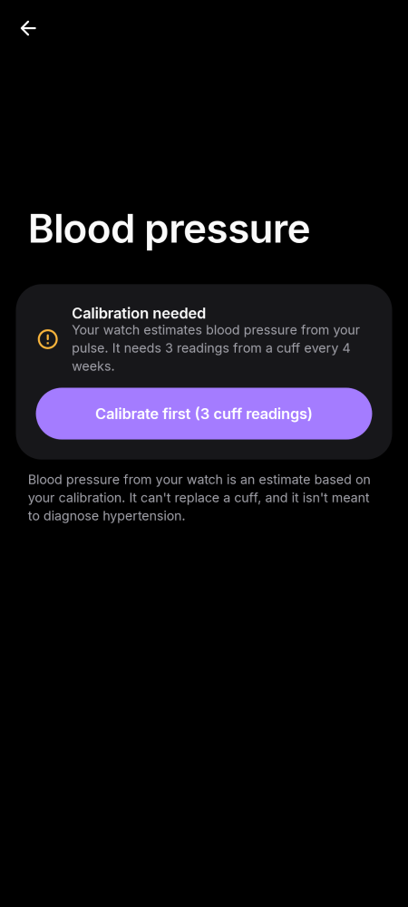 |
| **Accuracy against your cuff** | 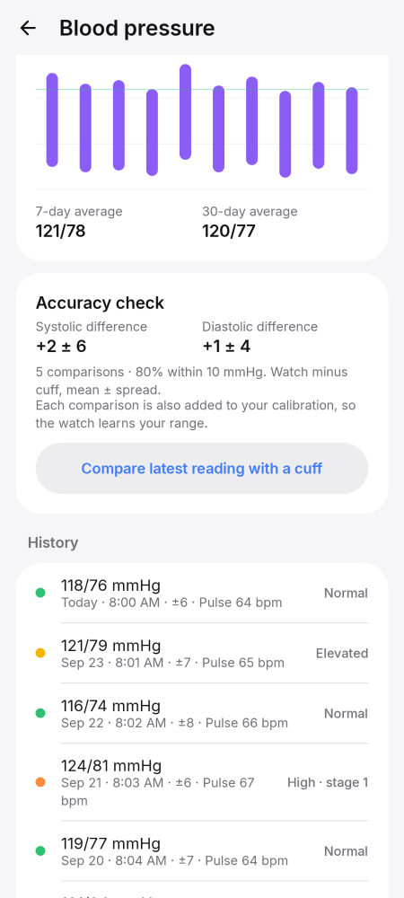 | 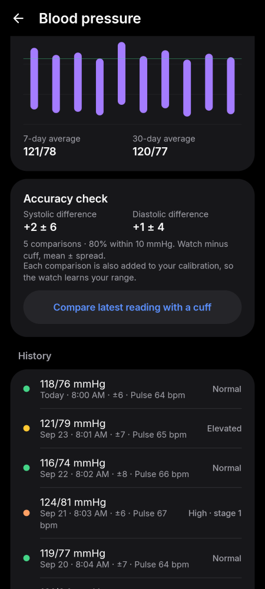 |
| **Calibration: introduction** | 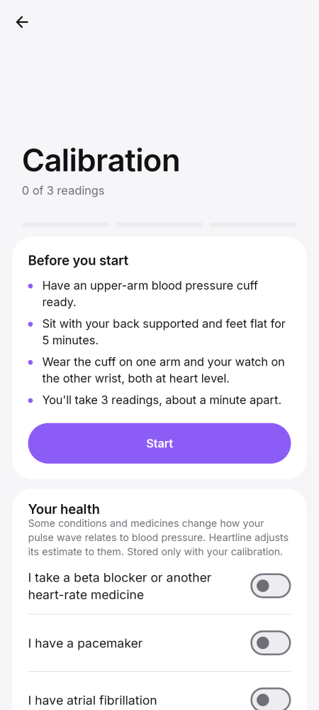 | 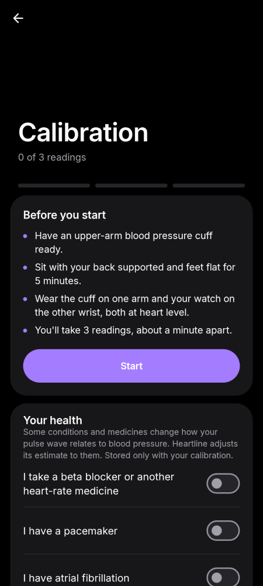 |
| **Calibration: enter the cuff reading** | 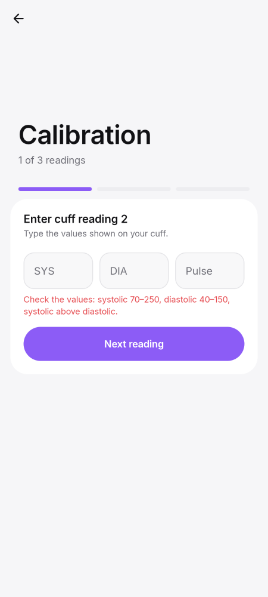 | 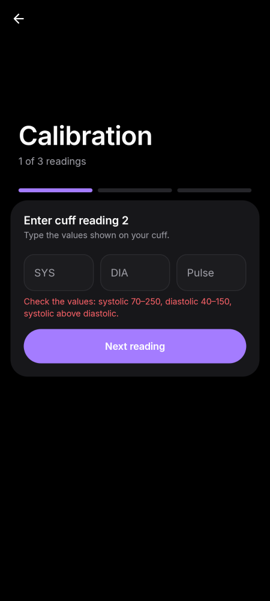 |
| **Calibration: waiting for the watch** | 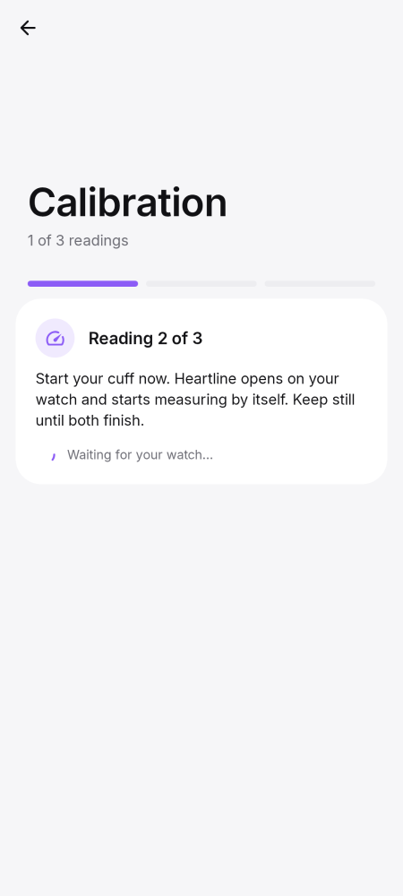 | 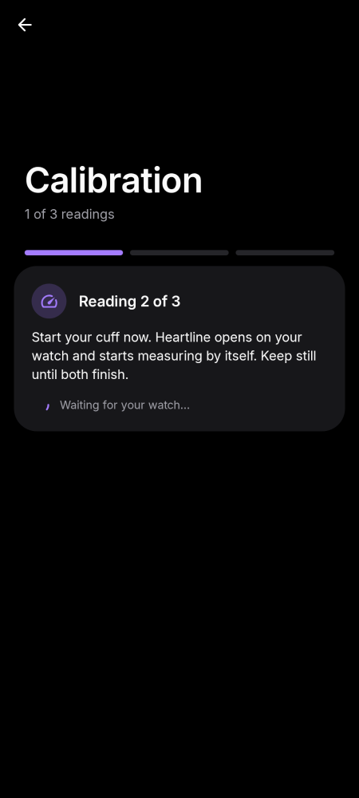 |
| **Calibration done** | 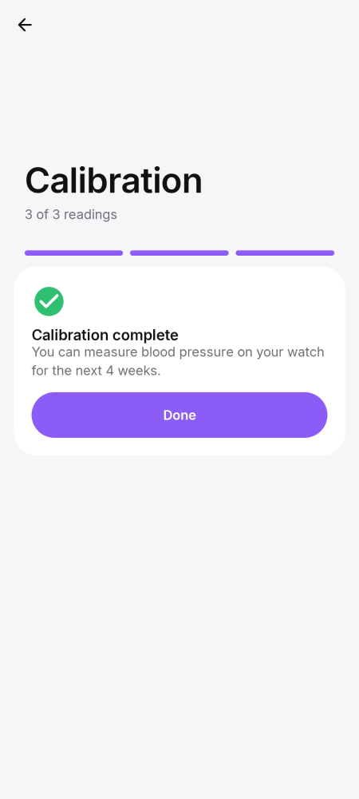 | 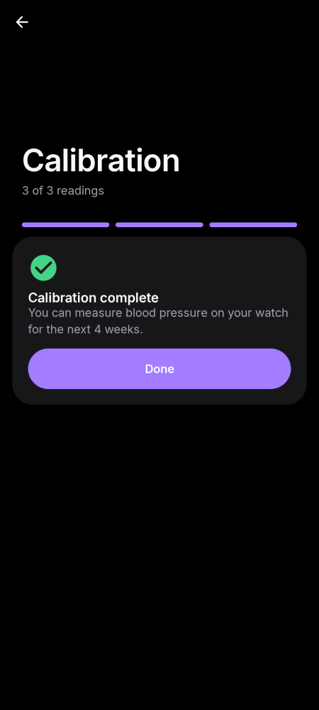 |
