# Phone · ECG

30-second ECG history, the waveform on ECG paper, symptoms and the PDF report.

[← All screenshots](../../README.md)

| | Light | Dark |
|---|:-:|:-:|
| **ECG overview** |  | 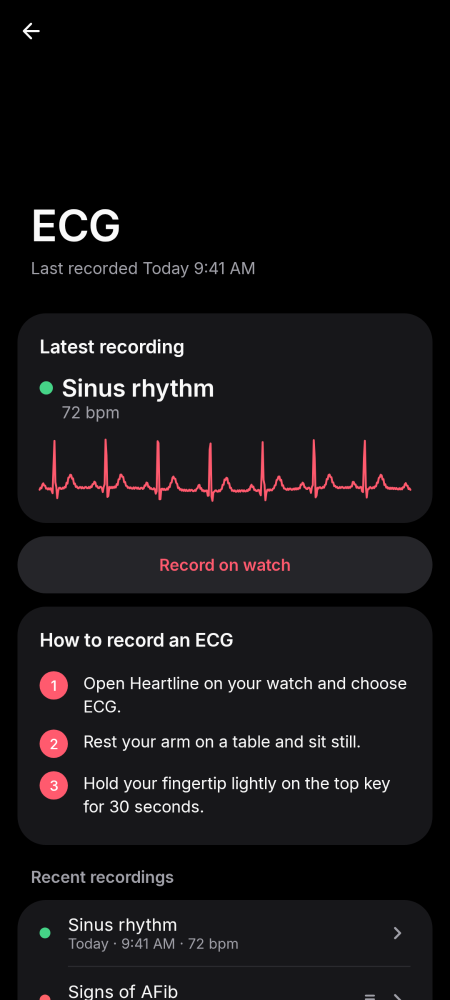 |
| **ECG overview, no recordings yet** | 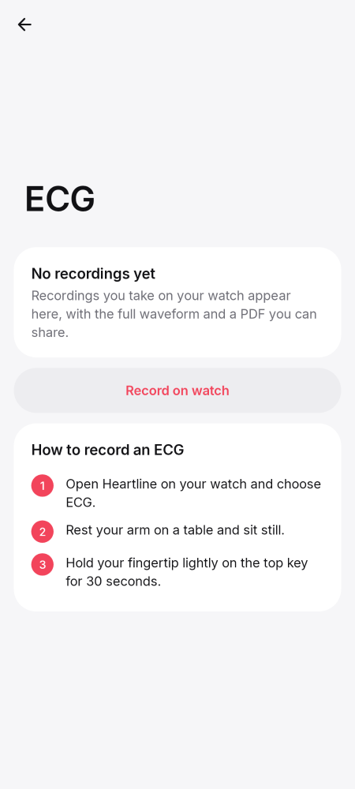 | 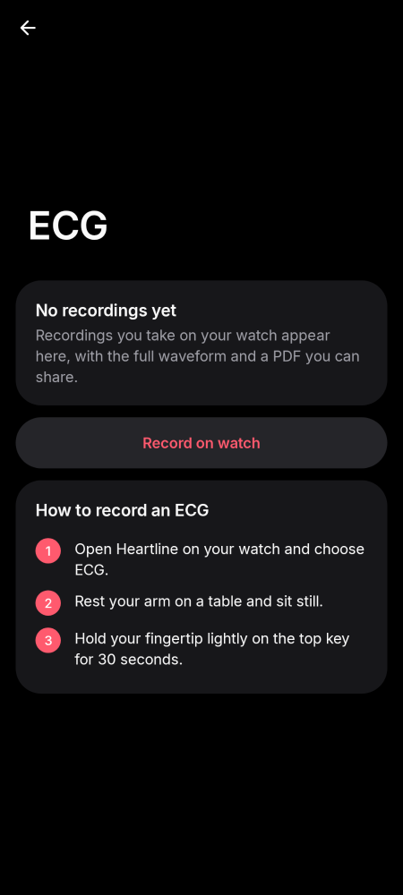 |
| **History** | 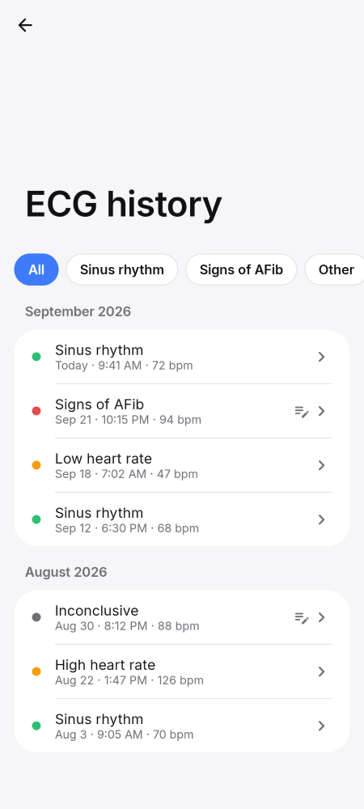 | 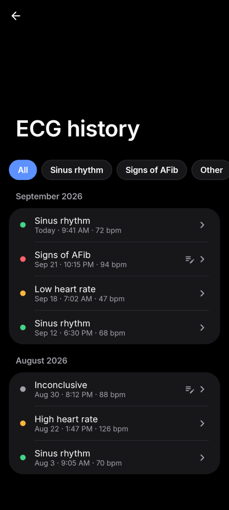 |
| **Recording: sinus rhythm** | 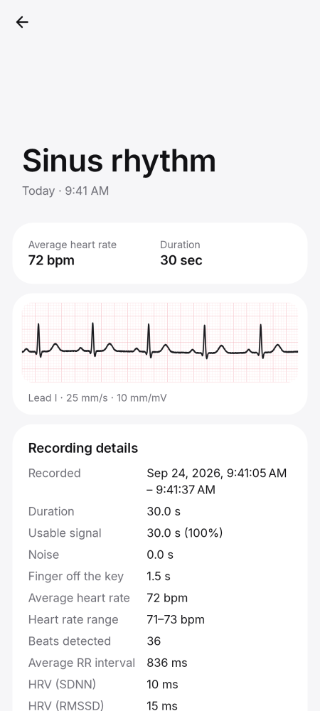 |  |
| **Recording: signs of AFib** | 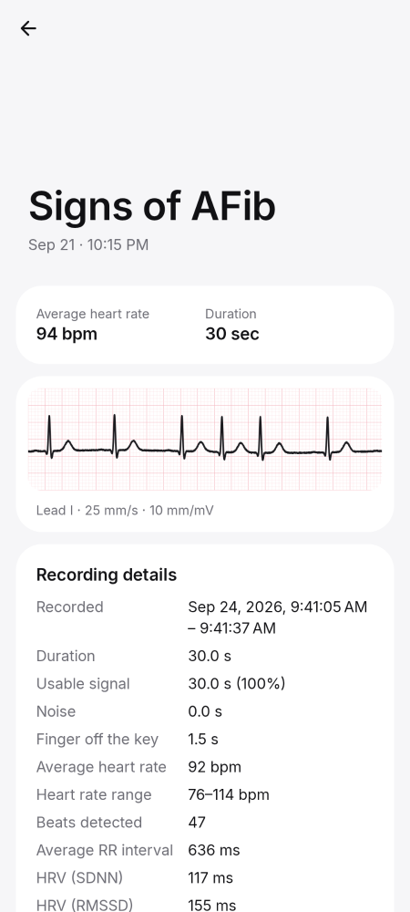 | 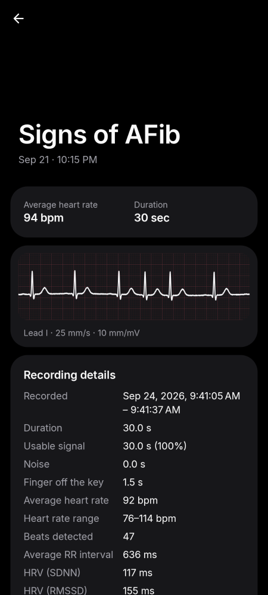 |
| **Recording details** | 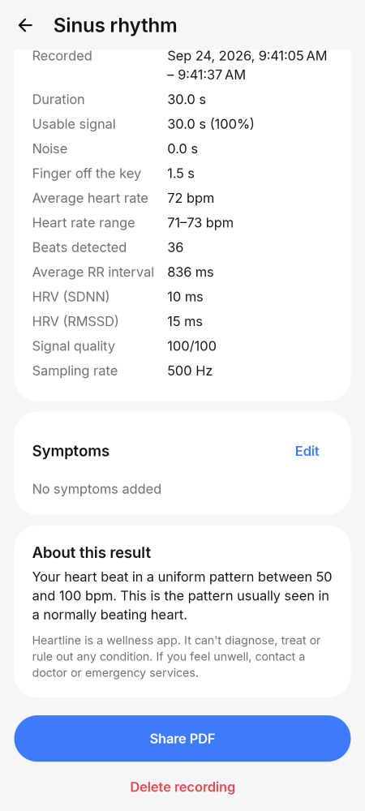 | 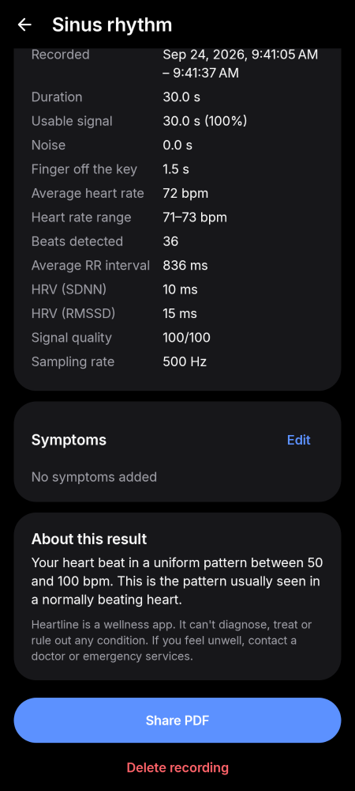 |
| **Symptoms** |  | — |
| **PDF report** | 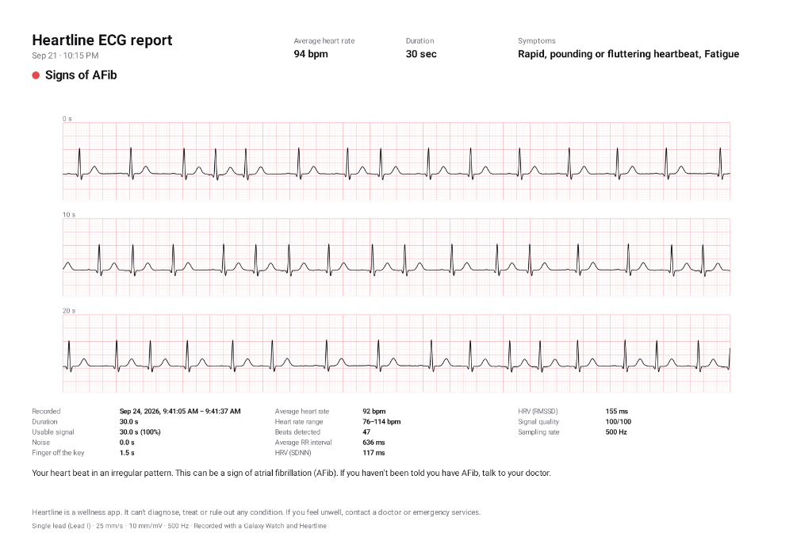 | — |
