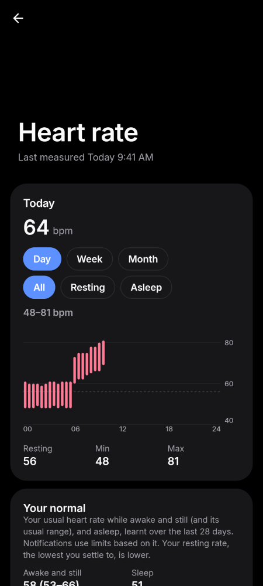
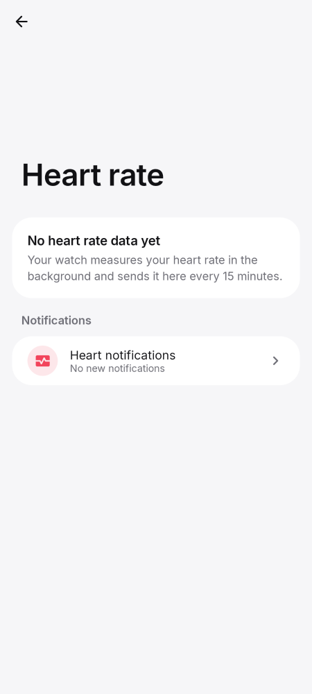
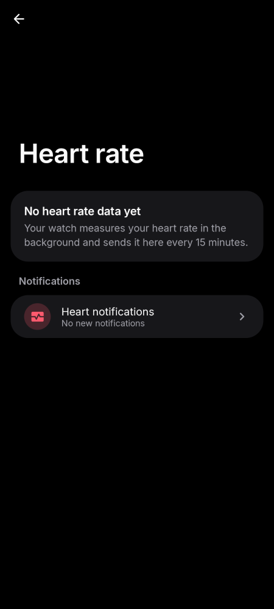
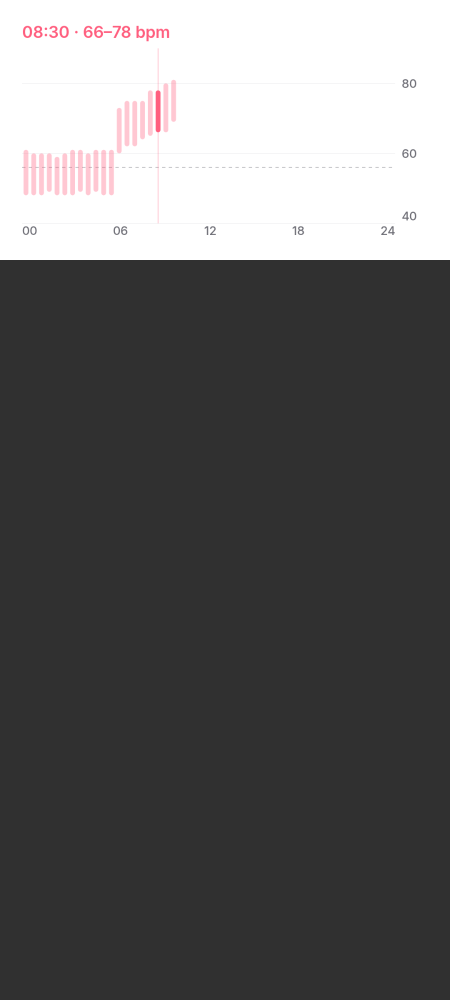
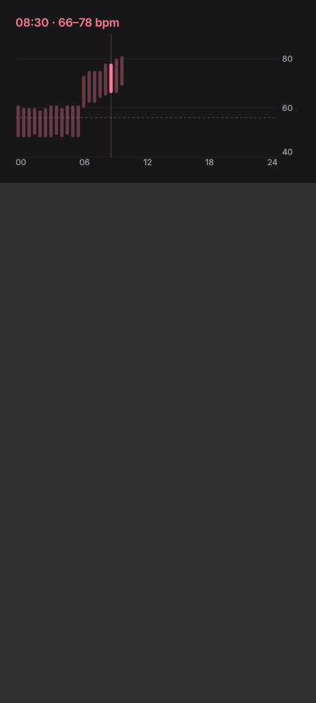
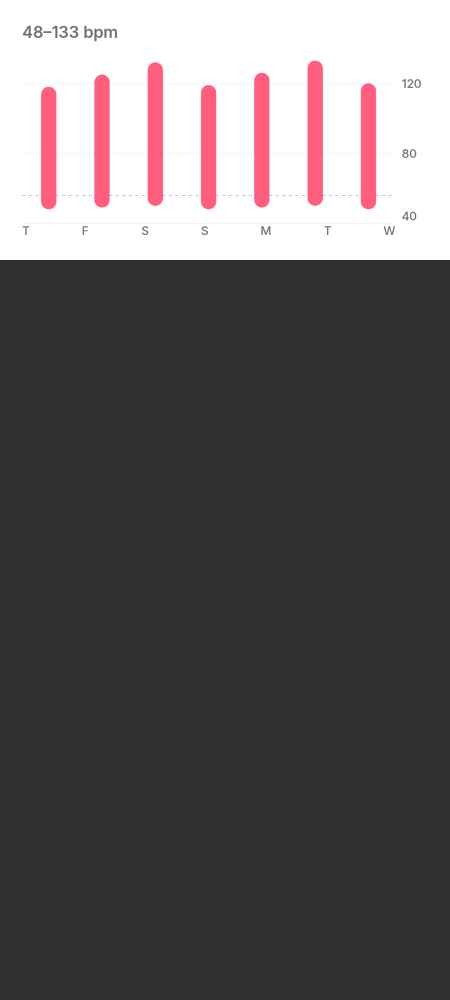
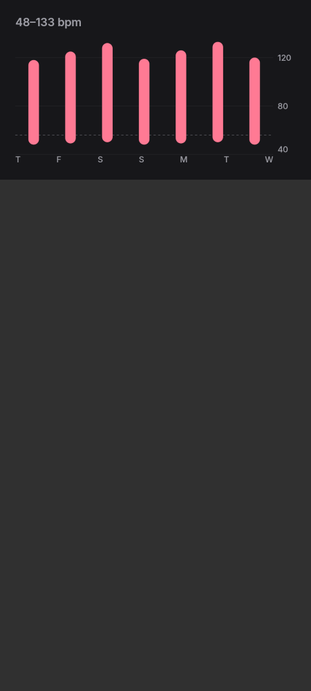
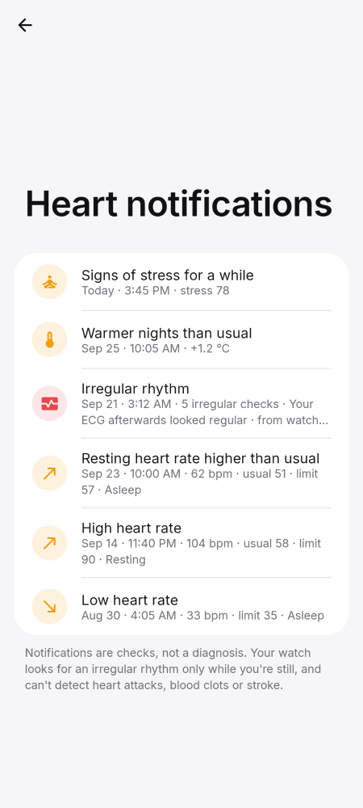
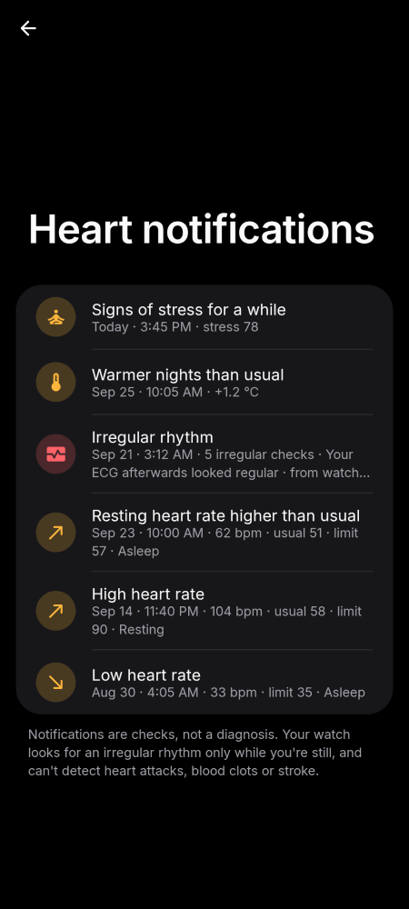

# Phone · Heart rate and alerts

Heart rate over the day and week, resting rate, HRV and rhythm alerts.

[← All screenshots](../../README.md)

| | Light | Dark |
|---|:-:|:-:|
| **Heart rate** |  |  |
| **Heart rate, no data yet** |  |  |
| **Day chart with a selected hour** |  |  |
| **Week chart** |  |  |
| **Irregular rhythm and high / low heart rate alerts** |  |  |
