# Phone · Home

Today at a glance, with a card for every measurement.

[← All screenshots](../../README.md)

| | Light | Dark |
|---|:-:|:-:|
| **Home** |  | 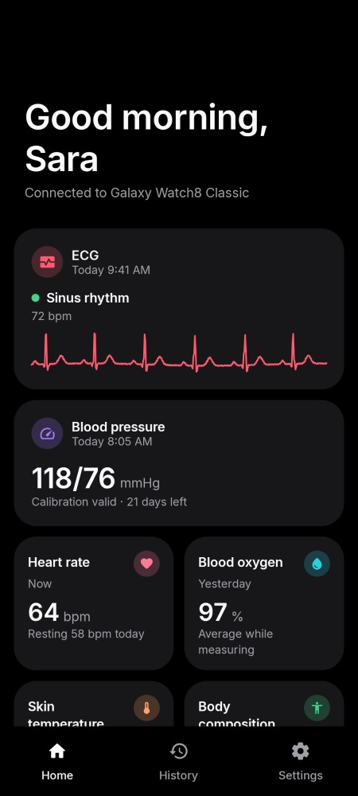 |
| **Home, scrolled** | 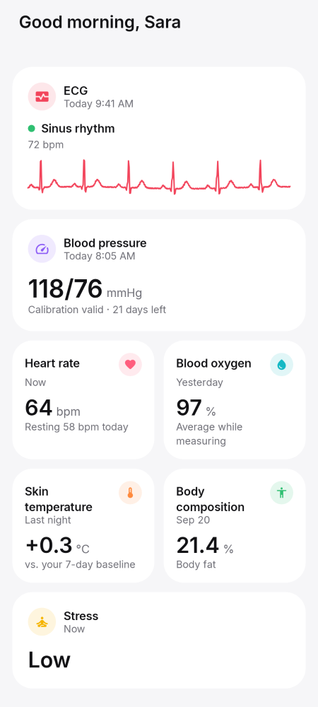 | 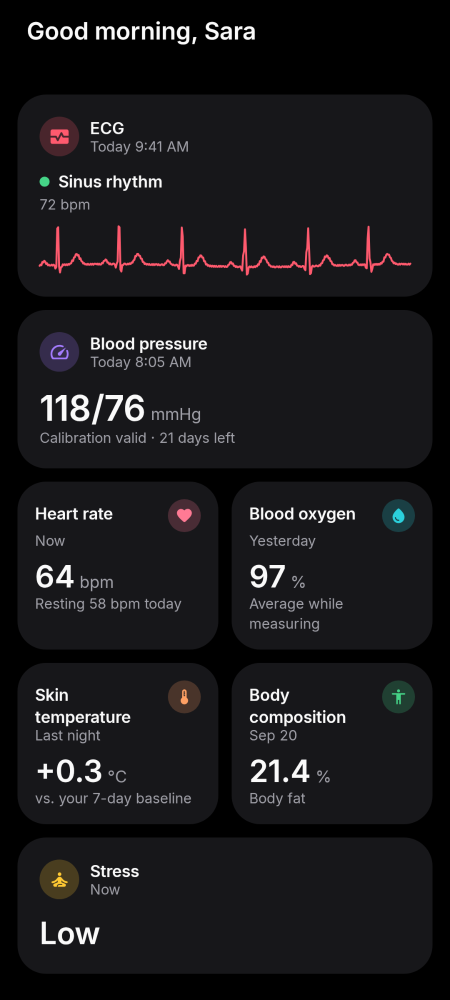 |
| **Home before the first measurement** | 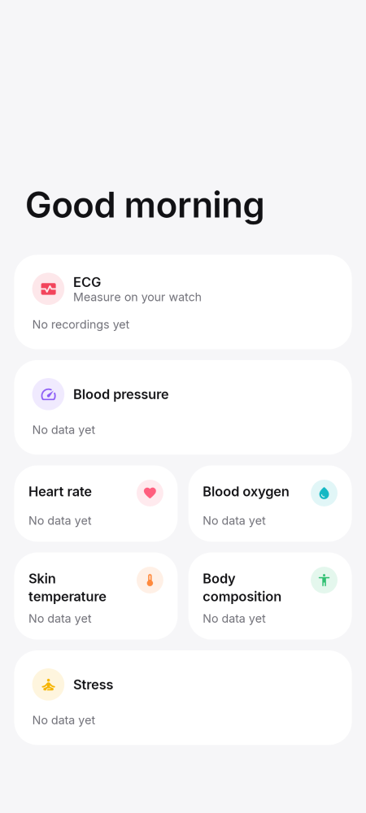 | 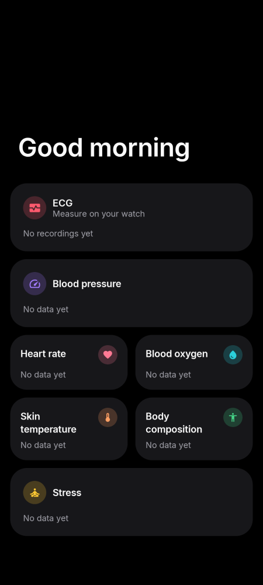 |
| **Home without a connected watch** | 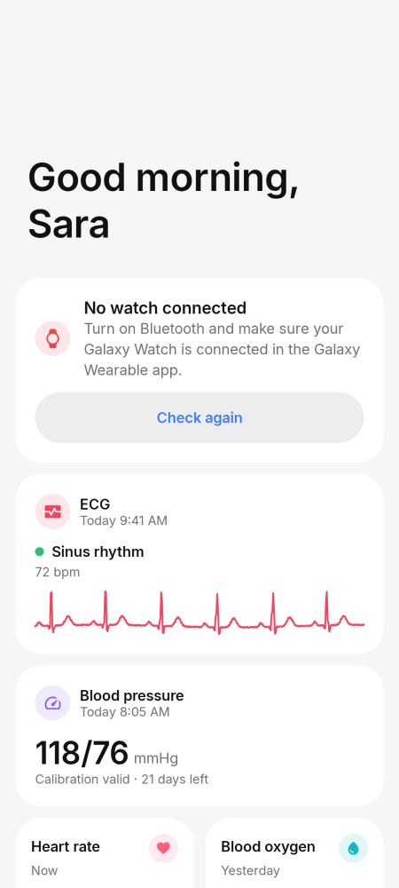 | 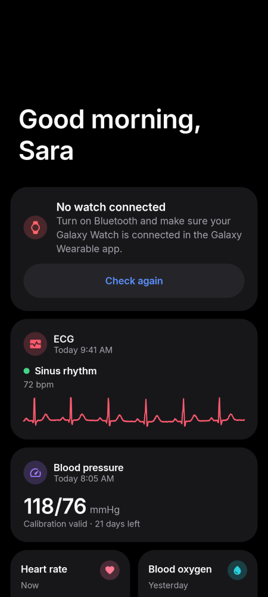 |
| **Home update ready** | 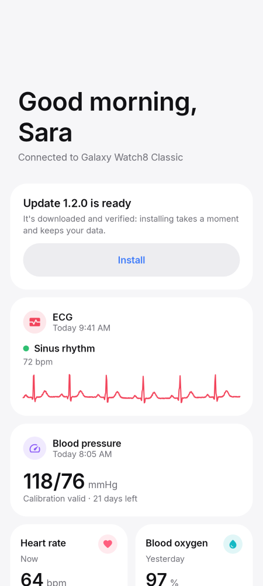 | 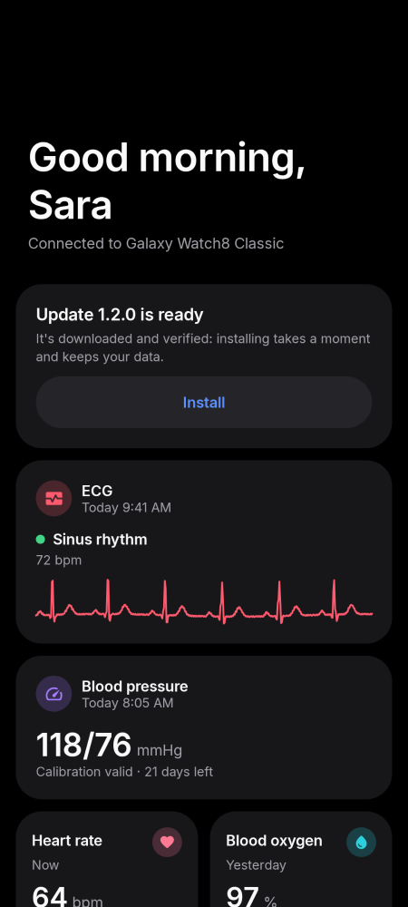 |
| **Home watch version** | 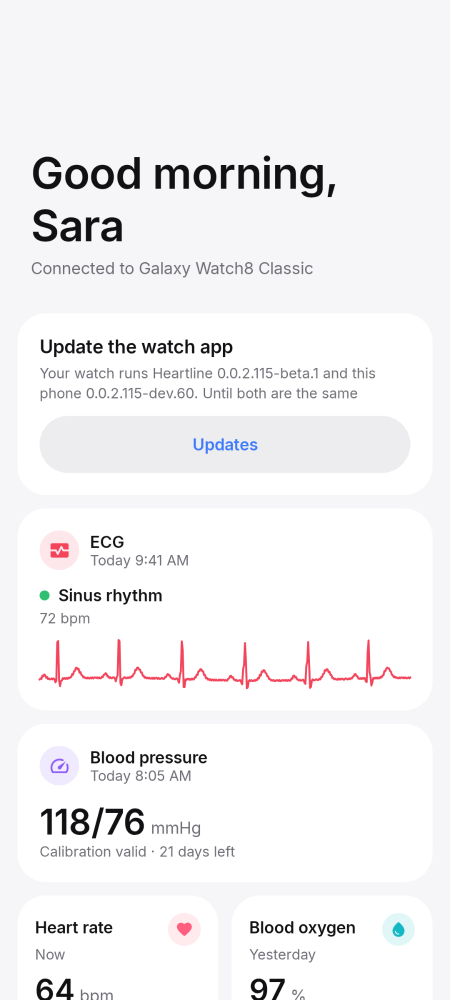 | 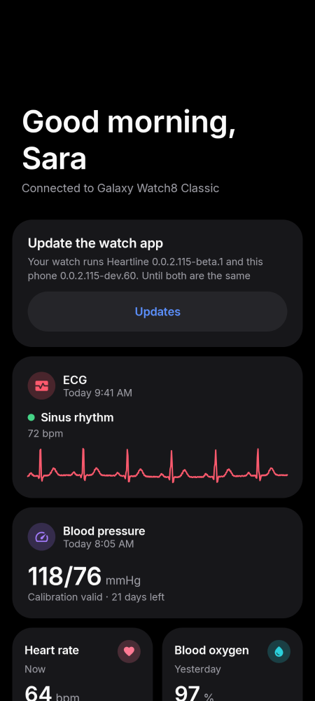 |
