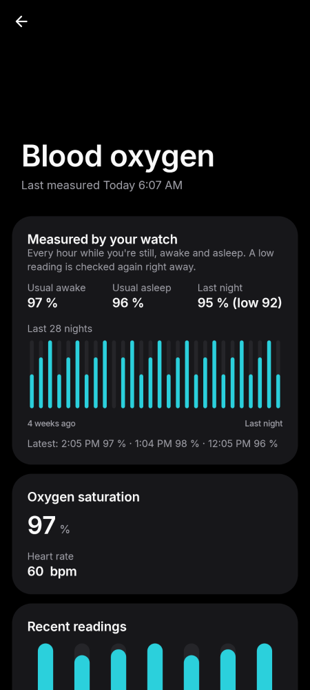
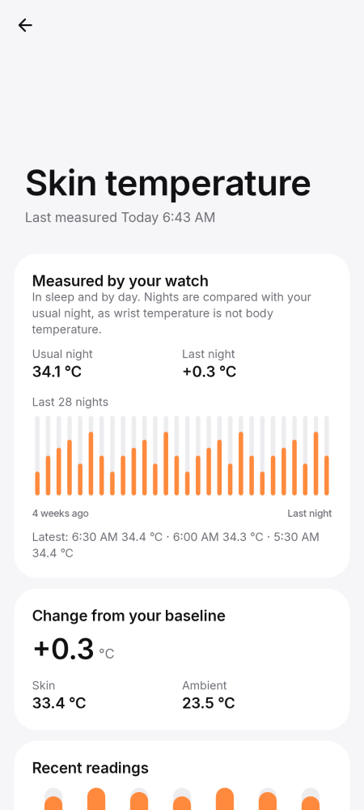
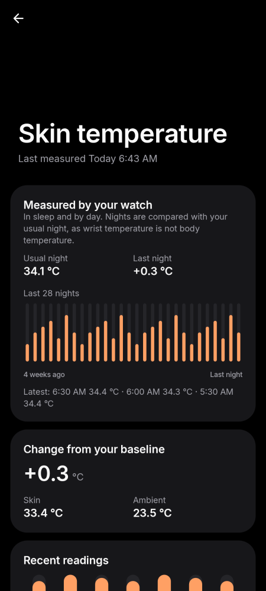
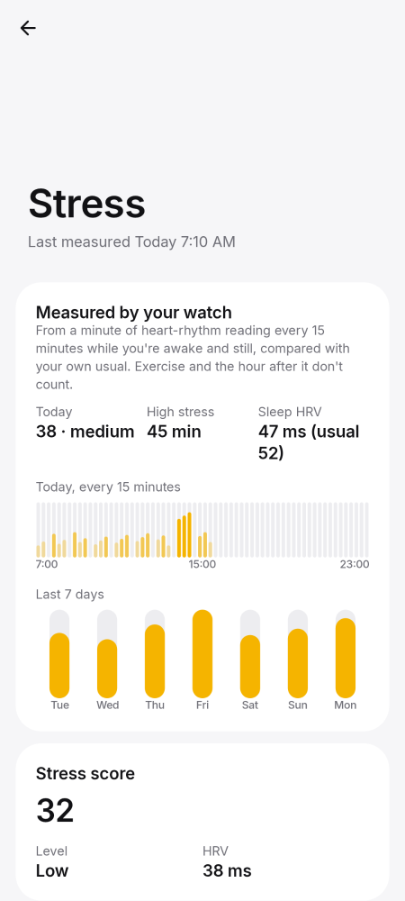
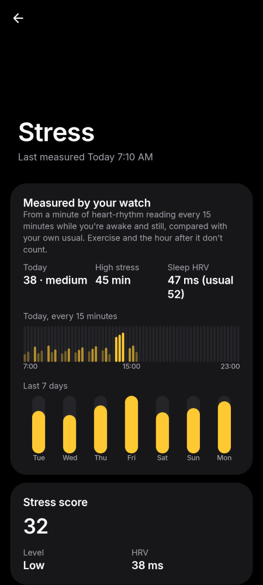

# Phone · SpO₂, temperature and stress

Blood oxygen, skin temperature and stress details.

[← All screenshots](../../README.md)

| | Light | Dark |
|---|:-:|:-:|
| **Blood oxygen** |  |  |
| **Skin temperature** |  |  |
| **Stress** |  |  |
