# Phone · Onboarding

First launch: terms, welcome, profile and connecting the watch.

[← All screenshots](../../README.md)

| | Light | Dark |
|---|:-:|:-:|
| **Terms of Use and Privacy Policy, accepted before anything else** |  | 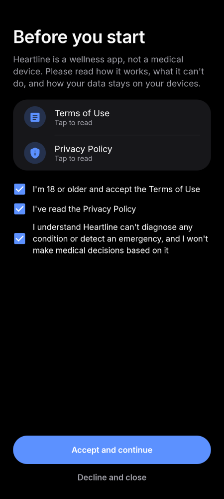 |
| **Welcome** | 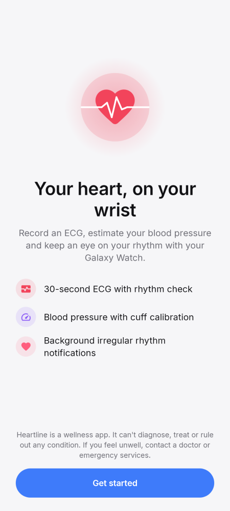 | 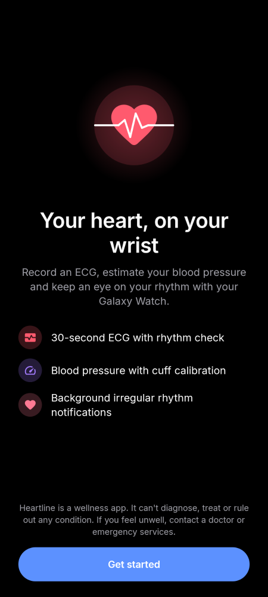 |
| **Your profile** | 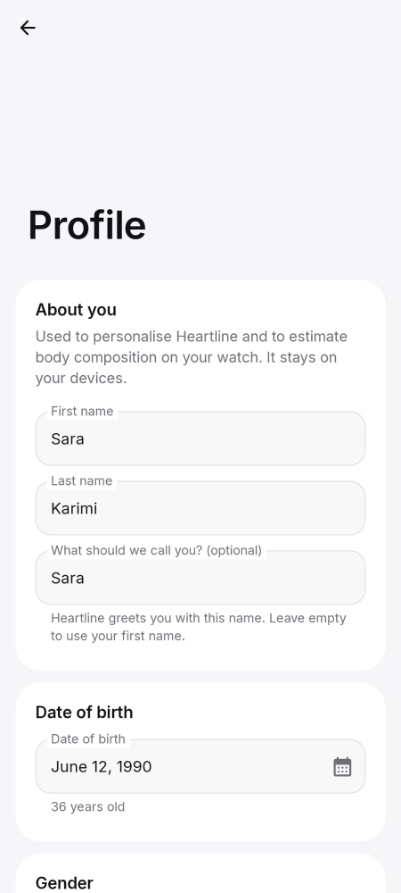 | 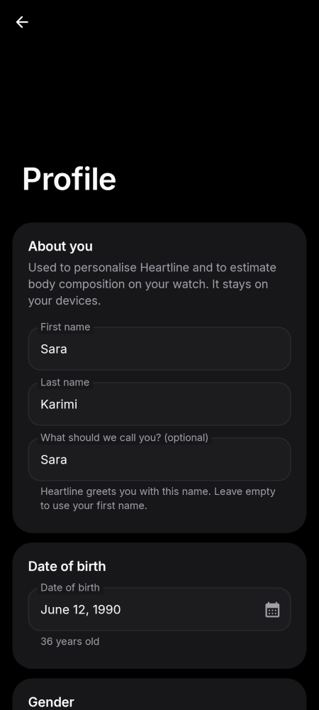 |
| **Profile with errors shown under each field** | 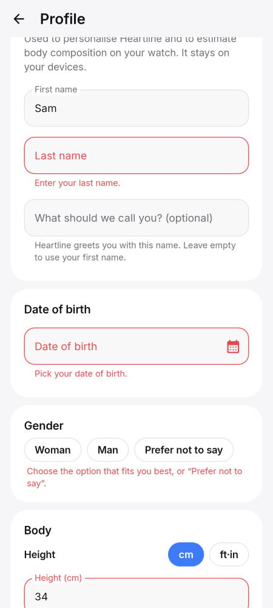 | 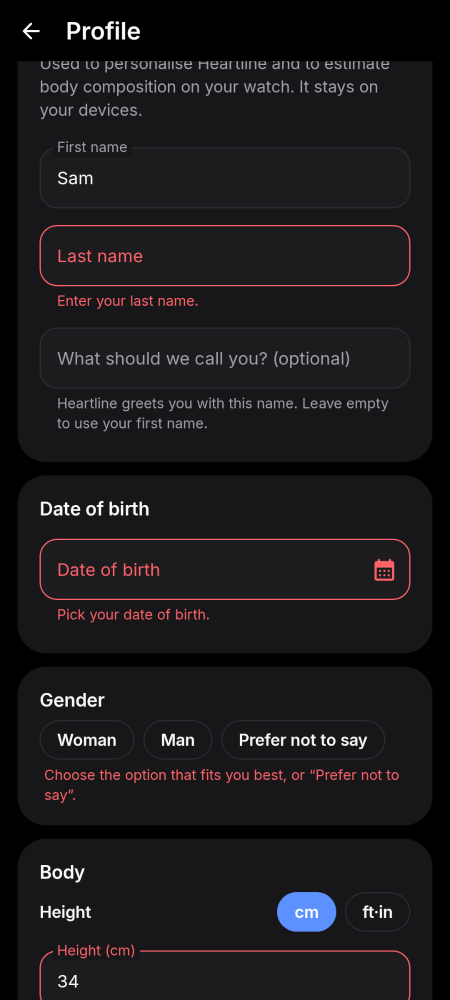 |
| **Profile: sex not given** | 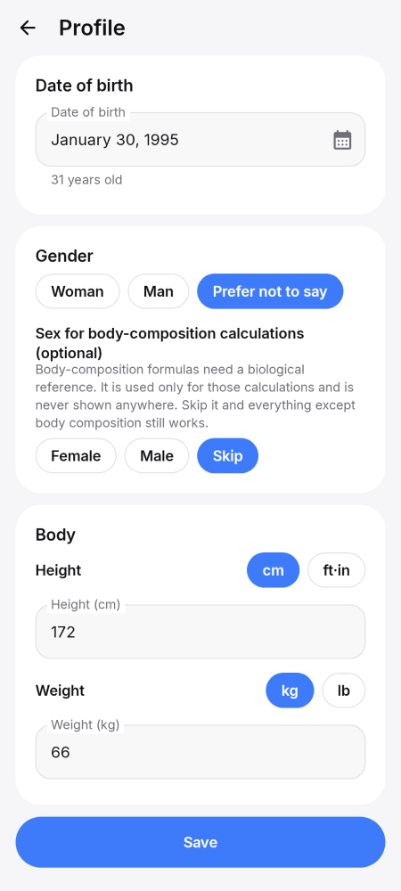 | 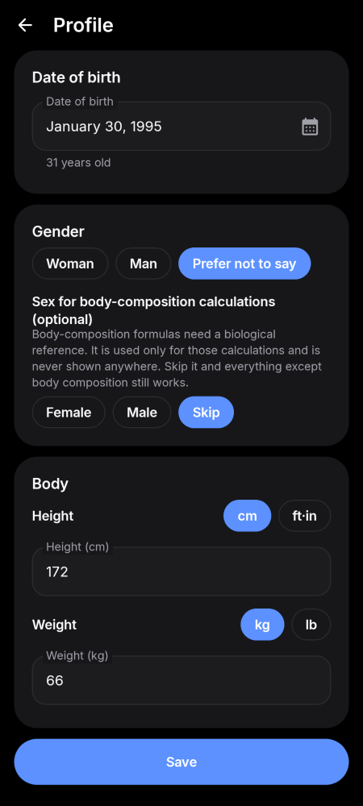 |
| **Connect your watch: watch found** | 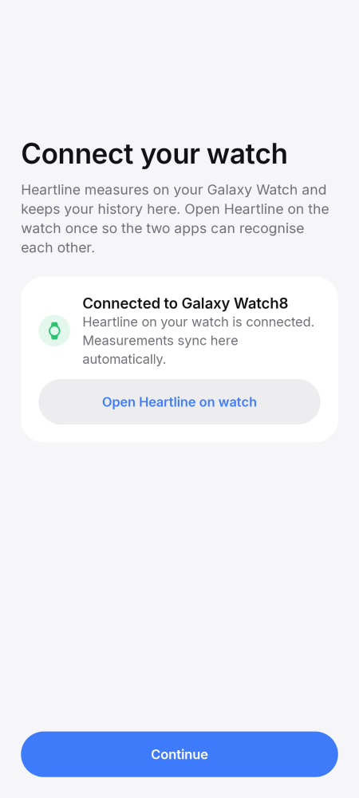 | 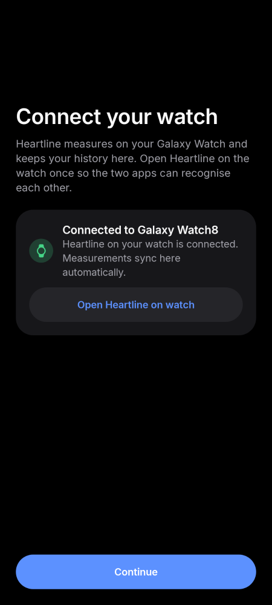 |
| **Connect your watch: Heartline not installed on the watch** | 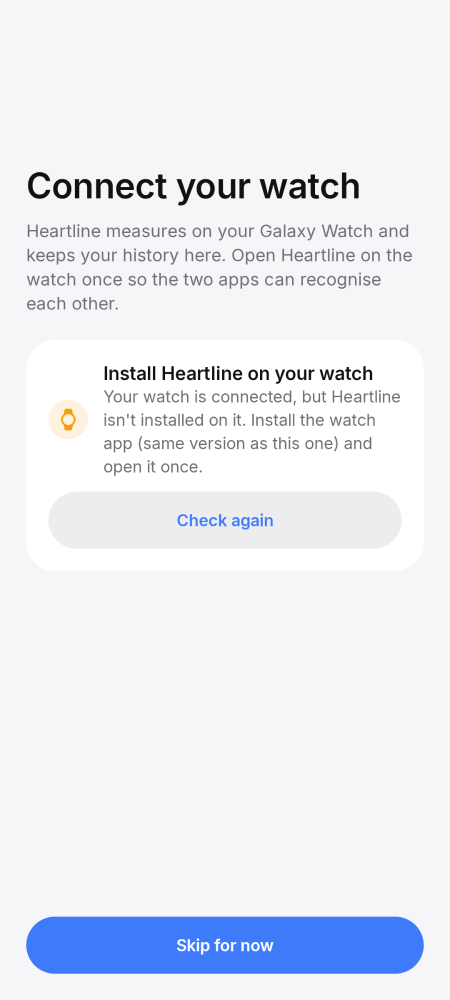 | 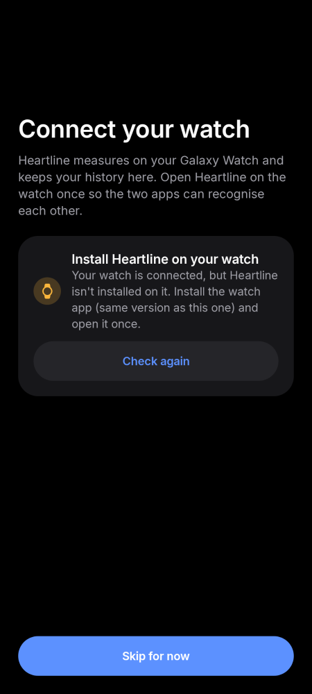 |
