# Phone · Other

Screens not yet assigned to a section.

[← All screenshots](../../README.md)

| | Light | Dark |
|---|:-:|:-:|
| **Diagnostics exporting** |  | 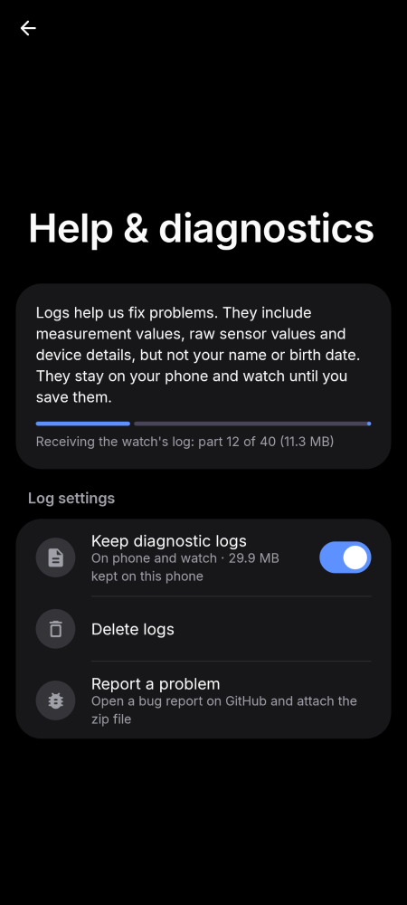 |
| **Setup health** | 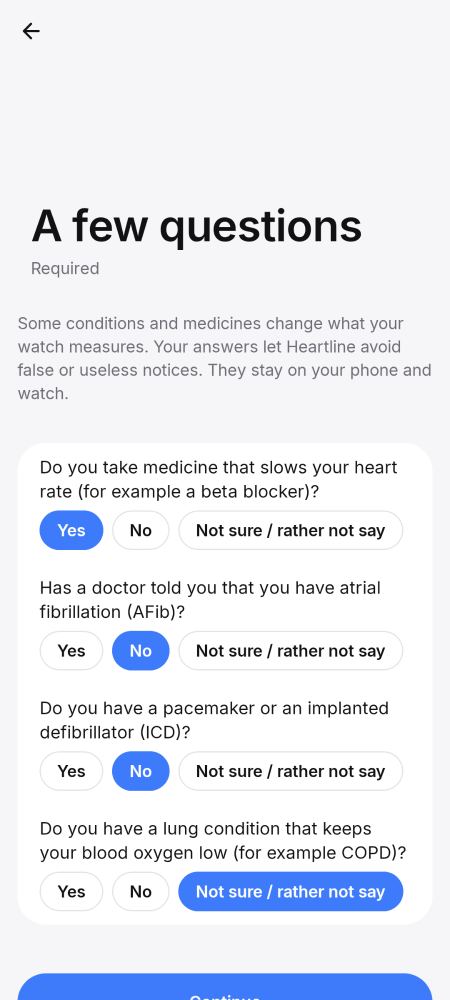 | 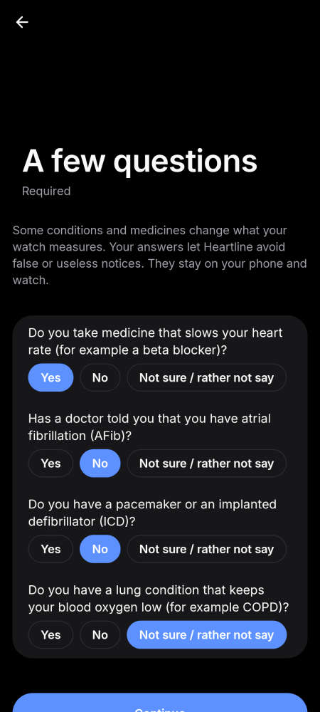 |
| **Setup monitoring** | 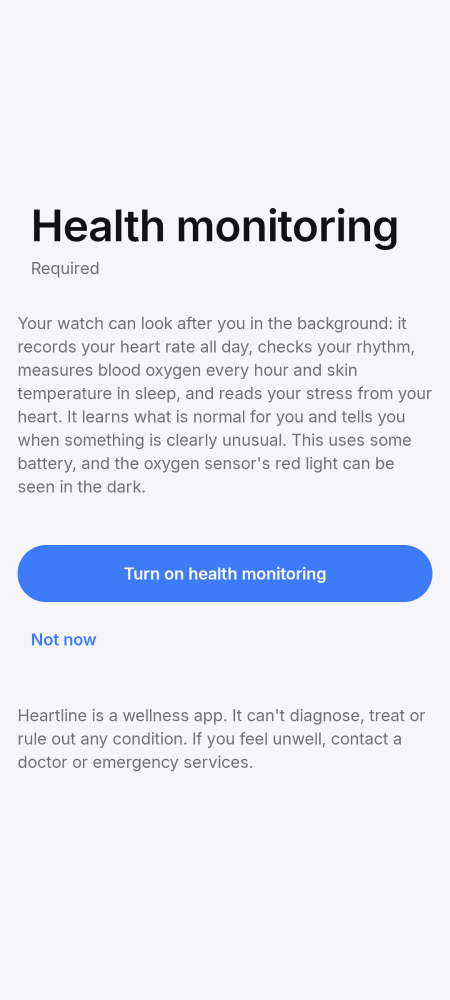 | 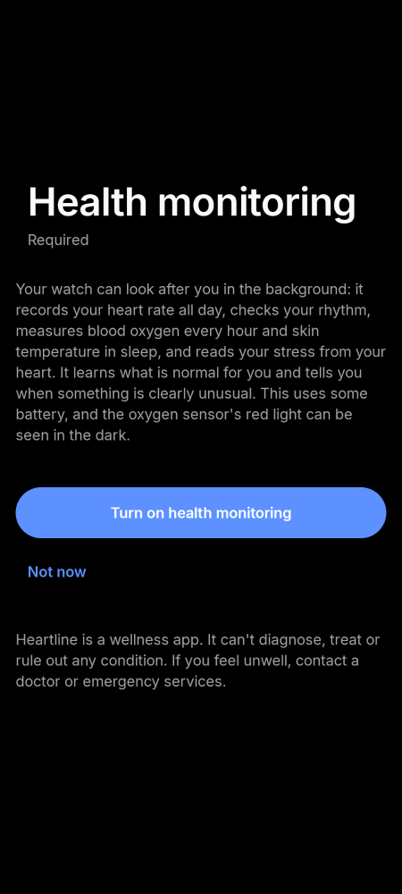 |
| **Setup optional** | 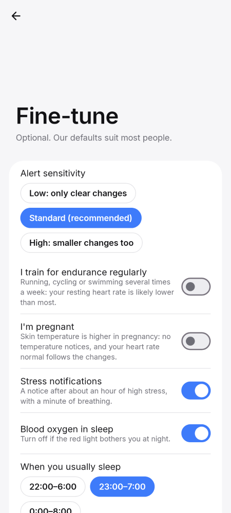 | 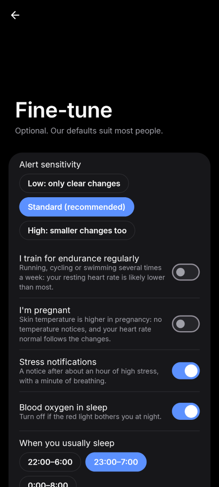 |
| **Setup parts** | 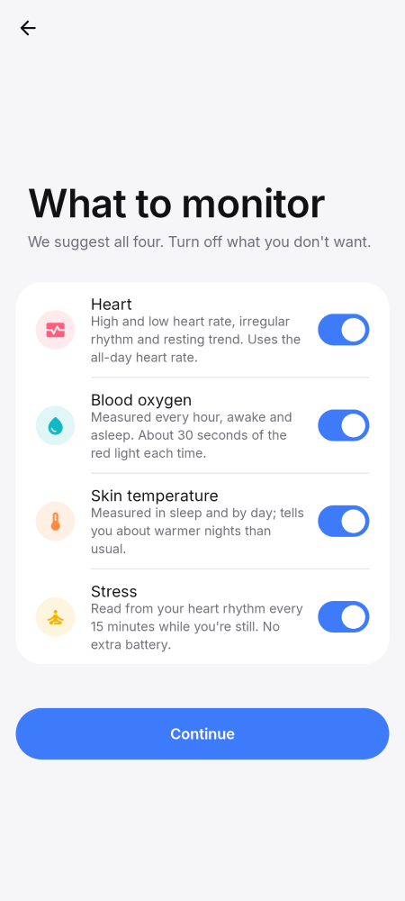 | 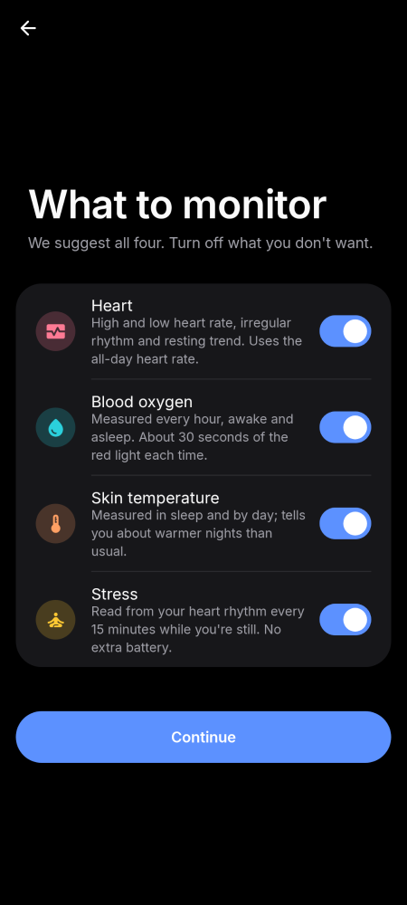 |
| **Setup summary** | 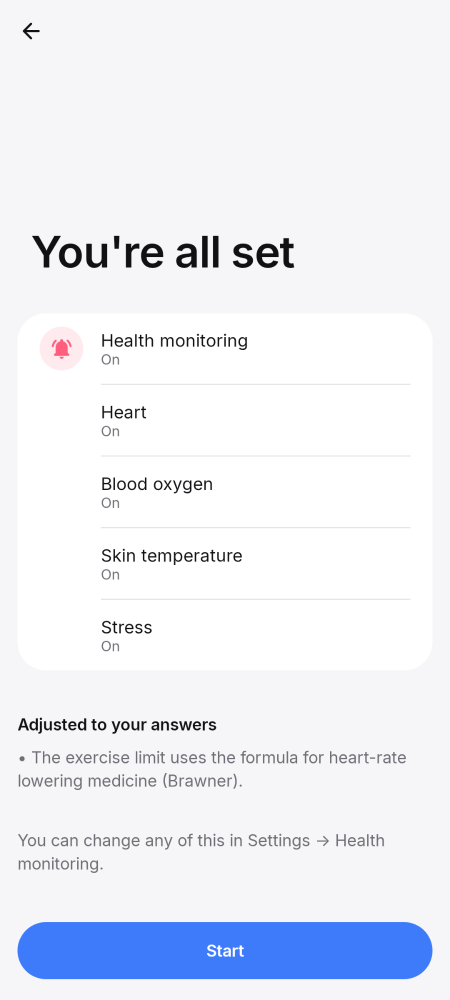 | 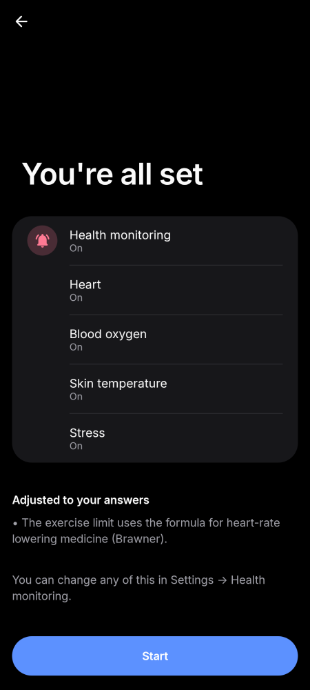 |
