# Watch · Blood pressure

Calibrated blood pressure estimates from the PPG sensor.

[← All screenshots](../../README.md)

| | Small watch (192 dp) | Large watch (454 px) |
|---|:-:|:-:|
| **How to measure** | 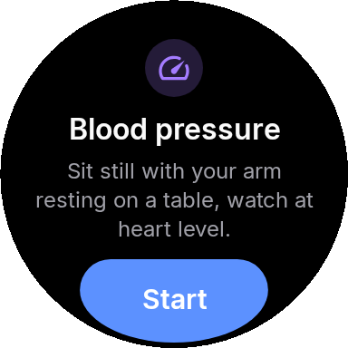 | 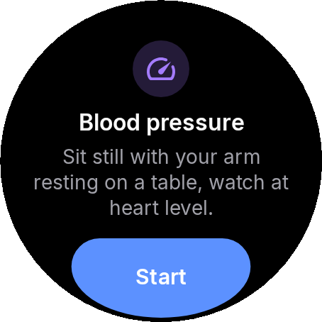 |
| **Measuring** | 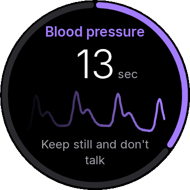 | 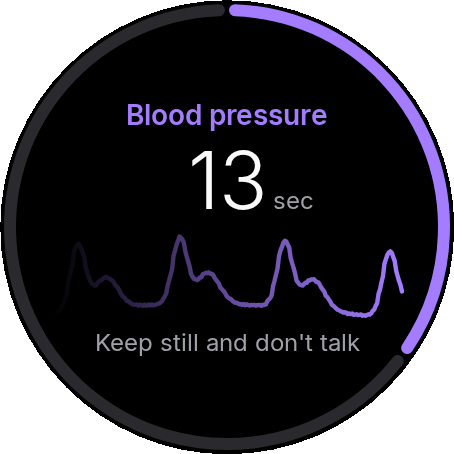 |
| **Measuring, live pulse** | 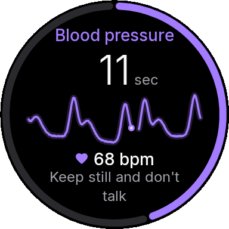 | 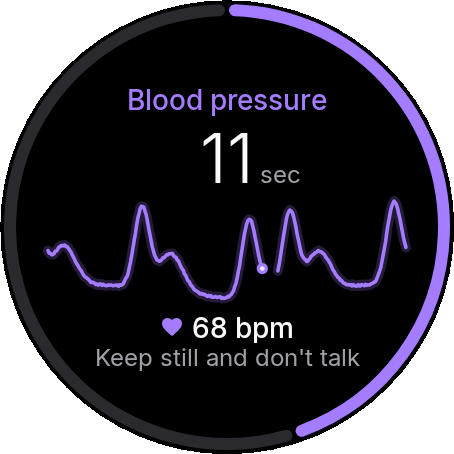 |
| **Keep your arm still** | 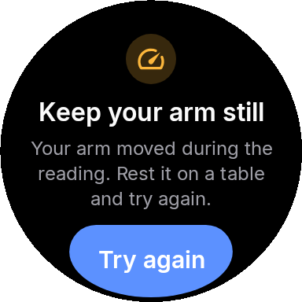 | 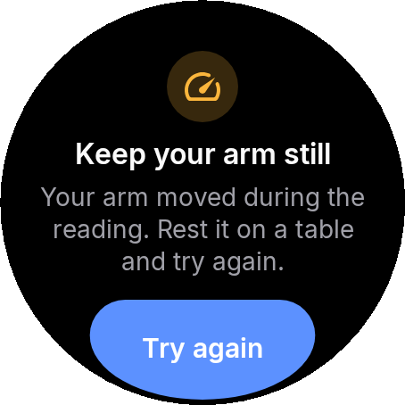 |
| **Result** | 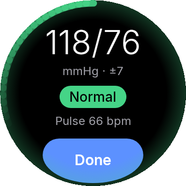 | 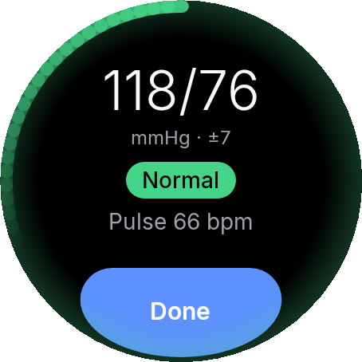 |
| **Result beyond the calibration range** | 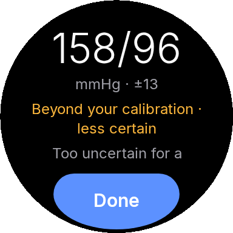 | 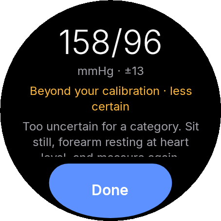 |
| **Very high result** | 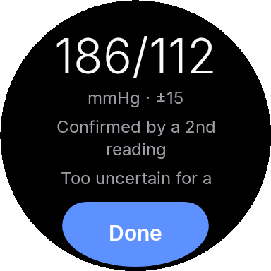 | 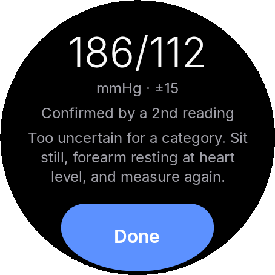 |
| **Out of range** | 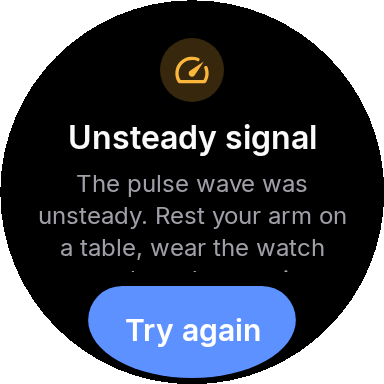 | 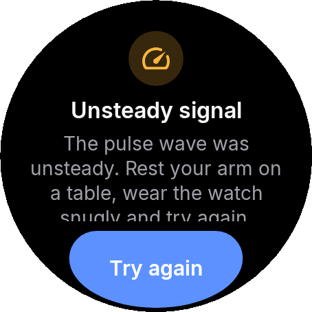 |
| **Calibration needed** | 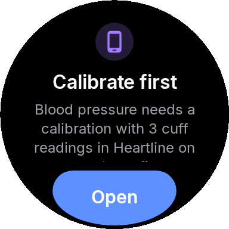 | 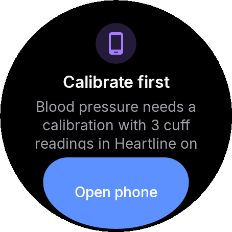 |
| **Calibration needed, opened on the phone** |  |  |
| **Calibration round** | 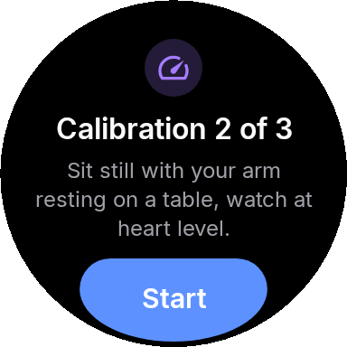 | 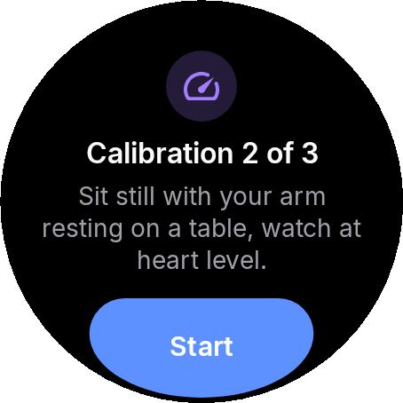 |
| **Calibration round recorded** | 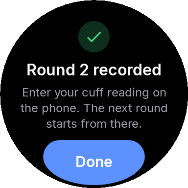 | 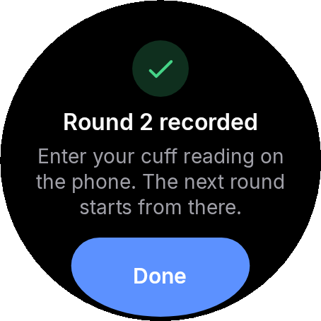 |
| **Bp calibration retry** | 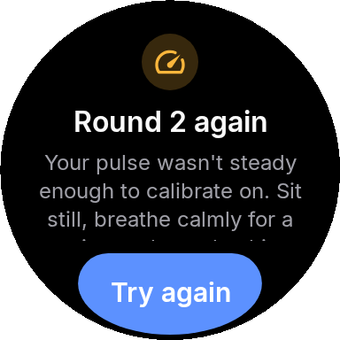 | 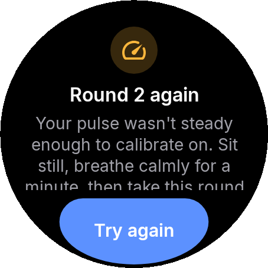 |
| **Bp instruction precise** | 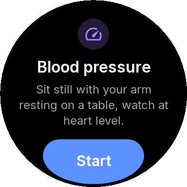 | 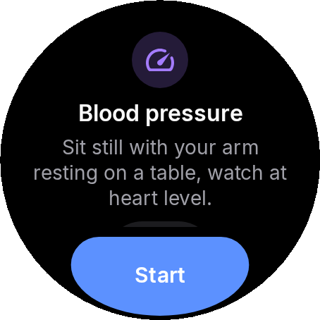 |
| **Bp measuring precise** | 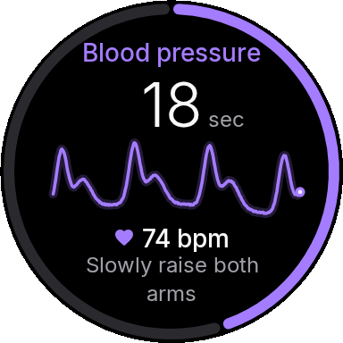 | 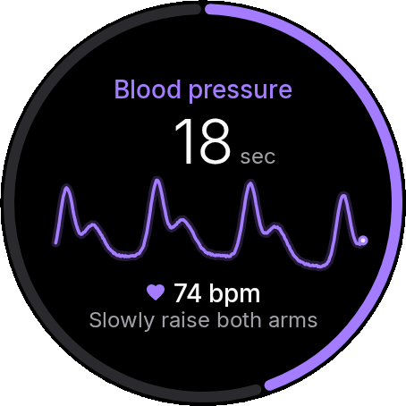 |
| **Bp result fused** | 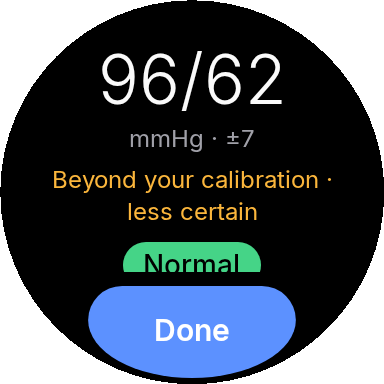 | 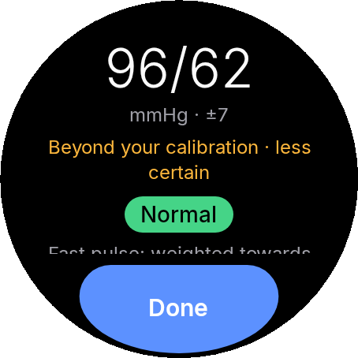 |
| **Bp result posture** | 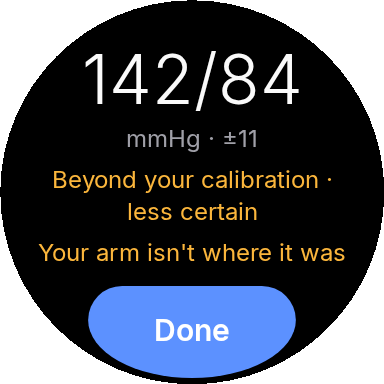 | 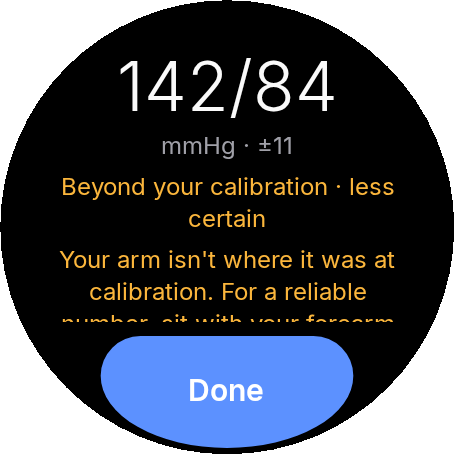 |
