# Watch · Body composition

Bioelectrical impedance with the two keys.

[← All screenshots](../../README.md)

| | Small watch (192 dp) | Large watch (454 px) |
|---|:-:|:-:|
| **Today's weight, set with the bezel** |  | 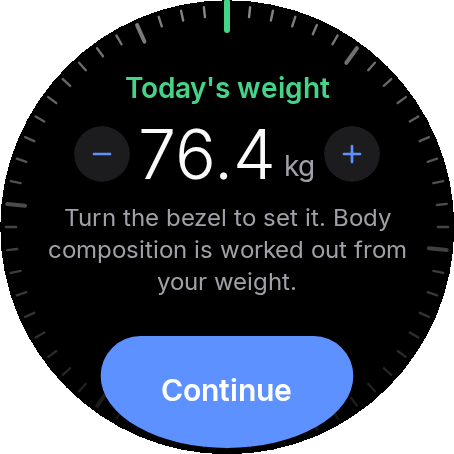 |
| **How to measure** | 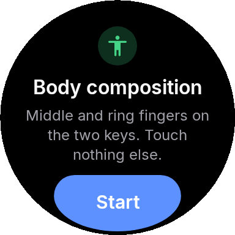 | 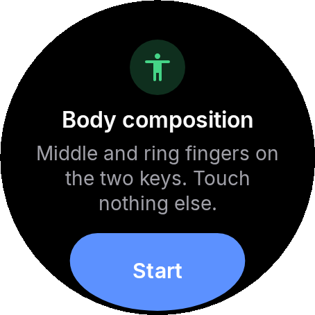 |
| **Finger missing on the upper key** | 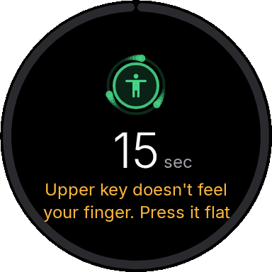 | 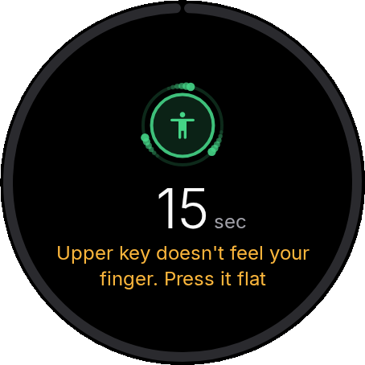 |
| **Measuring** | 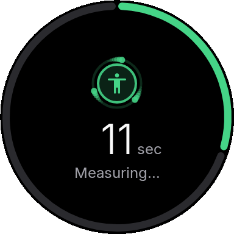 | 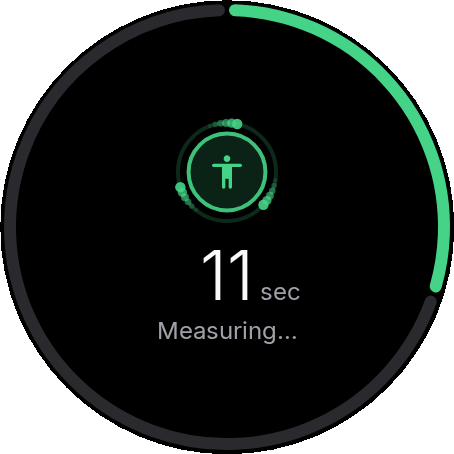 |
| **Result** | 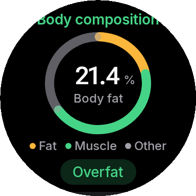 | 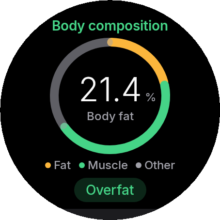 |
| **Result details** | 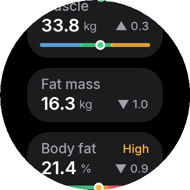 | 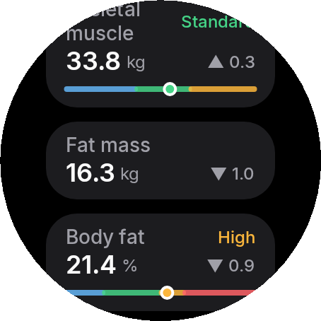 |
