# Watch · ECG

Recording a 30-second ECG and its result.

[← All screenshots](../../README.md)

| | Small watch (192 dp) | Large watch (454 px) |
|---|:-:|:-:|
| **How to record** |  | 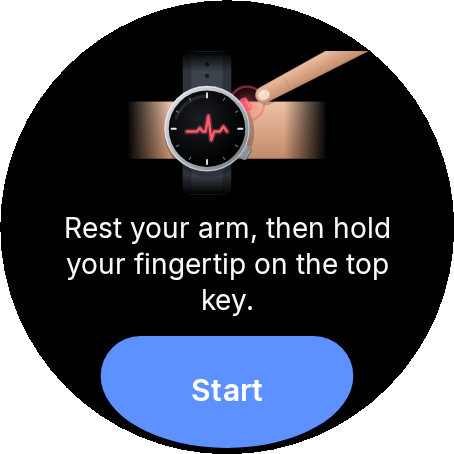 |
| **Waiting for your finger** | 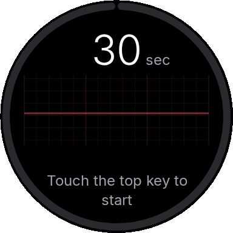 | 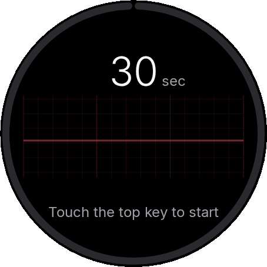 |
| **Checking contact** | 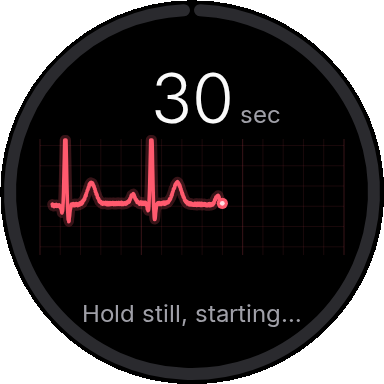 | 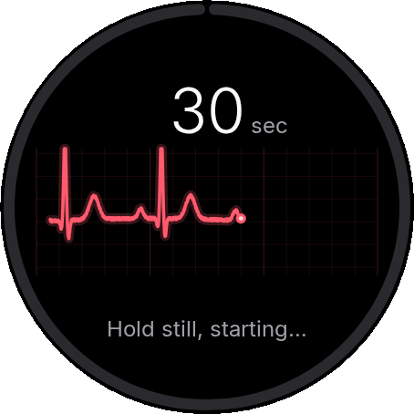 |
| **Recording** | 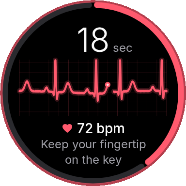 | 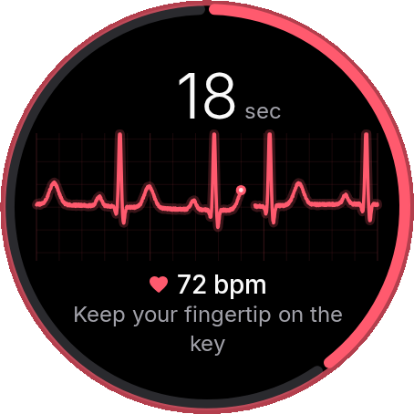 |
| **Finger lifted** | 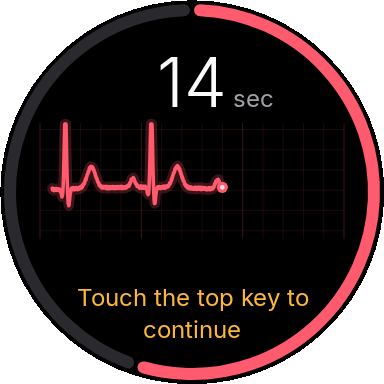 | 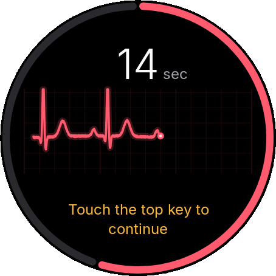 |
| **Weak signal hint** | 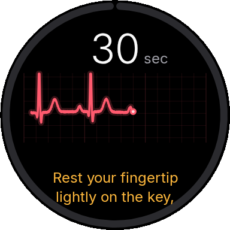 | 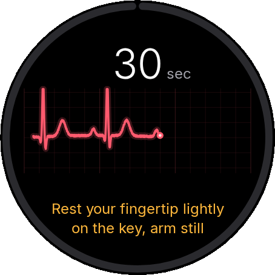 |
| **Analysing** | 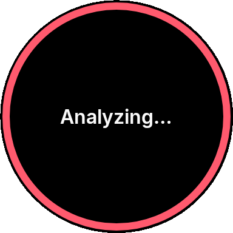 | 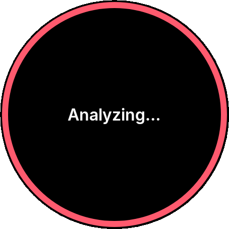 |
| **Result: sinus rhythm** | 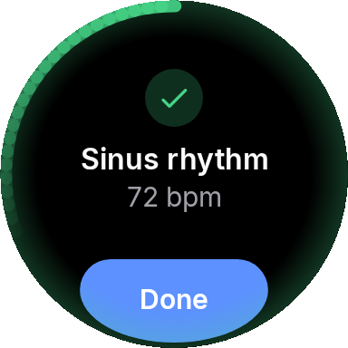 | 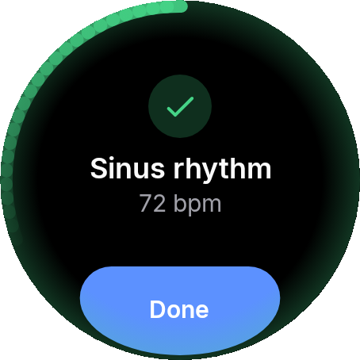 |
| **Result: signs of AFib** | 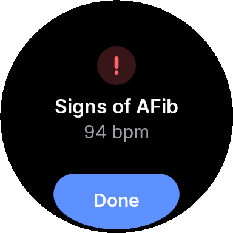 | 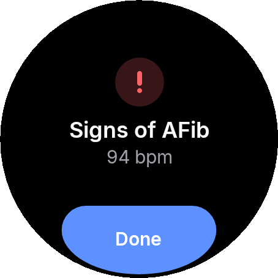 |
| **Result: inconclusive, with the reason** | 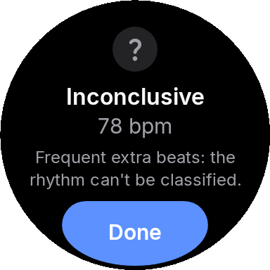 | 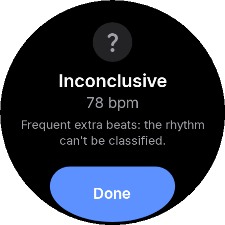 |
| **Result: poor recording, with the reason** | 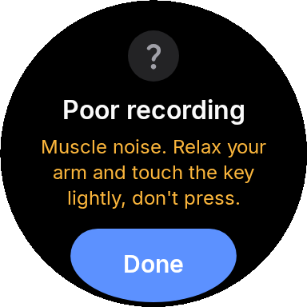 | 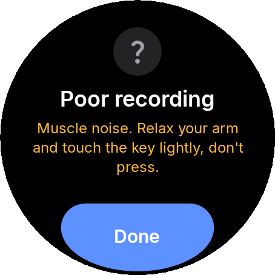 |
