# Watch · Launcher and history

The start screen, its options, history and celebrations.

[← All screenshots](../../README.md)

| | Small watch (192 dp) | Large watch (454 px) |
|---|:-:|:-:|
| **Launcher** |  | 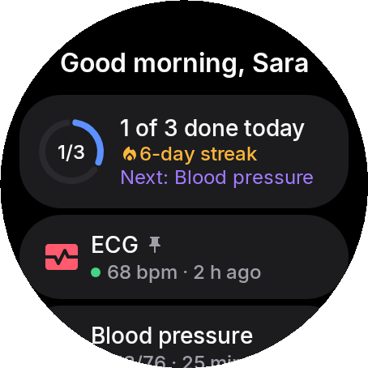 |
| **Launcher on your birthday** | 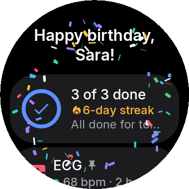 | 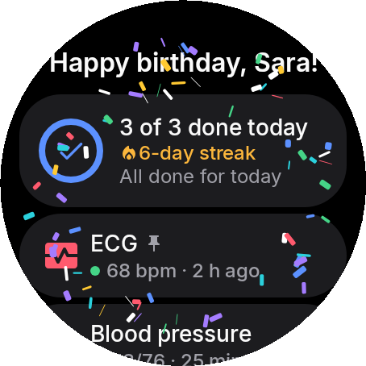 |
| **Choose what the launcher shows** | 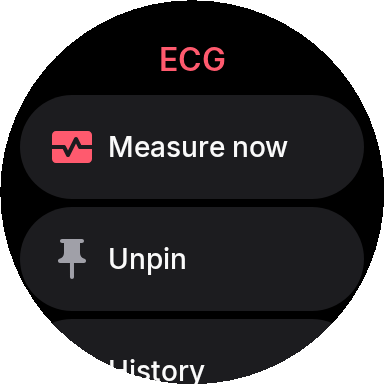 | 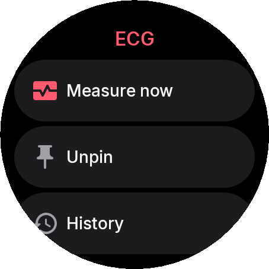 |
| **History** | 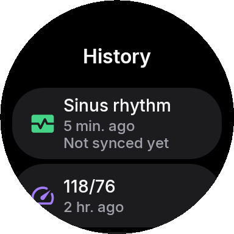 | 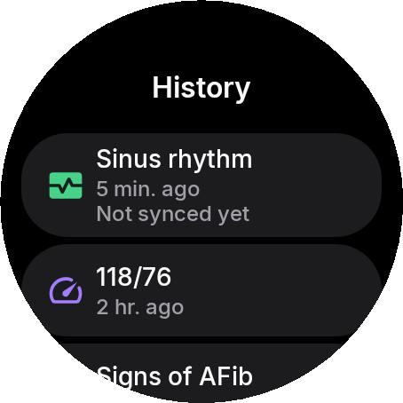 |
| **Daily goal reached** | 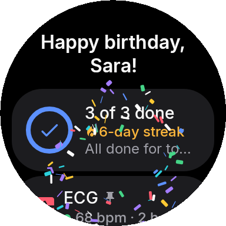 | 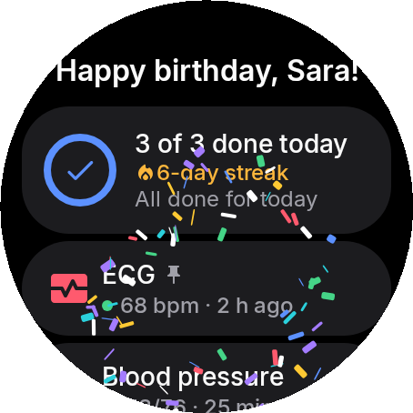 |
| **Edge glow effect** | 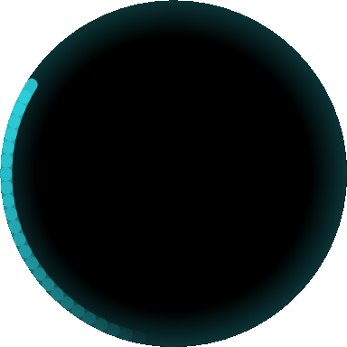 | 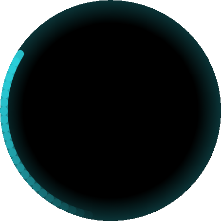 |
