# Watch · SpO₂, temperature and stress

Quick measurements.

[← All screenshots](../../README.md)

| | Small watch (192 dp) | Large watch (454 px) |
|---|:-:|:-:|
| **Blood oxygen: how to measure** |  | 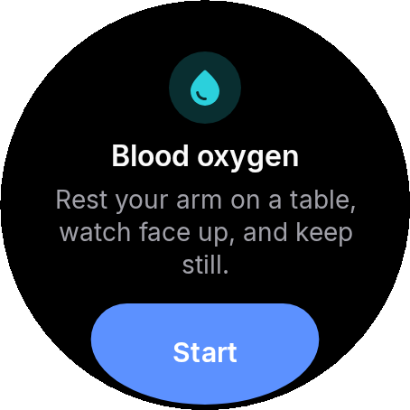 |
| **Blood oxygen: measuring** | 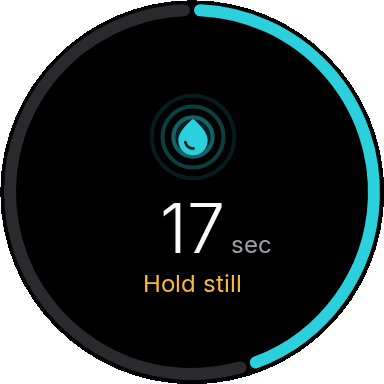 | 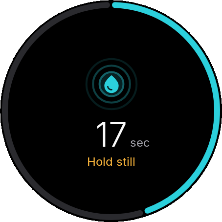 |
| **Blood oxygen: measuring, live** | 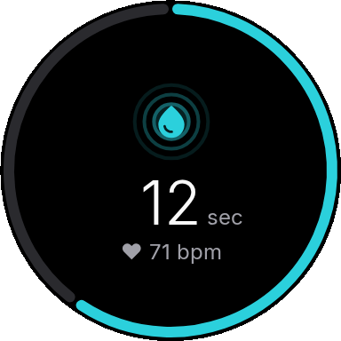 | 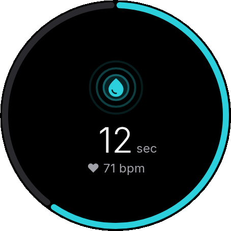 |
| **Blood oxygen: result** | 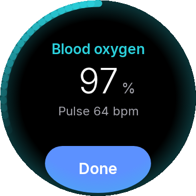 | 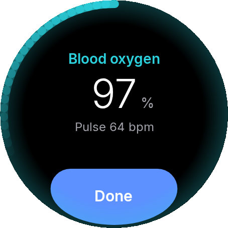 |
| **Skin temperature: measuring** | 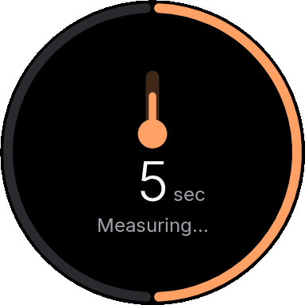 | 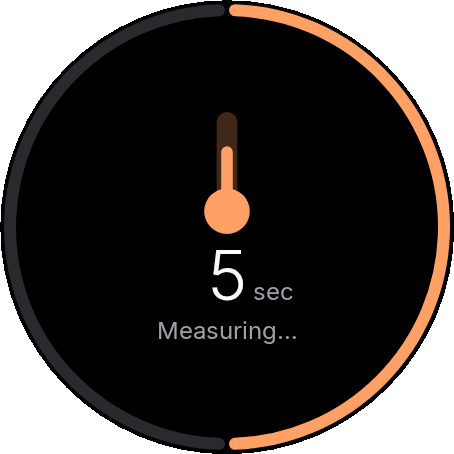 |
| **Skin temperature: result** | 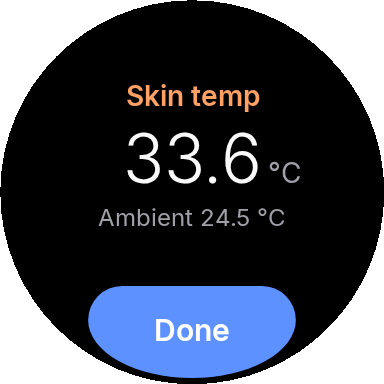 | 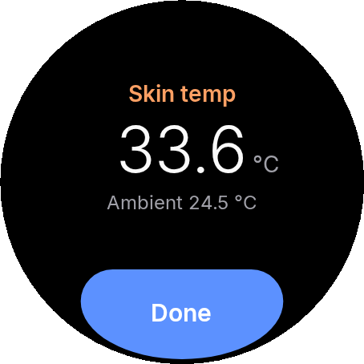 |
| **Stress: measuring** | 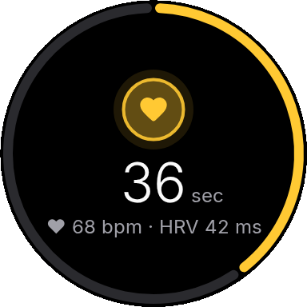 | 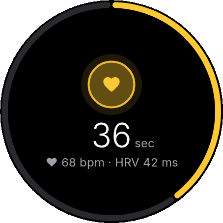 |
| **Stress: result** | 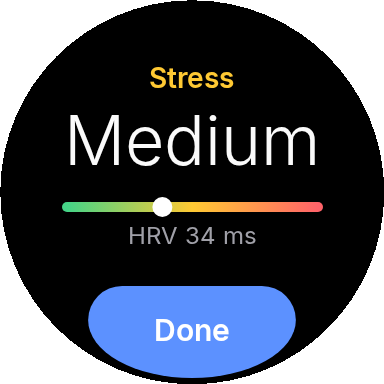 | 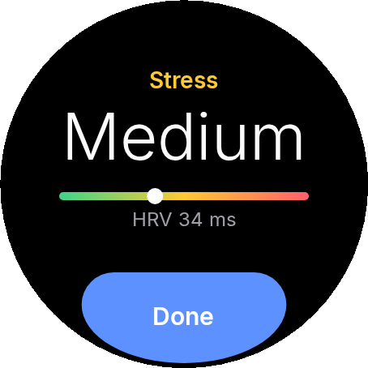 |
