# Watch · Settings

Watch settings.

[← All screenshots](../../README.md)

| | Small watch (192 dp) | Large watch (454 px) |
|---|:-:|:-:|
| **Settings** |  | 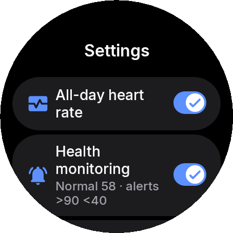 |
| **Settings: alerts and effects** | 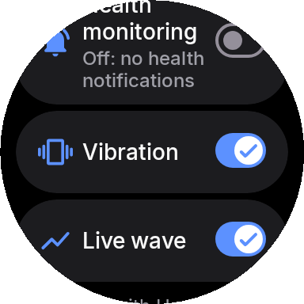 | 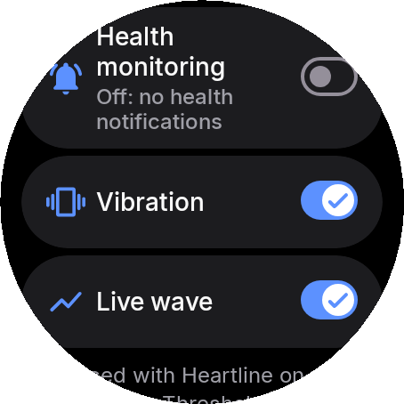 |
| **Settings: source code and community (open on the phone)** | 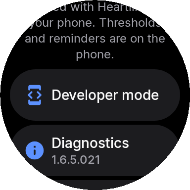 | 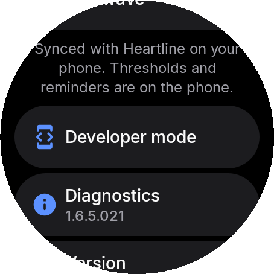 |
| **Settings all day off confirm** | 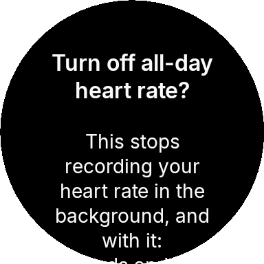 | 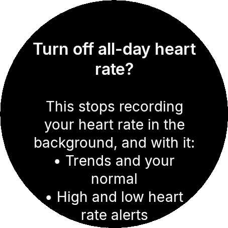 |
| **Settings monitoring off confirm** | 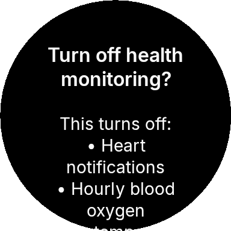 | 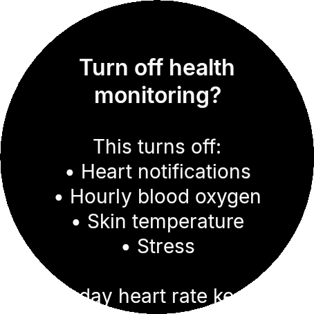 |
| **Settings monitoring off sure** | 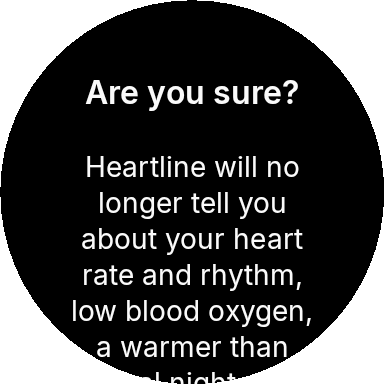 | 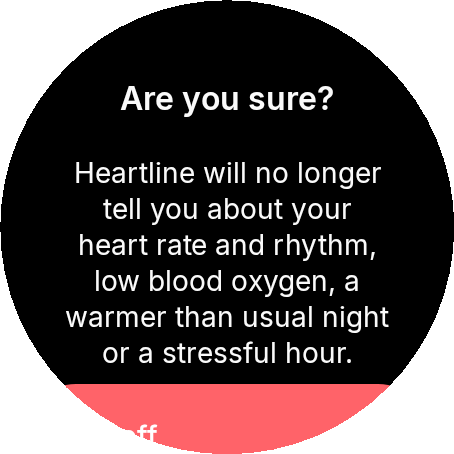 |
| **Settings parts** | 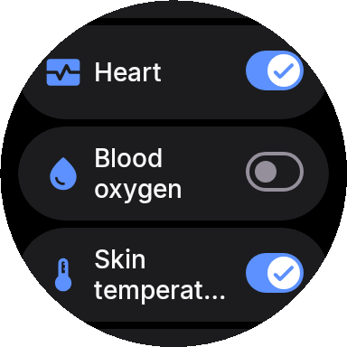 | 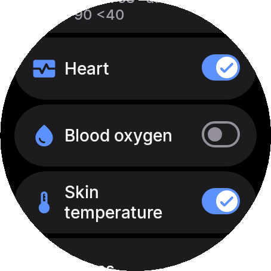 |
| **Settings setup needed** | 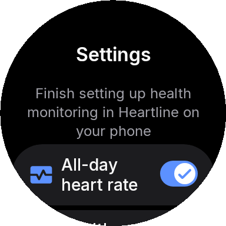 | 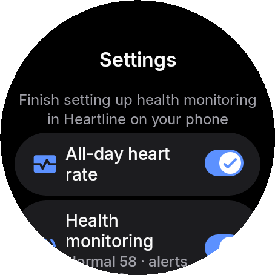 |
