# Watch · Setup

Connecting to the phone, permissions and the sensor check.

[← All screenshots](../../README.md)

| | Small watch (192 dp) | Large watch (454 px) |
|---|:-:|:-:|
| **Connecting to the phone** | 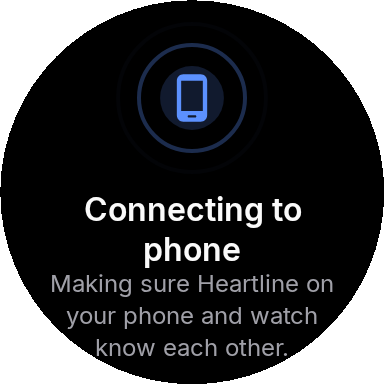 | 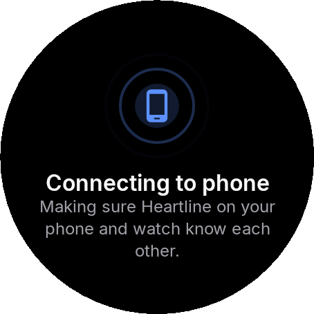 |
| **Phone not found** | 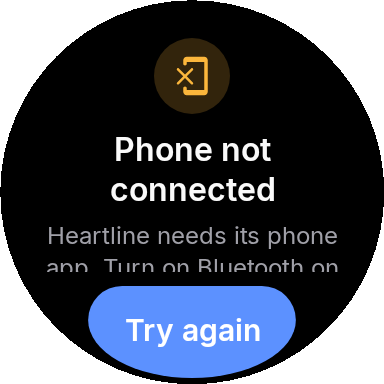 | 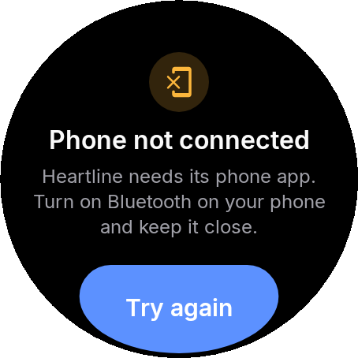 |
| **Phone not responding** | 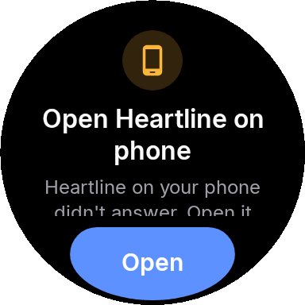 | 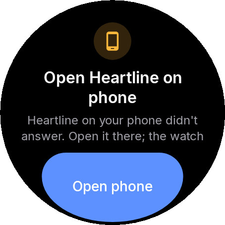 |
| **Heartline missing on the phone** | 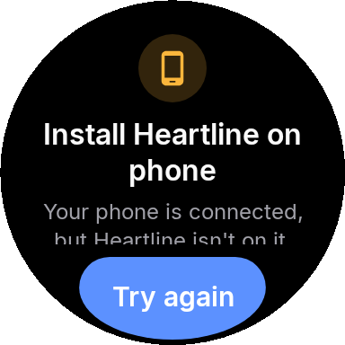 | 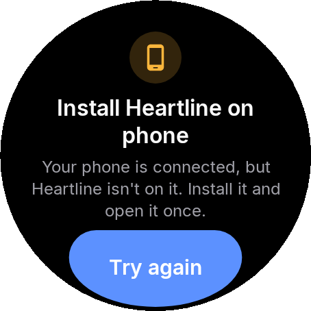 |
| **Finish setup on the phone** | 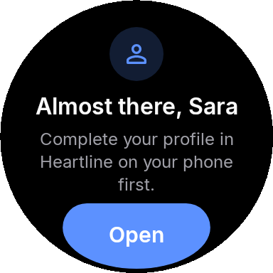 | 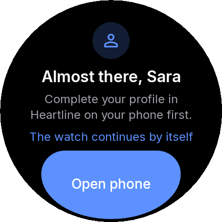 |
| **Accept the terms on the phone** | 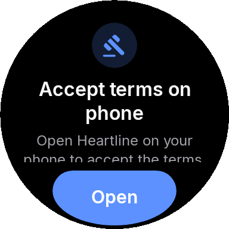 | 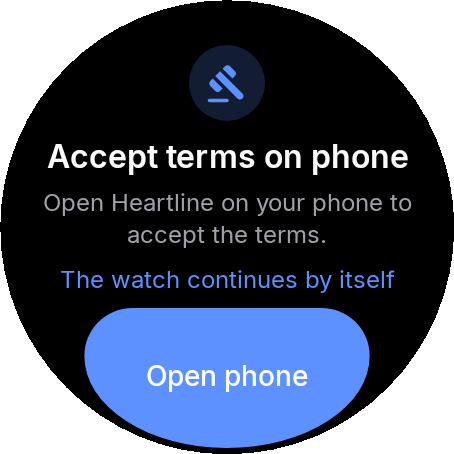 |
| **Profile needed** | 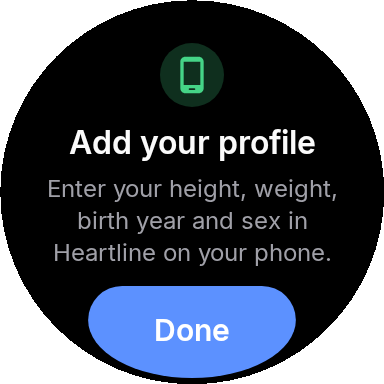 | 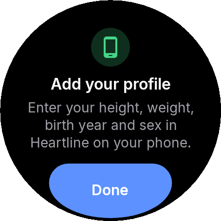 |
| **Permissions** | 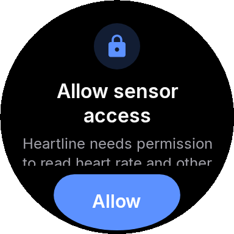 | 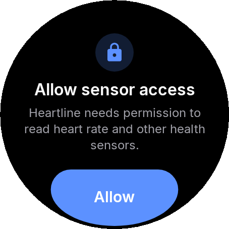 |
| **Checking the sensors** | 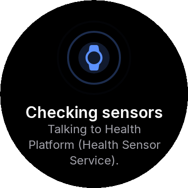 | 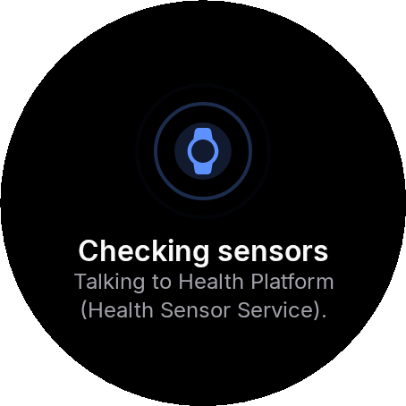 |
| **Developer mode guide** | 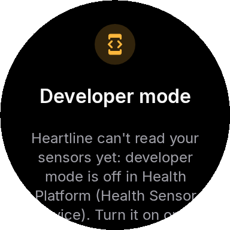 | 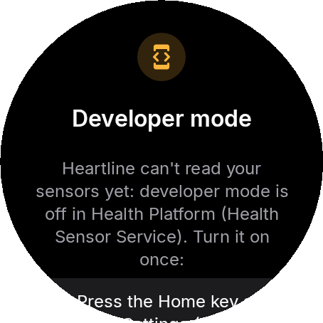 |
| **Developer mode guide, last step** | 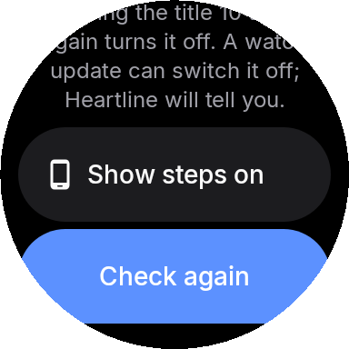 | 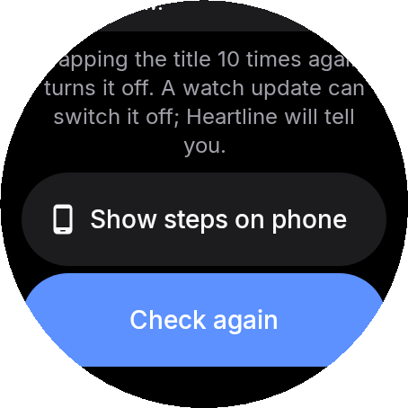 |
| **Sensor access blocked (developer mode off)** | 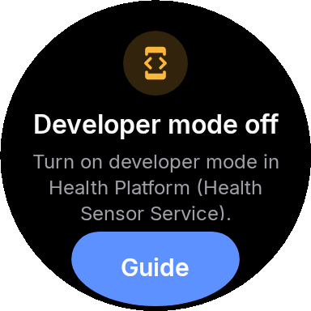 | 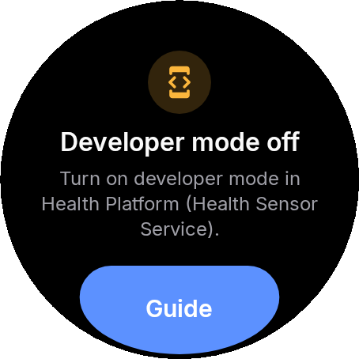 |
| **Measurement not supported on this watch** | 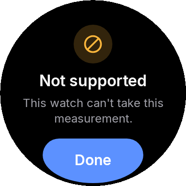 | 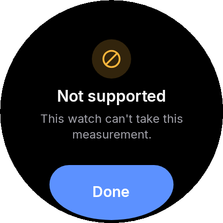 |
| **Diagnostics** | 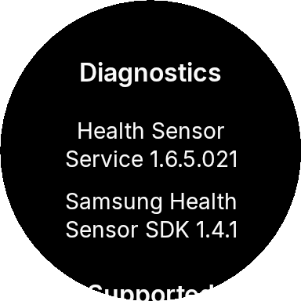 | 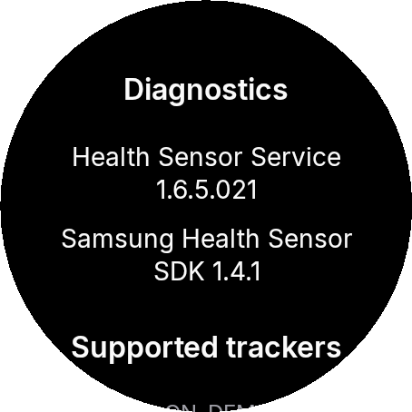 |
