# Watch · Tiles and cards

Heartline cards for the tile stack (small and large, One UI 9 Watch / Wear OS 7) and full-screen tiles for older watches. Complications show the same values on the watch face.

[← All screenshots](../../README.md)

| | Small card | Large card | Full-screen tile |
|---|:-:|:-:|:-:|
| **Heart rate** | 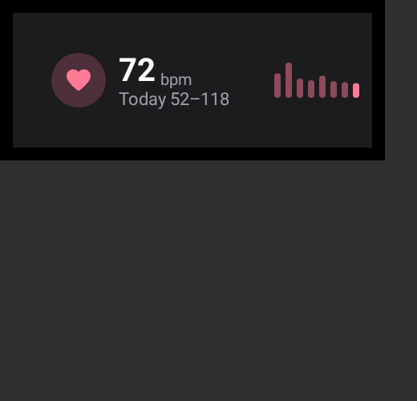 |  | 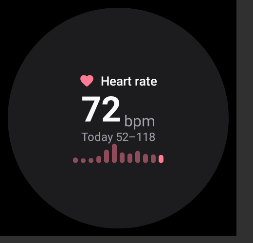 |
| **Heart rate, no data yet** | 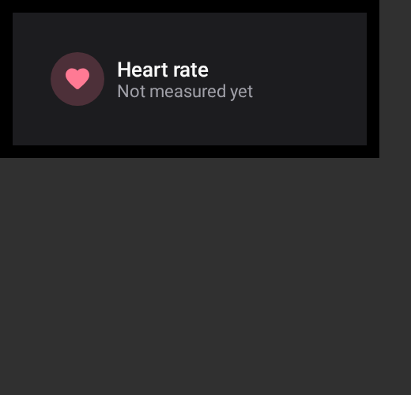 | 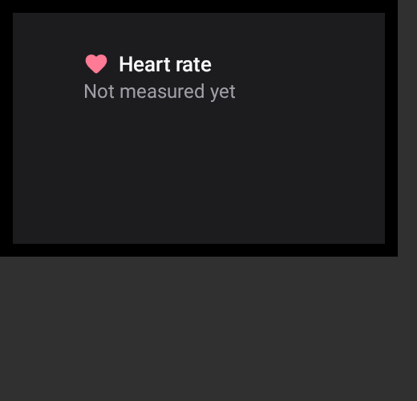 | 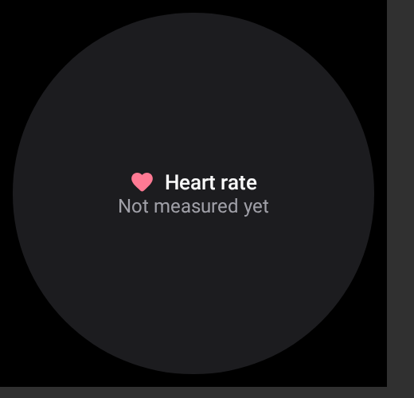 |
| **Blood pressure** | 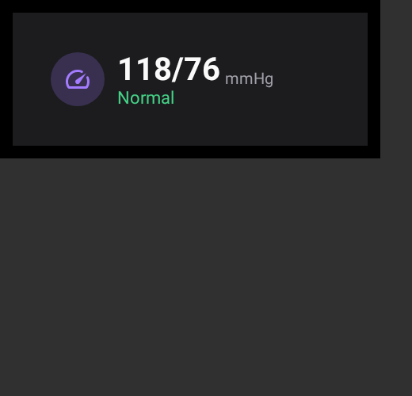 | 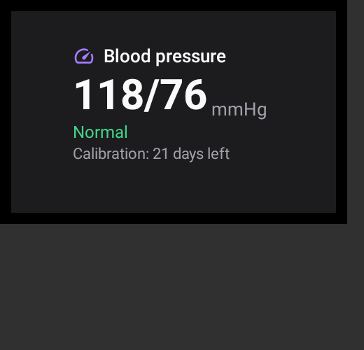 | 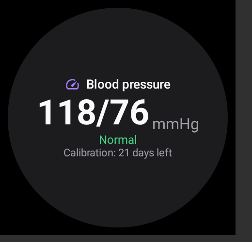 |
| **ECG** | 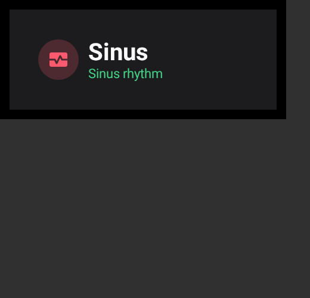 | 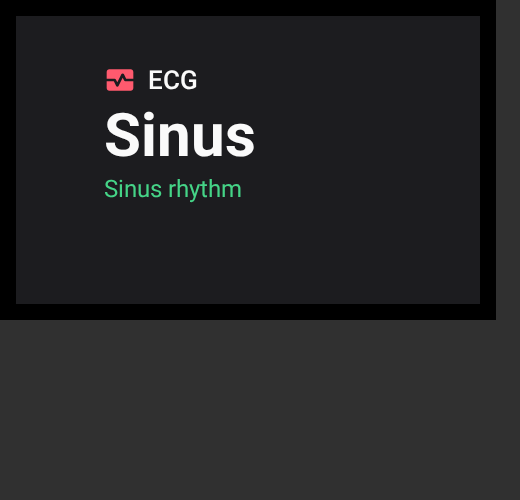 | 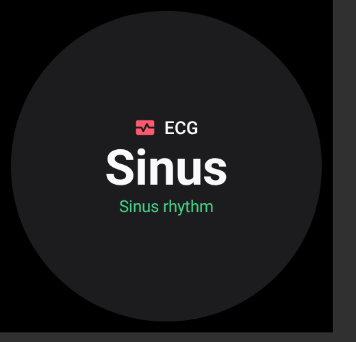 |
| **Blood oxygen** | 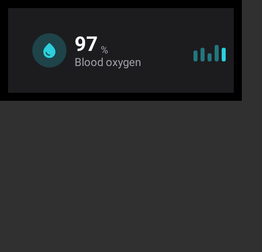 | 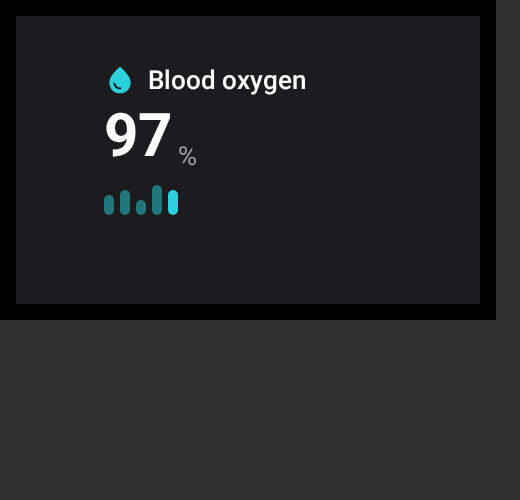 | 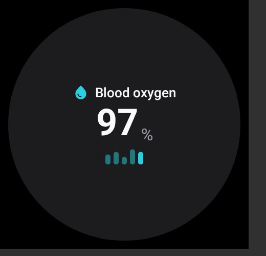 |
| **Stress** | 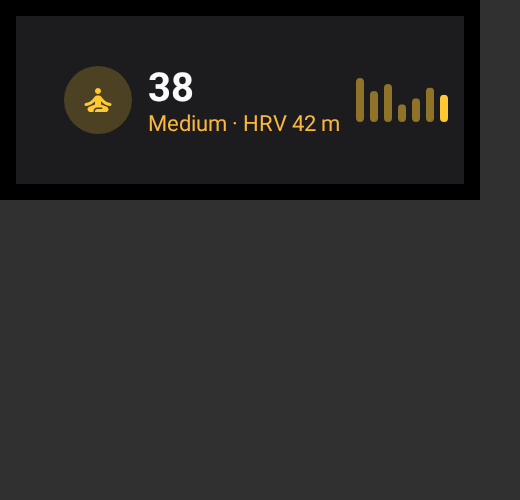 | 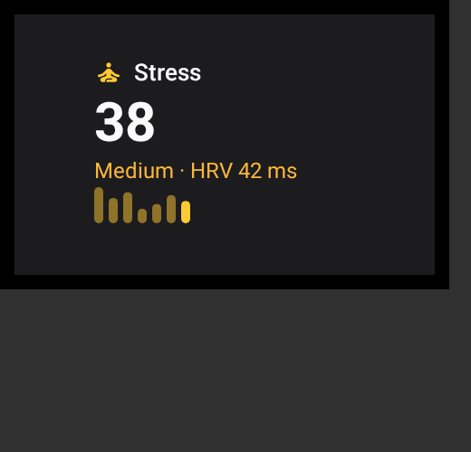 | 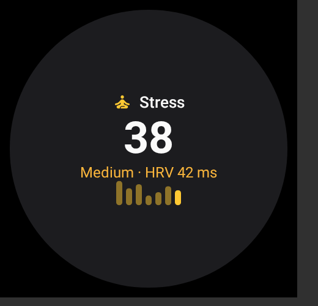 |
| **Body composition** | 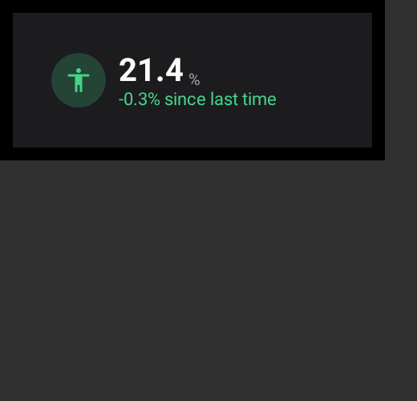 | 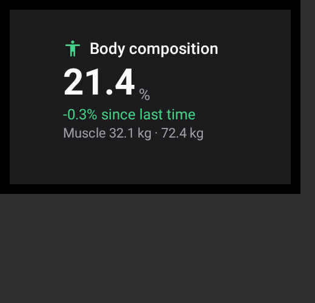 | 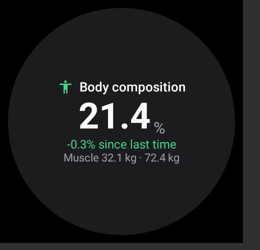 |
| **Today** | 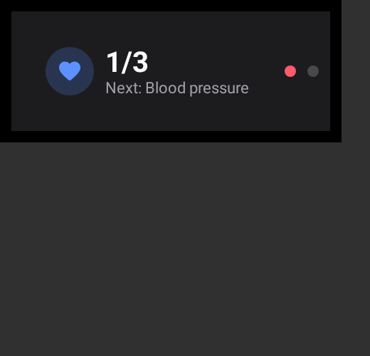 | 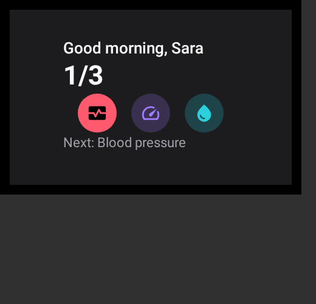 | 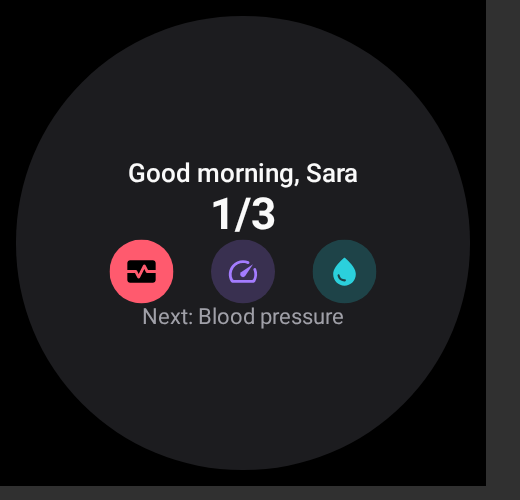 |
| **Wellness** | 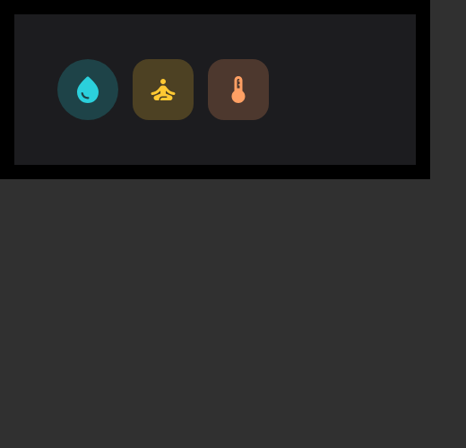 | 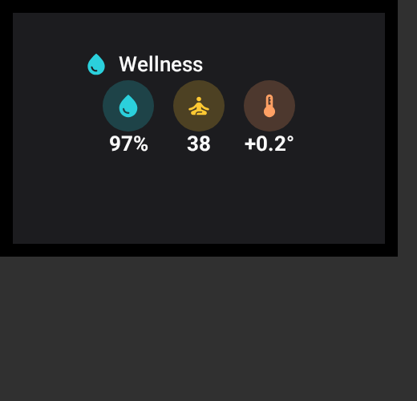 | 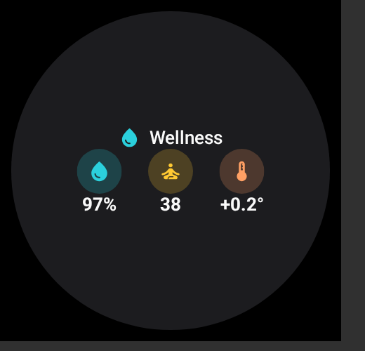 |
| **Measure** | 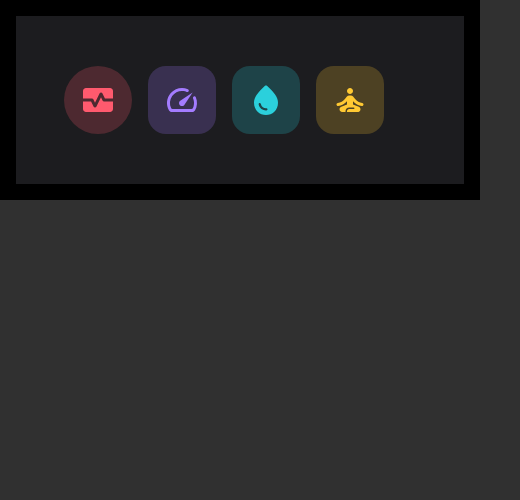 | 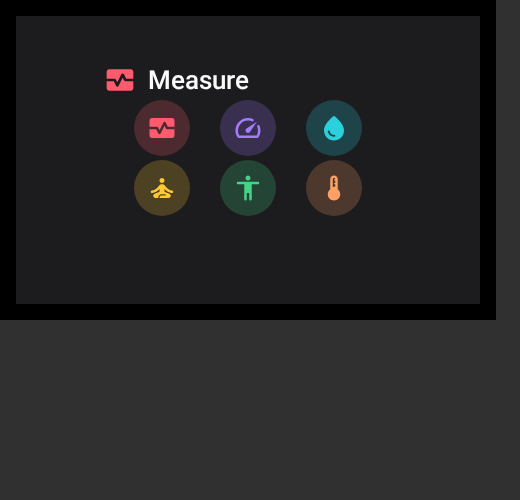 | 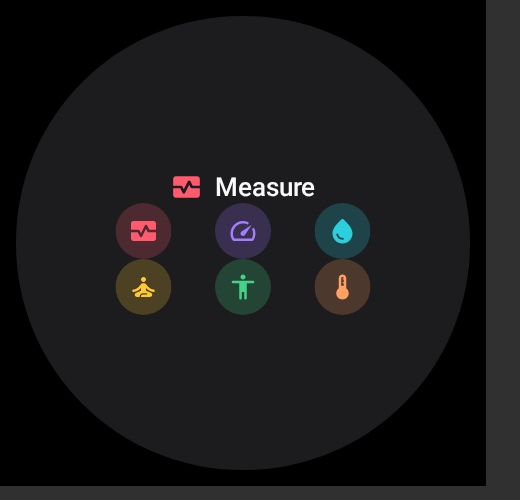 |
